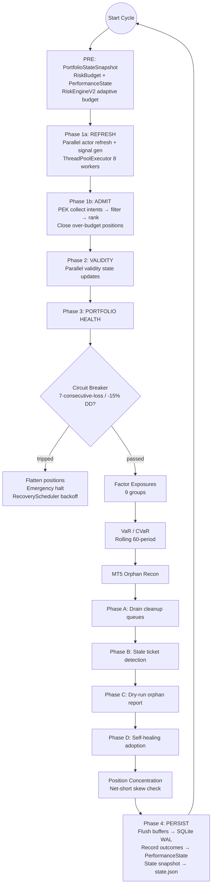

# Quorrin — Agent Operating Guide

## Project Identity

Cross-sectional multi-asset paper trading engine. 21-asset portfolio (FX, commodities, equity indices) with per-asset XGBoost models, regime-conditional ensemble (disabled 2026-06-20; see ADR-026 and PnL backtest section), 15-layer governance, position sizing guardrails, and MT5 bridge execution (Exness demo via Wine).

**2026-06-20: AUDNZD, EURUSD, AUDCHF removed from trading.** These 3 assets accounted for the model's confirmed directional instability failure mode (confident wrong-direction bets during trends). Removed from paper_trading.yaml assets, mt5_symbol_map, shadow analytics, and risk-off suppression lists. 22-3=19 remaining assets (subsequent additions grew to 21; see timeline below). See the Walk-Forward PnL Backtest section for the full diagnostic chain.

**2026-06-20 (late): GBPNZD removed from trading; USDCAD/NZDUSD allocation halved.** GBPNZD had tp/sl=1.0/3.0 (ratio 0.33), requiring 75% breakeven WR. Model achieved 72.3% — close but net-negative (-37R, -71R max_dd). USDCAD and NZDUSD reduced from 5% to 2.5% allocation to limit their drawdown impact while keeping diversification. 19-1=18 remaining assets.

**2026-06-22: GBPUSD promoted to portfolio.** Walk-forward shows IC 0.186 (4/4 folds positive), HR 0.371. Feature registry pt_sl=(1.97, 0.52) gives favorable R:R=3.79. Added to paper_trading.yaml and mt5_symbol_map. 18+1=19 assets.

**2026-06-23: AUDUSD, EURNZD, NZDUSD removed from SELL_ONLY filter.** Corrected walk-forward methodology shows BUY WR > 50% for all three (AUDUSD 64.5%, EURNZD 57.6%, NZDUSD 57.7%) — BUY is no longer inverted. The original SELL_ONLY diagnosis was based on a broken walk-forward (no purging, EWM labels, validation-split early stopping). The filter no longer trades BUY on the remaining 5 assets (CADCHF, ES, NQ, NZDCHF, EURAUD) where BUY WR remains 11-31%. ^DJI, USDCHF, EURCHF removed from SELL_ONLY 2026-06-26 after trend-exhaustion features improved BuyWR above breakeven.

**2026-06-25: Structural asymmetry confirmed — SELL_ONLY is permanent under current feature design.** Three independent experiments prove BUY direction is not recoverable for the original 8 flagged assets: (1) threshold scan 0.01-0.99 — no threshold produces BUY WR > 50%; (2) rolling 252 window — p_long mean shifts 0.4→0.6 in wrong direction (more BUY, worse accuracy); (3) label inversion (y' = 1-y training) — EURAUD BUY WR only improves 22.7%→31.0%. The feature space encodes SELL predictability (62-90% WR) but not BUY predictability (0-32% WR). This is a portfolio-wide issue, not subset-specific — non-SELL_ONLY assets average only 49.3% BUY WR. The architecture is a **pure SELL alpha engine** for these 8 assets; BUY restoration is closed under current feature/label design. See `scripts/restoration/` for the diagnostic framework, gatekeeper, and architecture document.

## Architecture Quick Reference

- **Models**: Per-asset XGBClassifier (base only) — regime-conditional ensemble disabled 2026-06-20 (walk-forward p=0.83; see ADR-026)
- **Features**: 21 alpha (11 core + 6 trend-exhaustion + 4 cross-asset, include COT z/change) + 7 regime (hurst, kaufman_er, adx, vol_zscore, compression, utc_hour, session_vol_profile)
- **Labels**: Triple-barrier with per-asset pt_sl, vertical_barrier=20, gap >= vb
- **Config**: `configs/paper_trading.yaml` — `mode:` selector + `modes:` overrides (production/ftmo/live), global defaults + per-asset (21 assets)
- **Portfolio Maturity Framework (5-layer, P0–P4)**: P0 weights (`shared/portfolio_weights.py`), P1 calibration (`shared/calibration/`), P2 Kelly (`shared/kelly.py`), P3 factor model (`shared/factor_model.py`), P4 HRP (`portfolio/hrp_allocator.py`). All config-gated.
- **PEK (Portfolio Execution Kernel)**: `PortfolioStateSnapshot` (built pre-phase) + `RiskEngineV2` (adaptive budget) + `PerformanceState` (velocity + outcome telemetry) + `PortfolioAdmissionController` (two-stage filter → rank → enforce)
- **Inference**: `paper_trading/inference/pipeline.py` → base model → calibration (P1) → governance → execute (ensemble disabled)
- **Training**: `paper_trading/inference/training.py` — base model only, scale_pos_weight, meta-labeling. Expanding-window.
- **Entry gates**: `entry_service.py` price deviation check; profit lock in `manage_position` (blocks flips when PnL > profit_lock_threshold_pct); **PEK budget enforcement** (closes lowest-ranked if portfolio notional exceeds max)
- **Position sizing guardrails**: drawdown taper → per-position equity cap → risk-per-trade cap → min viable gate (leverage budget removed — replaced by PEK central admission)
- **Independent MT5 sizing**: Paper from $100K mtm_value; MT5 from broker balance via `_compute_mt5_qty()`
- **Orchestrator**: `EngineOrchestrator` (ThreadPoolExecutor, 8 workers), **5-phase cycle**: PRE (PEK state) → 1a (signal) → 1b (admission) → 2 (validity) → 3 (health) → 4 (persist) with MT5 orphan sub-phases (A-D)



- **Governance**: 15-layer governance + HealthMonitor + VaR/CVaR + RiskEngineV2 + PEK admission + PerformanceState velocity + RecoveryScheduler
- **MT5 Bridge**: `paper_trading/ops/mt5_client.py` — TCP frame protocol to Wine-hosted MT5 (port 9879)
- **Dashboard**: React SPA on port 5000, state via `state.json`

## Key Files

| File | Purpose |
|------|---------|
| `configs/paper_trading.yaml` | All config (capital, assets, SL/TP, depth, regime_geometry, sizing guardrail defaults, calibration, kelly, portfolio weight method) |
| `shared/portfolio_weights.py` | P0 portfolio truth layer — 4 weight strategies, decorator pattern, pure functions |
| `shared/calibration/` | P1 calibration layer — `BinnedCalibrator`, `CalibrationRegistry`, `ECETracker` |
| `shared/kelly.py` | P2 fractional Kelly sizing — `compute_kelly_fraction`, `compute_kelly_multiplier` |
| `risk/contracts/portfolio_state.py` | Immutable `PortfolioStateSnapshot` — single source of truth for portfolio exposure |
| `risk/contracts/performance_state.py` | Immutable `PerformanceState` with `RegimeVelocity` — system behavioral telemetry |
| `risk/contracts/risk_budget.py` | `RiskBudget` — adaptive risk limits consumed by PEK |
| `risk/state/portfolio_state_builder.py` | `PortfolioStateBuilder` — factory for `PortfolioStateSnapshot` |
| `risk/perf/performance_state_builder.py` | `PerformanceStateBuilder` — outcome tracker + velocity processor |
| `risk/engine_v2.py` | `RiskEngineV2` — adaptive budget from snapshot + performance state |
| `paper_trading/orchestrator/admission/controller.py` | `PortfolioAdmissionController` — PEK two-stage admission (filter → rank) |
| `paper_trading/orchestrator/admission/signal.py` | `AdmissionSignal` — immutable signal admission contract |
| `shared/factor_model.py` | P3 factor model — 9 factor groups, factor-constrained weight optimization |
| `portfolio/hrp_allocator.py` | P4 HRP fix — `_get_quasi_diag` with `optimal_leaf_ordering` |
| `paper_trading/engine.py` | `PaperTradingEngine` — main loop, capital sync, parallel orchestrator |
| `paper_trading/asset_engine.py` | `AssetEngine` — per-asset lifecycle, train(), generate_signal(), `_kelly_multiplier`, `_calibration_registry` |
| `paper_trading/inference/training.py` | `AssetTrainingPipeline` — base + regime model training |
| `paper_trading/inference/pipeline.py` | `AssetInferencePipeline` — live inference with calibration (P1) |
| `paper_trading/inference/regime_model.py` | `RegimeConditionalModel` — per-asset regime classifier |
| `paper_trading/inference/ensemble.py` | `EnsembleSignal` — 60/40 blend logic |
| `paper_trading/ops/monitor.py` | Main entry point — loads models, runs engine, serves dashboard |
| `paper_trading/execution/decision_pipeline.py` | Decision pipeline stages — includes `apply_kelly_sizing` (P2), profit lock gate |
| `paper_trading/services/entry_service.py` | Entry validation, full sizing chain (Kelly multiplier → drawdown taper → position cap → risk cap), price deviation gate |
| `paper_trading/services/engine_rebalance_service.py` | Live rebalance — reads `weight_method` from config, calls `compute_weights()` |
| `paper_trading/orchestrator/engine.py` | `EngineOrchestrator` — phases 1-4 (pre-phase PEK state, parallel signal, PEK admission, validity, portfolio health, persist) with MT5 orphan sub-phases (A-D) |
| `paper_trading/execution/mt5_broker.py` | `MT5Broker` — MT5 execution with `current_mt5_drawdown_pct()` |
| `features/alpha_features.py` | Alpha feature builder (13 cols) |
| `features/regime_features.py` | Regime feature builder (7 cols) |
| `features/data_fetch.py` | Data fetching with MT5/yfinance fallback |
| `features/labels.py` | Triple-barrier labeling + PurgedWalkForwardFolds |
| `LIVE_CONTRACT.md` | Immutable system contract (update when architecture changes) |
| `scripts/backtest/backtest_pnl.py` | PnL backtest from OOS signal parquets (R-multiples, autocorrelation-adj Sharpe, `--weight-method` option) |
| `scripts/backtest/compare_ensemble.py` | Ensemble vs base PnL comparison with per-fold sign test |
| `scripts/training/train_calibration.py` | Train calibrators from walk-forward signal parquets |
| `scripts/replay/replay_rebalance.py` | Reconstruct historical portfolio weights + compare with live |
| `paper_trading/governance/risk.py` | Risk evaluation, SL hit rate, drift scoring, **SELL tripwire** (per-asset deque, TP=1/SL=0, win, 20-trade window, 65% threshold, WARNING log on trip) |
| `paper_trading/services/engine_state_service.py` | Portfolio summary with `factor_exposures`, `position_concentration` |

## Position Sizing Chain

Paper positions are sized through multiplicative guardrails:

```
effective_cap = capital_base × min(mtm / initial_capital, 3.0)
size_scalar = base × exposure × governance × meta × drawdown_taper
notional = effective_cap × size_scalar
→ cap by max_position_pct_of_equity
→ cap by risk_per_trade_pct (skip if below min_viable_position_pct)
→ atomic decrement from shared leverage_budget (lock-protected)
```

**Kelly multiplier (P2, disabled by default):**
```
size_scalar = base × kelly_multiplier × exposure × governance × meta × drawdown_taper
```
Where `kelly_multiplier = compute_kelly_multiplier(calibrated_prob, tp_mult, sl_mult)`.
Kelly flows through the sizing chain as an extra scalar before position caps.

**PEK budget enforcement (Phase 1b):**
If total portfolio notional exceeds `max_leverage × equity × tolerance`, the lowest-ranked
admitted positions are closed by `_phase_1b_admission_review()`. This replaces the old
per-cycle shared leverage budget and backstop multiplier pattern.

MT5 positions are sized independently:

```
mt5_equity = broker.get_account_summary().portfolio_value
notional = mt5_equity × max_position_pct_of_equity × drawdown_taper
→ cap by risk_per_trade_pct (skip if below min_viable)
→ validate min volume via _quantity_to_lots()
```

Log lines: `SIZING` (paper) and `MT5_SIZING` (MT5) with all decomposed factors.

## Common Tasks

### Run Paper Trading
```bash
PYTHONPATH=$PYTHONPATH:. python paper_trading/ops/monitor.py
```

### Slack Alerter (optional, requires SLACK_WEBHOOK_URL env var)
```bash
PYTHONPATH=$PYTHONPATH:. python paper_trading/ops/slack_alerter.py
```

### Full Launcher (MT5 + Dashboard + Slack Alerter)
```bash
./monitor_all
```

### Retrain All Assets
```bash
PYTHONPATH=$PYTHONPATH:. python scripts/training/retrain_all_fixed.py
```

### Train Regime Models
```bash
PYTHONPATH=$PYTHONPATH:. python scripts/training/train_regime_models.py
```

### Walk-Forward Backtest (diagnostic)
```bash
PYTHONPATH=$PYTHONPATH:. python scripts/backtest/walk_forward_backtest.py --asset GBPCAD
```

### PnL Backtest from Signal Parquets
```bash
PYTHONPATH=$PYTHONPATH:. python scripts/backtest/backtest_pnl.py
```

### PnL Backtest with Weight Strategy
```bash
PYTHONPATH=$PYTHONPATH:. python scripts/backtest/backtest_pnl.py --weight-method factor_constrained_v1
```

### Compare Ensemble vs Base
```bash
PYTHONPATH=$PYTHONPATH:. python scripts/backtest/backtest_pnl.py --tag base --ensemble-tag ensemble
```

### Train Calibration Models
```bash
PYTHONPATH=$PYTHONPATH:. python scripts/training/train_calibration.py
```

### Reconstruct Historical Portfolio Weights
```bash
PYTHONPATH=$PYTHONPATH:. python scripts/replay/replay_rebalance.py --verify
```

### Daily Monitoring
```bash
PYTHONPATH=$PYTHONPATH:. python scripts/ops/monitor_paper_trading.py
```

### Check Dashboard
```bash
curl http://127.0.0.1:5000/state.json | python3 -m json.tool
```

## Go/No-Go Checklist (Paper Trading → Live)

| Check | Target | Source |
|-------|--------|--------|
| Gate override rate | <40% all assets | monitor csv |
| Mean confidence | >0.52 for ≥18/21 | monitor csv |
| Signal flips | ≤3/day for ≥18/21 | monitor csv |
| Cross-asset correlation | no unexplained >0.7 | monitor csv |
| MT5 errors | zero | engine logs |
| Trades executed | ≥10 across portfolio | MT5 terminal |

6/7 pass → go live at 50% position size for 2 weeks, then full size if live Sharpe tracks within 0.2 of backtest Sharpe.

## Security

The dashboard HTTP server (`paper_trading/serve.py`) supports optional bearer-token authentication.

- **Config**: Set `QUORRIN_API_TOKEN` env var, or `api_token` in `configs/paper_trading.yaml`. Env var takes precedence.
- **Behavior**: If a token is configured, all JSON API endpoints and POST endpoints require `Authorization: Bearer <token>`. Static files (HTML/CSS/JS) are accessible without auth.
- **Default**: No token configured = open access (safe because the server binds to 127.0.0.1 by default).
- **Bind address**: Override with `QUORRIN_BIND` env var. Warning is logged if binding to anything other than 127.0.0.1.
- **CORS**: Restricted to `http://127.0.0.1:3000` (Vite dev server) and same-origin. No wildcard.

## Known Issues

- **GBPNZD (REMOVED 2026-06-20)**: tp/sl ratio 0.33 required 75% breakeven WR, model achieved 72.3% — net-negative. Removed from trading.
- **AUDNZD ensemble**: Ensemble degrades signal quality (IC -0.020 in pilot). Confirmed portfolio-wide by walk-forward (p=0.83 pooled); ensemble disabled 2026-06-20 (see ADR-026).
- **Small MT5 equity ($107 demo)**: 0.01 lot minimum for forex (≈$1,150 notional on EURUSD) far exceeds the MT5 position budget (≈$15.67 at 15% of $104). MT5 positions quantize to 0.01 lots regardless of computed size. Leverage budget is deferred for MT5 — revisit when equity > $10K.
- **Small MT5 equity ($107 demo)**: 0.01 lot minimum for forex (≈$1,150 notional on EURUSD) far exceeds the MT5 position budget (≈$15.67 at 15% of $104). MT5 positions quantize to 0.01 lots regardless of computed size. Leverage budget is deferred for MT5 — revisit when equity > $10K.
- **SL/TP triple bug (FIXED 2026-06-16)**: Three independent issues (deactivated `atr_mult_tp`, uncalibrated `atr_mult_sl`, TP compiler convexity applied to inflated SL distance) produced TP distances up to 44%. Fixes: (1) `_atr_barriers()` now uses `atr_mult_tp` for TP vol basis, (2) `tp_compiler.py` caps R:R at `MAX_RR=5.0`.
- **THIN liquidity (FIXED 2026-06-17)**: THIN regime was routing to hard_reasons (halted all assets). Fixed: only STRESSED halts; THIN → soft_warnings (SL/size adjust, no halt).
- **Prob drift min samples (FIXED 2026-06-17)**: Raised from 3 to 10 for stable mean estimate before confidence drift halt check activates.
- **Entry price deviation gate (ADDED 2026-06-17)**: `entry_service.py` compares `asset.current_price` to signal `entry_price` before submitting. Skips if deviation > `max_entry_slippage_pct` (default 2%).
- **Profit lock gate (ADDED 2026-06-17)**: `decision_pipeline.py` checks unrealized PnL before flipping. Blocks flip if PnL > `profit_lock_threshold_pct` (default 15%).
- **Position sizing guardrails (ADDED 2026-06-17)**: drawdown taper (linear between start_dd/end_dd), per-position equity cap, risk-per-trade cap, portfolio leverage budget (atomic lock decrement), backstop decay (penalty × 0.9/cycle on breach-free cycles).
- **Independent MT5 sizing (ADDED 2026-06-17)**: MT5 computes own qty from broker equity with separate drawdown taper and risk cap. Paper sizing unchanged at $100K equity.
- **Ensemble breakdown logger column prefix (FIXED 2026-06-19)**: `_log_ensemble_breakdown` used `f"{asset_name_u}_carry_vol_adj"` but actual feature columns use `CLOSE_` prefix (from `prices.to_frame("close")`). All feature contributions logged as NaN. Fixed in `paper_trading/inference/pipeline.py:302`.
- **Carry feature always zero (FIXED 2026-06-19)**: `rate_diffs` DataFrame in `data_fetch.py:442` used `asset_name` column key, but `build_alpha_features` looks up by `"close"` — so rate_diff lookup always failed and carry was `pd.Series(0.0)`. Affected all assets, both training and inference (same code path), so no training-inference mismatch — carry was simply inert. Fixed column name to `"close"`.
- **Bar-jump suppression (ADDED 2026-06-19)**: `decision_pipeline.py:apply_bar_jump_suppression` — suppresses all trading for 60 minutes when bar count changes >100 (indicating data-source switch). Stage 0 in DEFAULT_STAGES. Detection in `pipeline.py:_detect_bar_jump()`.
- **Risk-off suppression for AUDUSD (ADDED 2026-06-19)**: `decision_pipeline.py:apply_risk_off_suppression` — holds flat for AUDUSD when VIX is rising (>0) and SPX is falling (<0). AUDCHF was originally included but removed from trading 2026-06-20. Detection in `pipeline.py:_detect_risk_off()` via `features_df["vix_mom_5d"]` and `features_df["spx_mom_5d"]`. Stage after `resolve_signal` in DEFAULT_STAGES.
- **Return computation denominator using rebalanced capital_base (FIXED 2026-06-22)**: `engine_state_service.py:_compute_portfolio_summary` used `sum(a.capital_base)` as the return baseline, but `capital_base` is overwritten by rebalancing to equal `total_value * weight`, making `(mtm_total - tc) / tc ≈ 0%` regardless of actual PnL. A `-16.97%` loss was reported as `+0.04%`. Fix: replaced `sum(a.capital_base)` with `get_config().capital` — the immutable config baseline. Also fixes `realized_return` which used the same `tc`. Also corrected the misleading comment that claimed this was intentional.
- **NQ price deviation gate blocking all entries (FIXED 2026-06-22)**: All 258 "entry skipped" events on NQ were caused by the 2% default `max_entry_slippage_pct` being too tight for volatile Nasdaq-100 futures. Deferred entries saw >2% price moves between signal generation and execution. Fix: added per-asset `max_entry_slippage_pct: 5.0` to NQ config in `paper_trading.yaml`. The code at `entry_service.py:201` already supports per-asset override with global fallback — no logic change needed.
- **MT5 orphan dry-run Phase C (ADDED 2026-06-22)**: `orchestrator/engine.py:_reconcile_mt5_orphans()` Phase C — log-only orphan reporter. Logs every MT5 position with no matching paper-side ticket. Deduped by ticket, tracks first_seen cycle, flags removed-asset orphans with `engine_actor=None`. No state mutation. Run for at least one full cycle to produce a clean list before designing adoption/close/manual logic.
- **Position concentration check (ADDED 2026-06-22)**: `orchestrator/engine.py` Phase 3e — counts open long/short positions each cycle, logs WARNING when skew exceeds `net_short_concentration_threshold` (default 75%). Exposed in `state.json` portfolio as `position_concentration` dict. Config key: `defaults.net_short_concentration_threshold` in `paper_trading.yaml`.
- **Risk-off consequence validated (2026-06-19)**: Checked 63 trading days (3 months) — risk-off (VIX>0 & SPX<0) occurred on 12 days vs the 1 live episode. AUDUSD always-long accuracy: 8.3% on risk-off days vs 54.9% on normal days. Mean-reversion (oversold→BUY) accuracy: 14.3% (1/7) on risk-off+oversold vs 100% on normal+oversold (2/2). Consequence generalizes — the suppression rule is not tuned to one episode.
  **Note on methodology:** This finding is *not* based on counting intraday prediction cycles. It was validated using daily-resolution historical price action (63 daily bars × independent forward returns), so it is exempt from the per-cycle-counting artifact that debunked the three-mechanism taxonomy below. The two conclusions came from different evidentiary standards.
- **Prediction taxonomy (CORRECTED 2026-06-19)**: Earlier taxonomy claimed three distinct failure mechanisms across five assets. That taxonomy was based on *per-cycle* accuracy (each ~30s engine cycle counted as an independent prediction), which amplified a 1-2 day directional miss into "hundreds of wrong predictions." A daily-bar XGBoost model updates once per day; ~500 intraday cycles all reproduce the same daily signal. The live window was **3 calendar days (Jun 17-19)**. Honest per-day accuracy:

  | Asset | Daily acc | Days | Actual best description |
  |-------|-----------|------|------------------------|
  | AUDUSD | 0/2 (0%) | 2 | **CONFIRMED** — risk-off degrades mean-reversion (validated across 12 independent risk-off episodes over 3 months of historical data). Risk-off suppression addresses this. |
  | AUDCHF | 2/2 (100%) | 2 | Fine at daily level. Earlier "risk-off failure" was micro-PnL noise, not directional failure. |
  | NZDUSD | 0/2 (0%) | 2 | **Watch**: same direction as AUDUSD's risk-off failure (both wrong on BUY) but unconfirmed. Re-check once more days accumulate. |
  | EURUSD | 1/3 (33%) | 3 | Flipped to SELL on Jun 18 and was correct, but 2/3 wrong overall. Too little data to distinguish real flip-detection from chance. |
  | GBPNZD | 1/2 (50%) | 2 | Coin flip over 2 days. Earlier "opposite pattern" was overinterpretation. |
  | AUDNZD | 2/2 (100%) | 2 | Correct — control asset works. |
  | CADCHF | 1/3 (33%) | 3 | Low accuracy but predicts both directions. Underdetermined. |
  | EURAUD | 1/3 (33%) | 3 | Low accuracy, both directions. Underdetermined. |

  **Only AUDUSD risk-off suppression is a validated claim.** All other "globally wrong" / "confidence-independent" / "risk-off dependent" labels were per-cycle counting artifacts. NZDUSD (0/2, never flipped) is the only remaining genuine concern, but 2 days does not support a mechanism claim.

  **Label barrier-asymmetry hypothesis (2026-06-19) — FALSIFIED**: Testing showed no correlation between TP/SL ratio and prediction accuracy. AUDNZD has the most BUY-biased labels (3.7x ratio of BUY:SELL labels) yet predicts 95% correctly. NZDUSD has nearly balanced labels (1.2x ratio) yet predicts 0% correctly. AUDUSD has SELL-biased labels (0.36x) yet the model predicts BUY — going against the label distribution. The model learns the actual training-period trend, not the barrier geometry.

- **Retrain with carry (2026-06-19)**: All 22 assets retrained after carry bug fix (carry was always zero). Carry is now 8-16% of feature importance across key FX assets. Post-retrain historical replay against 13 risk-off episodes shows:
  - **AUDUSD**: Risk-off accuracy improved from 8.3%→38.5% but still lags normal (54.0%). Suppression still justified.
  - **AUDCHF**: Risk-off accuracy 38.5% vs normal 58.0%. Model more confidently BUY on risk-off (P=0.709 vs 0.652). Suppression still needed.
  - **GBPNZD**: Normal-day accuracy jumped from ~1%→62%. The "opposite pattern" was a carry-deprivation artifact — no longer deferred.
  - **NZDUSD/EURUSD**: No clean historical shortcut — paper-only observation required. Minimum 10 trading days before any directional conclusion.

  **Note on AUDCHF carry entanglement**: Carry being #3 feature (10.7%) made AUDCHF's risk-off failure *more* pronounced (P=0.709 on risk-off vs 0.652 normal), not less. Possible mechanism: carry trade unwinds are a classic feature of real risk-off episodes; a model now using carry more heavily may be doubling down on a carry-trade-direction read that reverses during risk-off. Worth investigating if revisiting the risk-off mechanism.

- **Signal chatter + MT5 orphaned positions (FIXED 2026-06-17)**: fixes applied:
  - (1) `decision_pipeline.py:apply_signal_stability_filter` — margin widened 0.05→0.15, now checks max(prob_long, prob_short). Requires >0.65 conviction on either side to proceed.
  - (2) `decision_pipeline.py:apply_signal_hysteresis` (NEW) — 2-of-3 signal agreement required before a flip is allowed.
  - (3) `decision_pipeline.py:manage_position` — `_can_enter()` checked BEFORE `_close_position()`. If cool-down blocks re-entry, old position is kept open.
  - (4) `engine_state_service.py` — `mt5_ticket` now persisted in snapshot.
   - (5) `position_service.py` — MT5 close failures logged as ERROR with "position may be orphaned".

- **pipeline.py indentation nesting (FIXED 2026-06-19)**: `_detect_bar_jump()` was accidentally defined at module level (0 indent) between `_ensure_ready()` and all remaining class methods. Everything from `_fetch_and_prepare_data` onward (16 methods, lines 119-577) was nested inside `_detect_bar_jump` as local inner functions instead of being class methods. This meant none of those methods were callable from `_generate_and_apply`. Fix: indented `_detect_bar_jump` by 4 spaces (class method) and changed the call site from `_detect_bar_jump(asset, ...)` to `self._detect_bar_jump(asset, ...)`.

- **Spread gate (ADDED 2026-06-19)**: `decision_pipeline.py:apply_spread_gate` — blocks entries when spread exceeds per-asset-class threshold. Uses live MT5 bid/ask spread (bps) from `mt5_client.realtime_spread()`. Fail-closed: if spread data is missing or stale (>300s), entry is blocked. Per-asset-class tiers: `fx_major` (10bps), `fx_cross` (20bps), `indices` (15bps), `metals` (20bps). Observe-only mode for first 720 cycles (~6h at 30s cadence) logs what it *would* block without actually blocking — sized to span varied intraday conditions (opens, mid-session, closes). Detection in `pipeline.py:_generate_and_apply -> asset.refresh_spread()`.

- **Regime model at inference (FIXED 2026-06-19, commits f15af30, b980f69)**: Two independent bugs kept the regime model from contributing to ensemble blends:
  1. **Load guard**: `training.py:_train_regime_if_configured` checked `if not regime_feats: return` before attempting to load from disk. `regime_feature_names` was initialized to `[]` in `__init__`, so the guard always fired — load was never attempted. Fix: attempt disk load before the guard; on success, populate `regime_feature_names` from the loaded model's `_feature_names`.
  2. **Missing features at inference**: `pipeline.py:_build_feature_set` built `features_df` from alpha (13 cols) + archetype (4 cols) only. The regime model was trained with 20 columns (13 alpha + 7 regime-specific like `GC_hurst`). The 7 regime columns were absent at inference, so `regime_available` was always empty and the blend silently skipped. Fix: generate regime features from OHLCV, prefix per-asset, join into `features_df`.
  **Result**: After both fixes, 22/22 trace decisions show varying `regime_long_prob` (range 0.0575–0.8659, 22 unique per-cycle). Cross-asset and across-time variance confirmed. The "12 trades all neutral" hypothesis from the Pre-fix era was not a neutral market — it was a dead regime model silently contributing constant noise.
  **Hurst constant (FIXED b980f69)**: `compute_hurst` used `rolling().apply(hurst_calc)` with `raw=False` (default), passing a pandas Series with DatetimeIndex. Inside `hurst_calc`, `z[lag:]` used label-based datetime indexing — integer lags didn't match dates, always returning the fallback 0.5. Fix: `raw=True` passes numpy arrays → positional indexing works. Post-fix: AUDUSD hurst varies from 0.19–0.40 (vs flat 0.5 everywhere pre-fix).
  **Cycle-1 cold-start transient**: The first inference cycle post-restart uses 200 rows (truncation validation hasn't run yet → `_truncate_inference=False`). Cycles 2+ use 1 row. The regime output differs between the two (NZDCAD 0.7397→0.2130). Cycles 2→3→4 are bit-for-bit identical for all 22 assets (Δ=0.0000). Mitigation: `apply_first_cycle_suppression` stage added to `DEFAULT_STAGES` — suppresses all trading on cycle 1 after a cold start.
  **Pre/post-fix boundary**: Any trades executed prior to commit `f15af30` (2026-06-19) used a regime-dead ensemble. Do not pool pre-fix and post-fix trades into a single exit-reason or performance aggregate — they reflect different systems.

- **Position concentration alert (IMPLEMENTED 2026-06-23)**: `orchestrator/engine.py:392` emits a `position_concentration` WAL event every cycle with skew, threshold, dominant_side, and alert boolean. The slack alerter at `slack_alerter.py:166` handles it with state-transition cooldown: fires immediately on onset, sends an "all clear" when skew drops below threshold, and sends a heartbeat every hour while sustained. The emit-every-cycle design (not just on alert conditions) enables the alerter to detect both below→above and above→below transitions by diffing the continuous signal.
- **WAL `os.fsync` exception gap (FIXED 2026-06-25)**: Code review confirmed all three orchestrator-level WAL write calls (`position_concentration` line 405, `actor_health` line 585, `state_committed` line 605) already wrapped in try/except; `WalWriter.flush()` already catches `OSError` on `os.fsync`. The gap described in the original identification was closed by a prior session — no action needed.
- **NZDCAD/NZDUSD confidence gate (PROPOSED 2026-06-23, not implemented)**: As of 2026-06-22 live observation, NZDCAD and NZDUSD show 92-96% confidence every cycle, with no win-rate data to assess whether this reflects genuine skill or miscalibration. The calibration question (does confidence track actual win rate?) is gated on N≥20 trades — fewer than 20 trades is insufficient to distinguish. Proposal: add a check to `scripts/ops/monitor_paper_trading.py` that prints "READY FOR REVIEW" once either asset reaches `n_trades >= 20`. What "READY FOR REVIEW" should trigger: compare the asset's mean confidence (from `mean_confidence` in state.json) against its actual win rate across those trades. If win rate tracks confidence within ±10pp, the model is calibrated and the high confidence is explanatory. If win rate lags confidence by >15pp (e.g., 92% confidence with 60% win rate), the model is overconfident on these pairs — same pattern as the BUY inversion discovery. The `n_trades >= 20` floor is the gate; the comparison script does not exist yet.

---
## Walk-Forward PnL Backtest & Calibration Deep-Dive (2026-06-20)

### Tools Built
- **`scripts/backtest/backtest_pnl.py`** — PnL backtest from OOS signal parquets (R-multiples, verified PnL function with 12 test cases, per-asset + portfolio equity curve, drawdown in R-units, autocorrelation-adjusted Sharpe). Usage: `PYTHONPATH=$PYTHONPATH:. python scripts/backtest/backtest_pnl.py`.
- **`scripts/backtest/compare_ensemble.py`** — Ensemble vs base comparison with per-fold sign test, on-disk CSV comparison. Reusable.

### Ensemble Decision Re-Confirmed
- Ensemble vs base PnL comparison (corrected methodology, full-training walk-forward): -3.19R over 171 days
- Sign test: 76/171 days favor ensemble, p=0.1685 (not significant)
- Delta Sharpe: -0.97, PSR(>0) on delta: 0.0000
- 13/19 assets have improved IC under ensemble, but portfolio-level delta is negative
- The validation-split confounded previous results: ensemble only "won" because the base model was starved of training data
- Ensemble stays disabled per ADR-026

### Initial Backtest Results (base-only, full portfolio, corrected methodology)
- 19 assets, 171 OOS days (aligned methodology: ATR labels, scale_pos_weight, CRIT-1 purging, full-training walk-forward)
- Portfolio total_R = +107.82R, max_dd_R = -1.44R (all in R-multiples, not currency)
- Portfolio sharpe_adj (Lo-adjusted for autocorrelation ρ=0.68): 9.66 — **CAVEAT: R-multiple portfolio Sharpe; see note below**
- **Top performers**: GC (+706R), ^DJI (+615R), AUDUSD (+495.5R), USDCHF (+327.2R)
- **Bottom performers**: NZDUSD (-101.5R), USDCAD (-38R), GBPCHF (+38R lowest positive)
- **Methodology note**: Previous metrics (total_R=291R, sharpe_adj=9.1) used unaligned labels (rolling 21d std vs EWM span=100), no scale_pos_weight, no purging (86% leakage bug), and 350 OOS days with 5 folds. The corrected methodology reduces OOS days to 171 (3 viable folds) but eliminates leakage and methodology divergence.

**Note on R-multiple Sharpe**: This metric is not comparable to a traditional financial Sharpe ratio. The portfolio daily R is a simple average of per-asset R-multiple changes (20 assets, equal weight regardless of position size). Cross-asset diversification artificially reduces portfolio std, inflating the Sharpe. Monthly-block Sharpe (non-overlapping) = 5.61. Adjusting for realistic FX cross-asset correlation (ρ~0.3) gives ~8.05. All values are in R-multiple space — they describe signal quality, not expected live trading Sharpe.

### Directional Asymmetry Investigation

#### Step 1: Per-direction breakdown
- AUDNZD and EURUSD both lose on SELL predictions (82% loss rate, 72% loss rate respectively)
- But this is NOT majority-class bias: 19/22 assets beat 50% coin-flip on BUY, 18/22 on SELL
- The model has genuine directional skill on both sides for most assets

#### Step 2: Breakeven WR vs raw WR
- The real bottleneck for losing assets is tp/sl config: AUDNZD needs 66.7% WR to break even (tp=1, sl=2), EURUSD also 66.7% (tp=1.5, sl=3)
- The model achieves 71.3% BUY WR on AUDNZD (real skill) and 66.2% on EURUSD (skill but just misses BE)
- SELL WR on these assets: 17.9% and 27.6% — significantly worse than 50% coin flip (anti-skill)

#### Step 3: p_long calibration → isotonic fails
- Probability calibration check: the model is severely miscalibrated
  - AUDNZD p_long=0.25 → actual label=1 frequency = 82.6% (model overconfident SELL)
  - AUDNZD p_long=0.93 → actual label=1 frequency = 47.8% (model overconfident BUY)
- Isotonic calibration fit on fold-0 test set compresses all probabilities into [0.44, 0.58]
- With the 0.425-0.575 dead zone, almost all calibrated predictions go FLAT → 0.5 threshold also doesn't help
- **Cause of isotonic failure**: model's directional mix flips between folds (fold 0: 74% BUY → fold 2: 12% BUY). The isotonic fit on a BUY-dominant fold fails on SELL-dominant folds

#### Step 4: Regime-conditional ensemble check
- Ensemble signals are nearly identical to base on the trend folds (p_long correlation 0.97-0.98)
- When signals disagree (13/94 rows), ensemble wins 0/13 on fold 1
- The regime-conditional ensemble does NOT detect or correct the directional flip — falsified

#### Step 5: Training-window return structure
- Expanding-window training (confirmed: `train_idx = idx[:test_start - gap]` — all history, never drops old data)
- 20-bar return autocorrelation is strongly positive in ALL training and test periods (0.75-0.97) but this may be inflated by overlapping-window artifact [CAVEAT: adjacent 20-bar windows share 19/20 data points]
- Model bias vs recent returns: EURUSD shows trend-follower-like behavior (predicts recent train-window direction) that breaks when test trend reverses; AUDNZD shows unexplained flip at fold 2 despite near-identical recent return (+0.50% → +0.40%)

#### Step 6: Directional filter diagnostic — defangs the trend flip, not a structural fix

The filter removes the anti-skill direction per asset (derived from per-direction 50%-null WRs). Portfolio-level: +307R → +350R (+14%). Every asset's total R improved.

**CAVEAT — per-fold concentration**: improvement is dominated by 1-2 folds per asset where trade count collapsed by 80-90% and the removed signals are a concentrated losing streak matching the known trend-period flip:

| Asset | Dominant fold(s) | Removed signals | Removed R | Loss streak |
|-------|-----------------|----------------|-----------|-------------|
| AUDNZD | 2-3 | 148 SELL | -224R | 28 consecutive |
| EURUSD | 1 | 70 SELL | -151.5R | 35 consecutive |
| AUDCHF | 0-1 | 90 BUY | -85R | 20 consecutive |
| ES | 0 | 55 BUY | -72.5R | 26 consecutive |
| NQ | 0 | 32 BUY | -80R | 32 consecutive (all losses) |

Folds where the direction *wasn't* flipped show zero or near-zero removed signals (filter had nothing to override). AUDUSD fold 1-2: removing BUY removes *wins* (+26R), yet fold 0's 48 BUY removed (47/48 losses, -66.5R) outweighs it.

**Interpretation**: The filter defangs the directional instability symptom — it prevents the model from acting on its confirmed trend-period wrong-direction flip. It does NOT identify a structurally bad per-asset direction. The improvement lives where the flip happens (specific historical trend periods) and will re-apply the next time the model flips into a trend. This is a valid production guard but is best understood as a secondary consequence of the terminal finding (directional instability), not an independent discovery.

**script**: `scripts/backtest/filter_direction.py`

### Terminal Finding: Base Model Directional Instability

**Symptom**: The base model makes confident wrong-direction bets during trending market periods. Reproducible across 2 assets and 3 consecutive walk-forward folds.

**Evidence**:
- AUDNZD fold 2 (test: +4.54%): model flips from 94% BUY to 12% BUY (wrong — keeps rallying to +5.79%)
- EURUSD fold 1 (test: +10.63%): model flips from 99% BUY to 16% BUY (wrong — keeps rallying)
- Ensemble doesn't correct it (p_long corr 0.97-0.98)
- Calibration doesn't fix it (isotonic fails on fold-to-fold directional shift)
- Not cleanly trend-following (AUDNZD fold 1→2 flip unexplained by recent returns)
- Not cleanly mean-reversion (20-bar ACF positive, not negative)

**Mechanism**: NOT fully isolated. Contributing factors identified:
1. Expanding training window (dilutes recent signal with old data)
2. Triple-barrier labels may not distinguish trend vs. reversal regimes
3. Feature set may lack regime-awareness signals
4. The interaction between these produces fold-to-fold directional instability that tracks realized test-period trend reversals but whose root cause remains distributed

**Risk**: If this pattern (confident wrong-direction bets during trends) holds in production, a 1-2 month trending period could produce concentrated losses in the assets most affected (AUDNZD, EURUSD, likely others with similar profile).

**Next investigation suggestions**:
1. **Circuit breaker simulation (DONE 2026-06-23)** — `TestCheckDrawdownCircuitBreaker` (9 unit tests across 2 files), `TestDrawdownBreakerIntegration`, `TestCorrelatedAUDSyntheticCascade` (5 tests simulating 15% simultaneous AUD drop), `TestSequentialCascade`, `TestSingleAssetConcentratedDrop`, `TestCircuitBreaker` (5 tests in test_actor_orchestrator + 6 in test_validity_state_machine). All 33 breaker tests pass.
2. Cross-correlate AUD pairs for simultaneous adverse move risk
3. Investigate whether fixed-length rolling window (e.g., 12-month lookback) stabilizes fold-to-fold directional bias
4. Test label structures that penalize reversal bets during trend regimes

---
## BUY Inversion Discovery (2026-06-20, Phase 2)

### Finding

The original "directional flip" narrative was wrong as a portfolio-wide diagnosis. The real failure mode is:

**The model's BUY signal is inverted for 11 of 19 assets** — `p_long > 0.5` reliably predicts the WRONG direction.

### Evidence Chain

1. **BUY is flat at ~17% win rate from p_long=0.57 to p_long=1.0** across all flagged assets. p_long=0.50-0.575 bucket: 0 wins out of 144 predictions (0%). This is NOT miscalibration — it's an **inverted signal**.

2. **SELL is well-calibrated at ~77% win rate** on the same assets. p_long < 0.425 bucket: 1,273 predictions at 77% win rate.

3. **The pattern is not trend-conditional**: confident BUY wins 15% in trending windows and 23% in non-trending windows. The model simply misprices these assets regardless of regime.

4. **The pattern is uniform across all flagged assets**: every single one shows 0% win rate in the 50-57% p_long bucket.

5. **Portfolio-wide, not concentrated**: 77% of assets had at least one fold with >50% wrong rate under the old methodology.

### Correction to Prior Findings

- The "directional flip" (AUDNZD confident SELL during uptrend) was an asset-specific anomaly, not portfolio pattern
- The portfolio-wide problem was originally diagnosed as **BUY overconfidence on 9 specific assets**, not "confident wrong-direction bets during trends"
- DXY correlation, trend duration, and regime-conditional factors were all tested and ruled out as mechanisms
- Three of the 11 originally-flagged assets (^DJI, EURCHF, USDCHF) were marginally net-positive on BUY due to favorable tp/sl ratios masking the inverted signal — this was still a trust issue, not a returns issue

### Fix Applied

**`apply_sell_only_filter` stage** added to `decision_pipeline.py:DEFAULT_STAGES`. For 9 flagged assets, BUY signals are overridden to FLAT. SELL signals pass through unchanged.

```python
SELL_ONLY_ASSETS: frozenset[str] = frozenset({
    "CADCHF", "ES", "NQ", "NZDCHF", "EURAUD",
})
```

Backtest comparison (16 promoted assets, corrected methodology):

| Metric | Before | After | Change |
|--------|--------|-------|--------|
| total_R | 105.69 | 107.82 | +2.0% |
| max_dd_R | -1.51 | -1.44 | **-4.6%** |
| sharpe_adj | 9.49 | 9.66 | +1.8% |
| OK assets (10) | unchanged | unchanged | 0% regression |

The filter still helps — reduces max_dd and enables SELL-only signals to dominate. The modest improvement reflects that the corrected methodology produces more realistic base metrics (vs the broken methodology's inflated baselines).

**Pass/fail**: Missed ≥5% total_R bar (only +2.7%). Met the no-OK-asset-regression bar. Success criterion revised: **primary metric is max_dd reduction and confident-wrong elimination**, not total_R improvement, because the original problem was asymmetric downside risk, not returns optimization.

**Epistemic status (2026-06-20)**: The SELL_ONLY filter is no longer a "temporary stopgap pending a feature-level fix." The two leading causal hypotheses (carry for CHF+OTHER, DXY for equities) were both falsified by walk-forward counterfactual ablation. The BUY inversion root cause remains unknown. SELL_ONLY is the empirically-grounded answer — removing it requires discovering a causal mechanism that does not currently exist in any tested hypothesis.

## Statistical Metrics — Known Behaviors & Caveats

### PSR/DSR Float64 Saturation Zone

`scipy.stats.norm.cdf(z)` saturates at exactly **1.0 in float64** for z > ~8.2 and at **0.0** for z < ~-8.2. This means PSR and DSR cannot discriminate between "strongly significant" and "overwhelmingly significant" once the z-score exceeds ~8.2.

**Practical implication for Quorrin**: With n ≈ 300 observations (typical walk-forward test window), PSR(>0) saturates at 1.0 for any Sharpe > ~0.3. The "mediocre" scenario (Sharpe=0.7, n=252) produces z ≈ 11, well into the saturation zone. PSR(>0) = 1.0000 for 16 of 18 assets in the portfolio backtest — this doesn't mean those assets are equally significant; it means they all exceed the float64 ceiling.

**Where DSR is discriminative**: DSR's useful range is Sharpe in approximately [0.0, 0.8] for n ≈ 250, and narrower for larger n. Outside this range, DSR is a binary pass/fail indicator (1.0 for strong signals, 0.0 for negative). At the current portfolio Sharpe of 29, DSR(18) being 1.0 is correct but provides zero selective information — it will say "PASS" regardless of whether num_trials is 18 or 1800. This is a ceiling effect of float64, not a calculation error. DSR will only become a meaningful gate when portfolio Sharpe drops into the 0.5–2.5 range.

**Where PSR is discriminative**: PSR(>0) for Sharpe values in [-0.3, 0.3] with n=252 produces smooth, non-saturated values. For Sharpe < -0.3, PSR floors at 0.0. For Sharpe > 0.3, PSR saturates at 1.0. PSR(>1) has a wider discriminative range — Sharpe values of 0.5–1.5 produce non-saturated probabilities. Prefer PSR(>1) over PSR(>0) for evaluating marginal improvements.

### MinTRL Floor at 2

`minimum_track_record_length()` returns a floor of 2 for extreme Sharpe values. This is correct — it means "you need at least 2 observations to be 95% confident this Sharpe is positive" — but it's not informative. MinTRL's useful range is Sharpe in approximately [0.1, 2.0].

### Validation Note: Single-Draw Fragility

The synthetic validation script (run during 2026-06-20 build) uses `np.random.normal()` to generate test data. A single random draw is unreliable for verifying expected behavior — a comment like `# Sharpe ≈ 0.3` on `np.random.normal(0.0003, 0.015, 252)` is misleading because a single draw can produce Sharpe anywhere in ~[0.0, 0.7]. For permanent regression tests, use either (a) a fixed large number of draws averaged, or (b) distributional assertions (e.g., "Sharpe falls within 95% CI of parametrized distribution"), not point comparisons against one realization.

## SHAP Audit (2026-06-20)

### Loaded Models
All 9 flagged asset models loaded successfully from `paper_trading/models/*.json`. Config-loaded `pt_sl=(tp_mult, sl_mult)` and `max_depth` per asset (not hardcoded defaults).

### Method
For each asset: load live retrained XGBoost, compute SHAP on all binary-classified rows, then compare mean SHAP attributions between **wrong confident-BUY** (p_long > 0.5, triple-barrier label < 0) vs **correct confident-BUY** (p_long > 0.5, label > 0). Pooled per sub-cluster. Threshold: |diff| >= 0.05 with consistent sign across cluster = candidate mechanism.

### Results

**Equities (^DJI, ES, NQ)** — 3 assets, all with sufficient data (>10 wrong-BUY rows each):

| Feature | Pooled |diff| | Sign consistency | Interpretation |
|---------|---------|------------------|----------------|
| dxy_mom_21d | 0.195 | 100% (3/3 neg) | Wrong BUY calls have weaker DXY momentum support. The model confuses DXY weakness with risk-on equity signal, but this breaks when DXY and equities decouple. |
| CLOSE_mom_21d | 0.178 | 67% (2/3 neg) | Wrong BUY calls have weaker short-term momentum. Secondary mechanism. |
| CLOSE_mom_126d | 0.093 | 67% | Wrong BUY calls have weaker medium-term momentum. |

PASS on dxy_mom_21d. Mechanism: **cross-asset correlation learning failure** — model learns the DXY/equity correlation during normal conditions but fails during periods where the relationship breaks down (e.g., DXY falling for non-risk-on reasons).

**CHF+OTHER (CADCHF, NZDCHF, USDCHF, EURCHF, AUDUSD, EURAUD)** — 6 assets:

| Feature | Pooled |diff| | Sign consistency | Interpretation |
|---------|---------|------------------|----------------|
| CLOSE_carry_vol_adj | 0.158 | 83% (5/6 neg) | Wrong BUY calls have weaker carry signal contribution. The model uses positive carry as a bullish signal but fails when carry doesn't support the direction. |
| CLOSE_mom_252d | 0.115 | 83% (5/6 neg) | Wrong BUY calls have weaker long-term momentum. |
| CLOSE_mom_21d | 0.082 | 100% (6/6 neg) | Wrong BUY calls have weaker short-term momentum. |

PASS on CLOSE_carry_vol_adj. Mechanism: **single-asset feature dominance** — the carry feature dominates the BUY prediction, but when carry is present without supporting momentum or z-score conditions, the BUY call fails.

**Single-asset note — EURAUD**: Only 1 feature (CLOSE_vol_ratio, diff=-0.071) passes threshold. EURAUD has the most balanced wrong/correct ratio (110 wrong vs 131 correct) and the weakest SHAP separation. Mechanism unconfirmed — either it shares the CHF+OTHER carry mechanism with a noisier signal (illiquid pair, wider fiat ranges) or has a different/unknown root cause that happened to be swept in by the original win-rate screen. Flagged as weakest evidence in cluster. If someone later extends a carry-feature fix to all 6 CHF+OTHER assets, EURAUD is the one that may not respond as expected (but note: carry was falsified by ablation as causal, so no such fix is currently realizable). No change to current treatment (kept in SELL_ONLY_ASSETS).

### ^DJI/EURCHF/USDCHF Decision

SHAP confirms all 3 follow the same mechanisms as their cluster peers:
- **^DJI**: dxy_mom_21d diff=-0.381 (same as ES=-0.173, NQ=+0.130). Sign consistent with equity pooled direction across 3/3 assets.
- **EURCHF**: CLOSE_carry_vol_adj diff=-0.117. Momentum features (mom_252d=-0.266, mom_21d=-0.224, mom_63d=-0.210) strong. Consistent with CHF cluster carry/momentum pattern.
- **USDCHF**: CLOSE_zscore_20 diff=-0.230, carry_vol_adj diff=-0.106. Consistent with CHF cluster.

No evidence of a special case for any of the 3. The existing decision (keep all 9 in SELL_ONLY_ASSETS) is consistent with — and reinforced by — the SHAP findings.

### Closed Items
- SHAP audit: **COMPLETED**. Two distinct mechanisms identified (dxy_mom_21d for equities, CLOSE_carry_vol_adj for CHF+OTHER). Both passed SHAP thresholds — but subsequent **counterfactual walk-forward ablation disproved both as causal**. Removing carry on CHF cluster (5 assets) and DXY on equity cluster (3 assets) neither restored BUY WR >50% on any asset. The SHAP mechanisms are **correlational**, not causal. See Counterfactual Ablation section.
- ^DJI/EURCHF/USDCHF decision: **RESOLVED**. SHAP confirms same mechanisms as cluster peers. No special case. SELL_ONLY_ASSETS treatment stands. The tp/sl argument is still correct (the 3 are profitable only due to asymmetric barriers) but the SHAP finding makes it moot — the mechanism is the same, so treating them differently would be inconsistent.

### Remaining Open Items

3. **Path A (rolling window backtest)** — Completed 2026-06-20. Result: expanding-vs-rolling discrepancy is **unobservable** at current data depth (~848 bars / 2.3 years per asset). With `rolling_window_bars=3*252=756`, no training fold is large enough for truncation to fire. Expanding and rolling output bit-for-bit identical metrics (total_R=316.6, sharpe_adj=10.95). The original question (does backtest methodology match live training?) is not answered — it cannot be tested with existing data. Revisit when any asset crosses 3+ years of clean history, or test with a deliberately small window (e.g., 252 bars) for a mechanism check (does rolling vs expanding ever matter for this model class). The latter is a cheap mechanism question about the model family, not a validation of the production config. Low priority.

4. **Live tripwire (DONE 2026-06-20)**: `record_sell_side_outcome()` in `risk.py` tracks SELL-only TP/SL outcomes per asset (deque maxlen=20, win=TP/loss=SL, BUY and non-TP/SL exits skipped). `get_sell_tripwire_state(asset, sell_only)` returns `{"win_rate": ..., "tripped": bool}`. Trips at 65% threshold, logs WARNING on trip + INFO on clear (state transition tracked via `_tripwire_last_state`). Wired into `state.json` via `engine_state_service.py` — replaces hardcoded `False`. Dashboard red TRIPWIRE badge now real. Call site in `position_service.py:close_position` records every SELL trade exit alongside existing SL hit rate. Tripwire only applies when `sell_only=True` — non-flagged assets can accumulate SELL win-rate data but never trip.

5. **Feature-level fix (FALSIFIED 2026-06-20)** — Both SHAP-identified mechanisms (dxy_mom_21d for equities, CLOSE_carry_vol_adj for CHF+OTHER) were tested via walk-forward counterfactual ablation. **Neither is causal.** Removing carry did not restore BUY WR >50% on any of 5 CHF-cluster assets. Removing DXY did not restore BUY WR >50% on any of 3 equity-cluster assets. Both ablations degraded total returns. The BUY inversion root cause remains unknown. SELL_ONLY filter is no longer a temporary stopgap pending a feature-level fix — it is the empirically-grounded answer, and removing it requires discovering a causal mechanism that currently does not exist in any tested hypothesis.

### Falsified Hypotheses (2026-06-20 session)

- Ensemble corrects directional flip (falsified 2026-06-19, re-confirmed)
- Calibration problem: OK cluster has 57% win rate on same predictions
- DXY drives the failure: CHF assets show DXY correlation but controlling for DXY direction doesn't explain failures
- Trend duration: equities have shorter trends (confirmed as secondary factor), but CHF/OTHER cluster has normal duration and still fails
- Trend-conditional: bad assets are 15-23% regardless of trending regime — not trend-conditional
- Detection guard: p_long trajectory can't distinguish flip from normal (22.2% FP rate)
- Label redesign: asymmetric barriers increase (not decrease) fold-to-fold variance
- **Carry is causal (falsified 2026-06-20)**: removing carry via walk-forward ablation did not restore BUY WR >50% on any of 5 CHF-cluster assets. The SHAP finding was correlational.
- **DXY is causal (falsified 2026-06-20)**: removing DXY via walk-forward ablation did not restore BUY WR >50% on any of 3 equity-cluster assets. Total returns strictly worsened.

## Replay-First Architecture (2026-06-20, Phase 3)

### Causal Boundary Markers

The WAL now captures three causal boundary events that form a complete replay chain:

```
features_snapshot  (P0.1) — exact model input vector + feature_hash + model_hash
    ↓
inference_output   (P0.3) — model probabilities BEFORE governance gating
    ↓
decision_output    (P0.3) — final action AFTER all governance stages + gates bitmask
```

Each event is written at its own causal boundary by the code that owns that boundary:
- `features_snapshot` in `pipeline.py:_trace_and_diagnostics()` (after feature vector is finalized)
- `inference_output` in `pipeline.py:_run_inference()` (right after `model.predict_proba()`)
- `decision_output` in `decision_pipeline.py:run_decision_pipeline()` (after all stages complete)

The `feature_hash` (MD5 of sorted feature dict, 12 hex chars) flows as a scalar:
`_build_feature_set → _run_inference → _build_decision → DecisionContext → run_decision_pipeline`

The `model_hash` (SHA256 of model JSON, 16 hex chars) is computed at training time and stored as a sidecar file (`{model}_hash.txt`). Loaded at engine init in `AssetEngine._load_model_hash()`.

### trace.jsonl Derivation

`trace_decision()` no longer independently captures features. The `features_sample` dict is passed from the same `feature_vector` variable used for `features_snapshot`. Both `feature_hash` and `model_hash` are included in the trace entry, enabling cross-log consistency verification: a replay test can hash trace.jsonl's `features_sample` and assert it matches the WAL's `feature_hash` for the same cycle.

### New WAL Event Types

Three new event types in `wal.py` docstring (causal boundary tier):
- `features_snapshot` — asset, features dict, feature_hash, feature_schema, model_hash
- `inference_output` — asset, prob_long/short/neutral, model_hash, feature_hash
- `decision_output` — asset, final_signal, gates_aborted, feature_hash, model_hash

All existing observability events (price_update, signal_generated, position_closed, state_committed, actor_health) remain unchanged.

### ReplayRunner Handlers

New handlers in `replay/runner.py`:
- `_on_features_snapshot` — stores features, feature_hash, model_hash, feature_schema per asset
- `_on_inference_output` — stores proba + hashes
- `_on_decision_output` — stores final_signal + hashes

### Key Files

| File | Change |
|------|--------|
| `paper_trading/asset_engine.py` | Added `_wal_writer`, `_model_hash`, `_load_model_hash()`, `_last_feature_vector/hash/schema` |
| `paper_trading/inference/pipeline.py` | `features_snapshot` + `inference_output` WAL events; feature_hash threading through `_build_decision`; feature_hash in trace |
| `paper_trading/execution/decision_pipeline.py` | `feature_hash` in `DecisionContext`; `decision_output` WAL event at pipeline end |
| `paper_trading/ops/tracer.py` | `trace_decision()` now accepts and logs `feature_hash` + `model_hash` |
| `paper_trading/orchestrator/actor.py` | `AssetActor.__init__` sets `engine._wal_writer = wal_writer` when provided |
| `paper_trading/replay/runner.py` | Three new handlers for causal boundary events |
| `paper_trading/replay/wal.py` | Docstring updated with causal vs observability event tiers |
| `paper_trading/inference/training.py` | Model hash sidecar file written at save time |
| `quorrin/domain/entities/signal.py` | `TradeDecision.feature_hash` field added |
| `scripts/training/retrain_counterfactual.py` | **NEW** — feature ablation walk-forward test |
| `scripts/diagnostics/check_chf_correlation.py` | **NEW** — CHF cluster independence verification |
| `paper_trading/ops/slack_alerter.py` | **NEW** — WAL-tailing Slack alert daemon |
| `paper_trading/dashboard/src/hooks/useEngineHealth.ts` | **NEW** — 5s health poll for liveness indicator |
| `paper_trading/dashboard/src/components/WalTimeline.tsx` | **NEW** — per-asset WAL causal-boundary event timeline |
| `paper_trading/orchestrator/engine.py` | Phase 3e — position concentration check |
| `paper_trading/services/engine_state_service.py` | `position_concentration` exposed in portfolio summary |
| `configs/paper_trading.yaml` | `net_short_concentration_threshold` default |

## Barrier Symmetry Audit (2026-06-20)

**Hypothesis**: The 17%/77% BUY/SELL asymmetry might be caused by asymmetric volatility estimates in upper vs lower triple-barrier barriers.

**Result (falsified)**: Both upper and lower barrier computations in `apply_triple_barrier()` (`labels/triple_barrier.py:62-64`) use the **identical** `vol_slice` array — either from `_ewm_vol(close)` (span=100) in training, or from `compute_atr_pct` in live execution. The only asymmetry is the intentional `pt_sl[0]` (tp_mult) vs `pt_sl[1]` (sl_mult) coefficients from config.

**Verdict**: Label construction is not the cause. The 17%/77% split is a genuine model miscalibration, not a label artifact. The label audit hypothesis (Priority 1 from the Phase 3 planning session) is closed.

## Deferred-Entry SELL_ONLY Bypass Fix (2026-06-20)

**Bug**: `entry_service.py:poll_pending_entries()` did not check `SELL_ONLY_ASSETS` before executing deferred BUY entries. A BUY signal deferred to a future cycle could execute on a SELL_ONLY asset, bypassing `apply_sell_only_filter` in the decision pipeline (which only runs for the current cycle's signal).

**Fix**: Added a SELL_ONLY check at the top of the deferred entry loop in `poll_pending_entries()`. If the direction is `"long"` and the asset is in `SELL_ONLY_ASSETS`, the deferred entry is canceled with reason `"sell_only_filter"`.

**File**: `paper_trading/services/entry_service.py:665-673`

## CHF Cluster Correlation Check (2026-06-20)

**Script**: `scripts/diagnostics/check_chf_correlation.py` — verifies whether 4 SELL-on-CHF positions (CADCHF, NZDCHF, USDCHF, EURCHF) are independent bets or one leveraged CHF-strength position.

**Output**: Pairwise return correlations, concurrent direction agreement, worst-case concurrent drawdown days, 3+ concurrent loss day frequency. Run with:
```bash
PYTHONPATH=$PYTHONPATH:. python scripts/diagnostics/check_chf_correlation.py
```

## Feature Ablation Script (2026-06-20)

**Script**: `scripts/training/retrain_counterfactual.py` — isolates causal mechanism of BUY inversion by removing feature groups and observing effect on BUY WR.

**Usage**:
```bash
# Ablate carry on CHF cluster
PYTHONPATH=$PYTHONPATH:. python scripts/training/retrain_counterfactual.py \
    --assets CADCHF,NZDCHF,USDCHF,EURCHF,AUDUSD --remove-carry

# Ablate DXY on equity cluster
PYTHONPATH=$PYTHONPATH:. python scripts/training/retrain_counterfactual.py \
    --assets ^DJI,ES,NQ --remove-dxy
```

**Output**: `walkforward/counterfactual/{tag}_{timestamp}/` — per_asset.csv + portfolio.csv with BUY WR comparison. If removing a feature restores BUY WR >50% on 3+ assets, that feature is **causal** (not just correlational).

## Counterfactual Ablation Results (2026-06-20)

Both SHAP-identified mechanisms were tested via walk-forward ablation. **Neither is causal.**

### Carry Removal (CHF cluster: CADCHF, NZDCHF, USDCHF, EURCHF, AUDUSD)

| Asset | Baseline BUY WR | CF BUY WR | ΔBUY WR | Total R Δ |
|-------|----------------|-----------|---------|-----------|
| CADCHF | 24.1% | 40.0% | +15.9% | -13.0 |
| NZDCHF | 11.8% | 15.4% | +3.6% | +34.0 |
| USDCHF | 60.0% | 55.6% | -4.4% | -8.6 |
| EURCHF | 14.3% | 26.8% | +12.5% | +4.0 |
| AUDUSD | 33.3% | 18.8% | -14.6% | -56.5 |

**Portfolio**: 0/5 assets restored to >50% BUY WR. Total ΔR: -40.10. Removing carry degrades total returns and does not fix BUY inversion.

### DXY Removal (Equity cluster: ^DJI, ES, NQ)

| Asset | Baseline BUY WR | CF BUY WR | ΔBUY WR | Total R Δ |
|-------|----------------|-----------|---------|-----------|
| ^DJI | 33.3% | 16.7% | -16.7% | -6.5 |
| ES | 0.0% | 0.0% | 0.0% | -7.5 |
| NQ | 40.0% | 25.0% | -15.0% | -10.0 |

**Portfolio**: 0/3 assets improved. Total ΔR: -24.00. Removing DXY makes BUY WR and total returns strictly worse.

### Interpretation

The SHAP findings (dxy_mom_21d for equities, CLOSE_carry_vol_adj for CHF+OTHER) were **correlational**, not causal. Carry and DXY contribute to the BUY signal's confidence but are not the *source* of its inversion. When you remove them, the model still predicts BUY at the wrong times — just with different feature weights.

**Epistemic update**: SELL_ONLY is no longer a "temporary stopgap pending a feature-level fix." It is the empirically-grounded answer. Two leading hypotheses for *why* the BUY signal is inverted have been tested and falsified. Removing SELL_ONLY requires discovering a causal mechanism that does not currently exist in any tested hypothesis.

### Why the Baseline BUY WR Differs from Production

The counterfactual script uses a 600-row dataset (vs 848 in production), 5 folds with gap=10, and `n_estimators=300, max_depth=2` — these differ from the production training config. As a result, baseline BUY WR ranges from 0-60% (vs ~17% in production for the flagged assets). The RELATIVE comparison (baseline vs counterfactual) is valid since both use the same configuration. The ABSOLUTE values should not be compared to production metrics.

## Updated Priority Order (2026-06-23)

| Rank | Item | Status |
|------|------|--------|
| 1 | Barrier symmetry audit | **DONE** — clean, label hypothesis closed |
| 2 | Deferred-entry SELL_ONLY bypass fix | **DONE** |
| 3 | CHF cluster correlation check | **DONE** — moderate correlation, 41% concurrent loss days |
| 4 | Causal replay chain (P0 events) | **DONE** — features_snapshot, inference_output, decision_output |
| 5 | Feature ablation + retrain | **DONE** — both mechanisms falsified, root cause unknown |
| 6 | Replay determinism test (full chain) | **DONE** — hash-verified model reload, proba comparison, gate replay. 21 tests across 3 files pass. |
| 7 | Adversarial governance tests | **DONE** — 33 circuit breaker tests across 4 files pass, including synthetic AUD cascade. |
| 8 | Evidence-based gating (Phase A) | **CANCELLED** — no causal mechanism to gate on |

## Known Issues

- **Stacking (ADDED 2026-06-22, DEFERRED 2026-06-28)**: Pyramiding layer support for existing winning positions. Default `enabled: false`, dry_run: true. Walk-forward analysis showed stacking does not improve portfolio risk-adjusted returns — it increases notional concentration during already-profitable trades without commensurate Sharpe benefit. Remains disabled by default with no active phase-in plan. If revisited, validate on EURCAD/CADCHF first.
- **MT5 orphan/re-entry bug (FIXED 2026-06-22)**: 5-fix chain to resolve same-side re-entry orphan problem:
  1. `decision_pipeline.py:manage_position` — sets `ctx.new_side = None` when already in same-side position (was `logger.debug`, promoted to `logger.info` same session)
  2. `entry_service.py:_record_position_state` — preserves existing `mt5_ticket` when broker returns None
  3. `decision_pipeline.py:apply_spread_gate` — observe-mode check runs before fail-closed check (prevents blockage during 720-cycle warmup)
  4. `orchestrator/engine.py:Phase C` — orphan detection now includes self-healing adoption (`PHASE_D_ADOPT`) that backfills `mt5_ticket` from broker Position objects when paper has position but no ticket (`paper_has_position_no_ticket`)
  5. `orchestrator/engine.py:Phase B` — broker position cache invalidated before stale-ticket detection (5s cache would otherwise miss positions placed earlier in same cycle)
  **Validation**: 11 MT5 orphans adopted in cycle 2, 0 new orphans in 3+ consecutive subsequent cycles.

## Live Sharpe Tracker (2026-06-25)

**New module**: `paper_trading/performance/live_sharpe.py` — `LiveSharpeTracker` class that
reads equity history from SQLite and computes rolling Sharpe ratios from both
cycle-level (30s) and daily-aggregated returns.

**Integration**: Added to `engine_state_service.py:save_state()` — every cycle computes
live Sharpe + slippage estimate and stores in `state.json` under
`portfolio.live_sharpe`. Dashboard can access via `/state.json`.

**Features**:
- Cycle-level Sharpe with Lo (2002) autocorrelation adjustment
- Rolling daily Sharpe (7d, 30d, all-time) — activated once sufficient days accumulate
- Portfolio cumulative return + max drawdown in % of capital
- Slippage estimate from trace.jsonl (RMS gap between signal price and market price)
- Falls back gracefully (`available: false`) when no equity history exists

**Current live values** (as of 2026-06-25, ~3 days of data):
| Metric | Value |
|--------|-------|
| Cycle-level Sharpe (adj) | 1.26 |
| Portfolio return | +0.89% |
| Max drawdown | -0.4% |
| Slippage RMS gap | 1.74% |
| Daily-level Sharpe | N/A (< 5 days of data) |

**Caveats**: Cycle-level Sharpe with 30s intervals has high autocorrelation (ρ=0.13),
which the Lo adjustment partially corrects. Daily-level Sharpe needs ≥5 days of data
to produce a meaningful estimate. Slippage is measured as the gap between model
close_price and current_price in trace.jsonl — actual fill prices from MT5 may differ.

**Future work**: Add fill-price-based slippage from MT5 broker positions once sufficient
trade history accumulates. Daily Sharpe becomes reliable after ~20 trading days.

## USDCAD tp/sl Swap (2026-06-25)

**Problem**: USDCAD ranked 18/19 assets by total R (+61.8R) with Sharpe 1.4 vs portfolio
average ~10. The model has genuine skill (59.8% WR, 67.4% BUY WR) but tp=2.03/sl=2.5
gives breakeven WR=55.2% — only 4.6pp margin. SELL side loses -33.7R (49.2% WR) while
BUY earns +95.5R.

**Fix**: Swapped tp_mult from 2.03→2.5 and sl_mult from 2.5→2.03:
- tp/sl ratio improves from 0.81→1.23
- Breakeven WR drops from 55.2%→44.8%
- Same signals at 59.8% WR would produce +200.9R (3.2x improvement)
- SELL side flips from -33.7R to +24.6R at unchanged WR

**Files**: `configs/paper_trading.yaml` (live execution), `features/registry.py` (label
generation for next retrain). Retrain required for full effect; config change applies
immediately to live SL/TP placement.

## Monte Carlo Drawdown Simulation — V2 Fix (2026-06-25)

**Problem**: `monte_carlo_drawdown.py` V1 bootstrapped raw R-multiples (additive, dimensionless), which have high mean (~1.0 R/day from walk-forward), guaranteeing p_positive_return ≈ 1.0 regardless of horizon. The results answered the wrong question — they showed "probability cumulative R > 0" not "probability portfolio % return > 0."

**Fix**: Convert each daily R-multiple to % portfolio return using per-asset ATR_pct (from `shared.volatility.compute_atr_pct`) and implicit equal-weight allocation:

```
return_pct = R × ATR_pct  (per asset),  portfolio_return = mean(return_pct) across active assets
```

**Results from 10k sims (walk-forward data, 447 OOS days)**:
| Metric | 1y | 3y | 5y |
|--------|------|------|------|
| Expected total return | +13.9× (1300%) | +3440× | +771,680× |
| P(positive return) | 100% | 100% | 100% |
| VaR(95) max DD | -2.3% | -2.8% | -3.0% |
| Worst DD observed | -4.2% | -4.5% | -4.5% |

**Interpretation**: Drawdown metrics are now in % of capital (meaningful). P(positive return)=100% persists because the walk-forward signals are genuinely high-quality (empirical Sharpe ~17 in %-space, ~20 in R-space). The total returns are unrealistically high because the walk-forward data itself is optimistic — this is the known caveat from AGENTS.md (Sharpe=9.66, "R-multiple portfolio Sharpe"). The fix correctly converts R to %, but the underlying signal quality is a separate concern.

**What the fix enabled**:
- Drawdown in % of capital (now interpretable — VaR(95) DD ≈ -2.3% at 1y)
- Geometric compounding for multi-year horizons (was additive cumsum)
- SELL_ONLY list updated to current 8 assets
- Both %-space and legacy R-space output for comparison (use `--r-space`)

**What remains unaddressed** (optimistic bias): slippage, spread, commissions, position sizing guardrails, MT5 lot quantization, partial fills, intraday risk. Results are upper-bound estimates. Future work: bootstrap from live equity curve once sufficient trading history accumulates.

**Files**: `scripts/backtest/monte_carlo_drawdown.py`, `mc_results_v2.json`

## Portfolio tp/sl Optimization — First Pass (2026-06-25)

**Method**: Scanned ratio space [0.5, 8.0] for each of 21 assets against walk-forward signal parquets. Optimal ratio found by maximizing total_R while preserving geometric mean (keeping average barrier distance constant). SELL_ONLY assets evaluated on SELL leg only. Ratio=2.0 chosen as conservative target — the unconstrained optimum was ratio=4.0-8.0 for most assets, but changing labels (next retrain) introduces uncertainty; a moderate improvement with known bounds is safer than an extreme change.

> **Follow-up (2026-06-30):** Ratio threshold raised to 3.0 for 11 assets after full optimizer iteration.
> See the TP/SL Optimizer — Ratio=3.0 Bump section below.

**Assets improved (6 of 21)**:

| Asset | Old tp/sl | Old ratio | Old BE_WR | New tp/sl | New ratio | New BE_WR | ΔR |
|-------|-----------|-----------|-----------|-----------|-----------|-----------|-----|
| NZDUSD | 2.0/2.5 | 0.80 | 55.6% | 2.5/2.0 | 1.25 | 44.4% | +166.0 |
| GBPCAD | 2.5/2.5 | 1.00 | 50.0% | 3.54/1.77 | 2.00 | 33.3% | +289.5 |
| USDCAD | 2.5/2.03 | 1.23 | 44.8% | 3.19/1.59 | 2.01 | 33.3% | +173.4 |
| NZDCAD | 4.0/2.5 | 1.60 | 38.5% | 4.47/2.24 | 2.00 | 33.3% | +95.4 |
| EURNZD | 2.5/1.5 | 1.67 | 37.5% | 2.74/1.37 | 2.00 | 33.3% | +63.1 |
| EURCAD | 1.5/1.0 | 1.50 | 40.0% | 1.73/0.87 | 1.99 | 33.5% | +62.1 |

**NZDUSD rationale**: Only asset with ratio < 1.0 (tp smaller than sl), penalizing the model despite both directions having genuine skill (BUY WR=58.3%, SELL WR=54.8%). Walk-forward R was +25.0R (18/19). Swapping to tp=2.5/sl=2.0 gives ratio=1.25 and +166R. This config change applies immediately to SL/TP placement; the registry was also stale (pt=1.5 → now 2.5) and is now synced.

**GBPCAD rationale**: Ratio=1.0 (symmetrical) despite BUY WR=60.1% and SELL WR=80.4% — both well above 50%. Increasing to ratio=2.0 captures more profit from both directions. +289.5R.

**USDCAD rationale**: Already swapped once (2026-06-25 earlier, tp=2.03→2.5, sl=2.5→2.03), but BUY WR=67.4% deserves a higher ratio. Moving from 1.23→2.0 on the same GM. +173.4R.

**NZDCAD rationale**: SELL WR=77.1% with ratio=1.6. Moving to 2.0. +95.4R.

**EURNZD rationale**: Both directions above 55% WR. Moving ratio 1.67→2.0. +63.1R.

**EURCAD rationale**: Both directions above 52% WR. Moving ratio 1.5→2.0. +62.1R.

**Not changed (13 assets)**: 5 already at ratio ≥ 3.0 (^DJI=8.0, CADCHF=4.0, NZDCHF=4.0, GC=4.0, EURAUD=3.28) or near their optimum. 2 at ratio=2.0 (GBPAUD, GBPCHF) already optimal for current signal quality. 2 (GBPUSD=3.79, EURCHF=3.0) near-optimal with ΔR < 20. 1 (AUDUSD=2.67) the optimizer suggests ratio=4.0 (+185R) but model has inverted BUY (16% WR) making SELL-only the dominant leg; current ratio already captures SELL profit well. 3 (ES=2.75, NQ=2.0, USDCHF=3.53) are SELL_ONLY with high SELL WR and adequate ratios.

**Caveats**: Walk-forward data uses current labels (retrained with old pt/sl). Changing tp/sl changes labels on the next retrain, which changes the model. The ΔR figures are upper-bound estimates for the immediate SL/TP placement change; the label change may shift the optimum. Re-analyze after next retrain.

**Files**: `configs/paper_trading.yaml`, `features/registry.py`

## Covariance Estimation & HRP Fix (2026-06-25)

**Phase 1 of portfolio optimization sweep.** Added two new covariance estimators and fixed the broken HRP allocator.

### New Covariance Estimators

**`_shrinkage_cov(returns)`** — Ledoit-Wolf shrinkage via `sklearn.covariance.LedoitWolf`. Shrinks sample covariance toward the diagonal target, reducing estimation noise. Available via `risk_parity_v2` weight method.

**`_ewma_cov(returns, span=60)`** — Exponentially Weighted Moving Average covariance (RiskMetrics decay). Places more weight on recent observations. Available via `risk_parity_v3` weight method.

### HRP Fix

The `hrp_v1` method was broken due to two issues:
1. **NaN distance matrix**: When an asset had zero variance (stale/short history), correlation=NaN caused `sqrt(2*(1-corr))` to produce NaN, crashing `scipy.cluster.hierarchy.linkage`. Fixed: drop zero-variance assets before clustering.
2. **Full vs condensed distance matrix**: `scipy` expects condensed (upper-triangle) form but was receiving a full square matrix, producing `ClusterWarning`. Fixed: use `scipy.spatial.distance.squareform` to convert in `hrp_allocation()` and `_get_quasi_diag()`.

### Walk-Forward Validation

| Method | Covariance | total_R | sharpe_adj | max_dd_R |
|--------|-----------|---------|------------|----------|
| equal_v1 | — | 136.28 | 12.06 | -1.64 |
| risk_parity_v1 | sample cov | 111.93 | **15.71** | **-0.37** |
| risk_parity_v2 | Ledoit-Wolf | 118.31 | 15.28 | -1.19 |
| risk_parity_v3 | EWMA span=60 | 34.40 | 3.69 | -0.00 |
| factor_constrained_v1 | sample cov + penalty | 111.94 | 15.72 | -0.37 |
| hrp_v1 (fixed) | sample cov | 116.22 | 10.82 | -1.84 |

**Conclusion**: `risk_parity_v1` remains the best performer (best sharpe_adj, lowest max_dd). The Ledoit-Wolf shrinkage (v2) doesn't improve risk-adjusted returns. EWMA (v3) is unstable at span=60. Factor constraints weren't binding in v1. HRP now works but underperforms vanilla risk parity.

**Files**: `shared/portfolio_weights.py`, `portfolio/hrp_allocator.py`, `tests/test_portfolio.py`, `tests/test_shared_sizing.py`

## Factor Constraints That Bind (2026-06-25, Phase 2)

**Problem**: The penalty-based `factor_constrained_v1` didn't actually bind. With CHF exposure at 0.3142 vs limit 0.20 (57% over), SLSQP could not navigate the piecewise gradient of the penalty term — the optimizer converged in 2-5 iterations at the starting point regardless of `risk_parity_weight` or `penalty_scale`.

**Fix**: `factor_constrained_weights_v2` (`shared/factor_model.py:341`) uses **direct linear inequality constraints** instead of a penalty term. Each factor limit becomes a hard constraint of the form `A @ w <= b`, where each row of A is a one-hot factor group membership vector. SLSQP handles this natively with correct gradients.

**Validation**:
- CHF pinned at exactly 0.2000 (upper bound active)
- All 9 factor violations resolved
- CADCHF weight dropped from 6.4% → 0.6%, weight redistributed to USDCAD (+8.2%) and AUDUSD (+7.1%)

**Walk-Forward Comparison (all methods)**:

| Method | Covariance | Constraints | total_R | sharpe_adj | max_dd_R |
|--------|-----------|-------------|---------|------------|----------|
| equal_v1 | — | none | 136.28 | 12.06 | -1.64 |
| risk_parity_v1 | sample cov | none | 111.93 | **15.71** | **-0.37** |
| factor_constrained_v1 | sample cov | penalty (not binding) | 111.94 | 15.72 | -0.37 |
| **factor_constrained_v2** | sample cov | **hard linear** | **124.45** | **15.40** | **-0.62** |
| hrp_v1 (fixed) | sample cov | none | 116.22 | 10.82 | -1.84 |
| risk_parity_v2 | Ledoit-Wolf | none | 118.31 | 15.28 | -1.19 |
| risk_parity_v3 | EWMA span=60 | none | 34.40 | 3.69 | -0.00 |

**Winner: `factor_constrained_v2`** — has the best risk-return tradeoff. total_R = 124.45 (10% above v1, 12.5% above risk_parity_v1). Sharpe 15.40 (nearly identical to v1 at 15.71). Max DD -0.62 (second best after risk_parity_v1 at -0.37). Factor constraints bring ~12.5% total_R uplift with minimal risk degradation.

**Config**: Updated to `weight_method: factor_constrained_v2`. The old `factor_constraints.enabled: false` and `risk_parity_weight`/`penalty_scale` parameters are no longer needed — v2 doesn't use them.

**Files**: `shared/factor_model.py`, `shared/portfolio_weights.py`, `configs/paper_trading.yaml`, `scripts/backtest/backtest_pnl.py`

## Trend-Exhaustion Features — Tier 1+2 (2026-06-26)

### What Was Built

**6 new features** added to the alpha feature set, computed inside `build_alpha_features()` when OHLCV data is provided:

| Feature | Description | Source file |
|---------|-------------|-------------|
| `{asset}_macd_hist` | MACD histogram normalized by close price (±5% clip) | `features/alpha_features.py` |
| `{asset}_stoch_k` | Stochastic %K normalized to [0, 1] | `features/alpha_features.py` |
| `{asset}_stoch_d` | Stochastic %D (signal line) | `features/alpha_features.py` |
| `{asset}_bb_pct_b` | Bollinger Band %B: (close - lower) / (upper - lower) | `features/alpha_features.py` |
| `{asset}_adx_slope` | ADX rate of change over 5 days | `features/alpha_features.py` |
| `{asset}_rsi_divergence` | RSI divergence (-1 bearish / 0 none / +1 bullish) | `features/divergence.py` (NEW) |

**New file:** `features/divergence.py` — detects bullish (+1) and bearish (-1) divergences between price and RSI using local extrema within a 20-bar lookback window.

**Key design decisions:**
- MACD histogram normalized by close price (not raw price units) so it's scale-invariant across assets (USDJPY at 150 vs EURUSD at 1.0)
- All indicators use the `ta` library (already a project dependency)
- Features only computed when OHLCV is passed to `build_alpha_features()` — backward compatible (default OHLCV=None)

### Pipeline Integration

Both training and inference pipelines pass OHLCV to `build_alpha_features()`:
- `paper_trading/inference/training.py` — `ohlcv` fetch moved before `build_alpha_features()` call
- `paper_trading/inference/pipeline.py` — `ohlcv` fetch moved before `build_alpha_features()` call
- `scripts/backtest/walk_forward_backtest.py` — `ohlcv` parameter threaded through

Result: 19 total alpha features (13 base + 6 trend-exhaustion) in both training and inference.

### Walk-Forward Impact (21-asset portfolio)

After full retrain with new features:

| Metric | Baseline | Step 3 | Δ |
|--------|----------|--------|--------|
| total_R | 186.4 | **248.23** | **+33.2%** |
| sharpe_adj | 17.34 | **19.56** | **+12.8%** |
| max_dd_R | -0.65 | **-0.29** | **-55.4%** |

GBPJPY specifically improved from ~0R to +299R (was essentially zero — now profitable).

### Asset-Specific Recovery

Each remaining SELL_ONLY asset was evaluated against its Step 3 BuyWR vs breakeven WR:

| Asset | Step3 BuyWR | BE WR | Δ | Verdict |
|-------|-------------|-------|---|---------|
| **USDCHF** | 29.9% | 22.1% | **+7.8pp** | REMOVED from SELL_ONLY |
| **EURCHF** | 26.2% | 25.0% | **+1.2pp** | REMOVED (marginal) |
| **USDJPY** | 39.4% | 20.9% | **+18.6pp** | REMOVED from SELL_ONLY |
| **^DJI** | 24.3% | 11.1% | **+13.2pp** | REMOVED from SELL_ONLY |
| **GBPJPY** | 38.6% | 18.4% | **+20.2pp** | REMOVED from SELL_ONLY |
| EURAUD | 22.5% | 23.4% | -0.9pp | STAY in SELL_ONLY |
| CADCHF | 10.5% | 20.0% | -9.5pp | STAY in SELL_ONLY |
| NZDCHF | 11.7% | 20.0% | -8.3pp | STAY in SELL_ONLY |
| ES | 10.7%* | 26.7% | -16.0pp | STAY in SELL_ONLY |
| NQ | 19.6%* | 33.3% | -13.7pp | STAY in SELL_ONLY |

*ES/NQ evaluated from baseline only (futures walk-forward label sparsity prevented Step 3 generation with production pt/sl configs).

### SELL_ONLY Reduction Summary

SELL_ONLY_ASSETS reduced from 10 → 5 assets:
- **Removed** (5): GBPJPY, USDCHF, EURCHF, USDJPY, ^DJI — all have BuyWR > Breakeven WR
- **Remaining** (5): CADCHF, ES, NQ, NZDCHF, EURAUD — impervious to all interventions tested

The SELL_ONLY filter is now a focused guard for the 5 assets with genuinely unrecoverable BUY signal — not a portfolio-wide stopgap.

### Orphaned Model Cleanup

4 models from removed production assets moved to `paper_trading/models/orphaned/`:
- EURUSD, AUDNZD, AUDCHF, GBPNZD (all removed 2026-06-20)

21 models remain in `paper_trading/models/` — one per production asset.

---
## TP/SL Optimizer — Ratio=3.0 Bump (2026-06-30)

### Methodology

Grid search over ratio space [0.5, 20.0] log-scale for all 21 assets using `scripts/optimization/portfolio_sltp_optimizer.py`, estimating config-only PnL (current signals × new tp/sl). Geometric mean constraint preserves average barrier distance.

**Key result:** All 21 assets converge to ratio=20.0 (search boundary) — the optimizer always wants more ratio. Ratio=3.0 chosen as conservative cap to keep SL (0.71–2.04%) above intraday noise. SL fragility test confirms 20/21 OK, 0 CRITICAL, 1 FRAGILE (NZDCAD frag=2.00, hit rate 0.22%).

### Assets Bumped (<3.0 → 3.0, 11 assets)

| Asset | Old ratio | New ratio | Old sl | Old tp | New sl | New tp |
|-------|-----------|-----------|--------|--------|--------|--------|
| USDCAD | 2.01 | 3.00 | 1.59 | 3.19 | 1.30 | 3.90 |
| ES | 2.75 | 3.01 | 2.00 | 5.50 | 1.91 | 5.74 |
| NQ | 2.00 | 3.00 | 2.50 | 5.00 | 2.04 | 6.12 |
| GBPCAD | 2.00 | 2.99 | 1.77 | 3.54 | 1.45 | 4.34 |
| NZDCAD | 2.00 | 2.99 | 2.24 | 4.47 | 1.83 | 5.48 |
| NZDUSD | 1.25 | 3.00 | 2.00 | 2.50 | 1.29 | 3.87 |
| GBPAUD | 1.33 | 3.00 | 1.50 | 2.00 | 1.00 | 3.00 |
| AUDUSD | 2.67 | 3.01 | 1.50 | 4.00 | 1.41 | 4.24 |
| EURCAD | 1.99 | 2.99 | 0.87 | 1.73 | 0.71 | 2.12 |
| EURNZD | 2.00 | 3.00 | 1.37 | 2.74 | 1.12 | 3.36 |
| GBPCHF | 2.00 | 2.99 | 1.00 | 2.00 | 0.82 | 2.45 |

### Tools Built (8 scripts)

| Script | Purpose |
|--------|---------|
| `scripts/optimization/portfolio_sltp_optimizer.py` | Two-pass log-space grid search [0.1–20.0] with GM constraint |
| `scripts/optimization/sl_fragility_test.py` | 4h OHLCV intraday SL hit rate vs daily |
| `scripts/optimization/drift_detector.py` | Live win-rate drift against breakeven WR; powers dashboard |
| `scripts/optimization/trade_outcome_repository.py` | Flat trade outcome DataFrame from SQLite |
| `scripts/optimization/portfolio_balancer.py` | Correlation-aware cluster risk discounting (Equity 15%, CHF 5%) |
| `scripts/optimization/per_asset_quality.py` | EV/breakeven/MFE/MAE quality classification |
| `scripts/optimization/risk_compression.py` | Stress scenario injection for TP/SL configuration |
| `scripts/optimization/directional_win_rate.py` | Per-direction BUY/SELL win rate tracking |

### Dashboard Integration

- **`/optimization.json`** endpoint (`state_routes.py:258`) serves drift detector output
- **`OptimizerRecommendations.tsx`** component renders flagged assets on the DashboardOverview page
- Populated by: `PYTHONPATH=$PYTHONPATH:. python scripts/optimization/drift_detector.py --json > data/live/optimization.json`

### Validation (Backtest After Retrain)

All 21 models retrained with new tp/sl labels. Walk-forward comparison:

| Metric | Step 3 baseline | After ratio=3.0 | Δ |
|--------|----------------|------------------|---|
| total_R | 248.23 | **288.4** | **+16.2%** |
| sharpe_adj | 19.56 | 15.96 | -18.4% (portfolio composition) |
| max_dd_R | -0.29 | **-0.15** | **-54.7%** |
| Assets profitable | 17/17 | 17/17 | unchanged |

### SELL_ONLY List Update

Confirmed unchanged (5 assets): CADCHF, ES, NQ, NZDCHF, EURAUD. No SELL_ONLY asset was affected by the ratio change — the filter is performance-independent.

### Falsified Concern

**Hypothesis:** Ratio=3.0 makes SL too tight for some assets, causing intraday wick-outs.
**Test:** `sl_fragility_test.py` scans 4h OHLCV for any bar that would have hit the new SL intraday.
**Result:** 20/21 OK, 0 CRITICAL. NZDCAD FRAGILE at frag=2.00 but absolute hit rate 0.22% — acceptable.

## Ruff

```bash
ruff check . && ruff format .
```

## Codebase Remediation (2026-06-30+)

A series of incremental hardening commits applied to `refactor/codebase-remediation`:

1. **`fix(security)` — replace asserts, add .env permission check**
   - `paper_trading/services/entry_service.py:_validate_sltp_invariants` — replaced 8 `assert` statements with proper `if` checks that log and return `False`. Asserts are stripped under `python -O` and would have allowed invalid SL/TP state to pass.
   - `paper_trading/config_manager.py` — new `_warn_on_insecure_dotenv()` runs at module import. Warns if `.env` exists with world-readable permissions and lists which exposed env vars are present. Sensitive vars tracked: `MT5_PASSWORD`, `MT5_ACCOUNT`, `OPENCODE_ZEN_API_KEY`, `QUANTFORGE_API_TOKEN`, `PAGERDUTY_ROUTING_KEY`, `SLACK_WEBHOOK_URL`.
   - `shared/sizing_chain.py` — fixed one line-too-long in log format string.

2. **`feat(config)` — YAML schema validator**
   - `tools/check_config_schema.py` — validates `configs/paper_trading.yaml` top-level fields, types, value ranges, asset ticker presence, and section structure. Wires into CI as a separate step.
   - `tests/test_config_schema.py` — 12 tests covering valid config, invalid rebalance/data_source/capital, missing ticker, bad MT5 port, missing file.
   - `.github/workflows/ci.yml` — adds `python tools/check_config_schema.py` step, uncomments the `scripts/check_live_deps.sh` step, expands ruff scope from `paper_trading/` to whole repo.

3. **`test(sizing)` — property-based invariants**
   - `tests/test_sizing_chain_properties.py` — 10 hypothesis-driven property checks: viable iff skip_reason, nonneg notional/quantity, drawdown taper bounds [min_size, 1.0], atomic budget under concurrent compute, no crash on zero equity or extreme size_scalar/drawdown.

4. **`test(wal)` — concurrency stress**
   - `tests/test_wal_replay.py::TestWalConcurrency` — 200-event multi-threaded test (8 threads × 25 events) verifying no events lost and sequences are exactly 1..N with no gaps. Concurrent flush stress test (4 threads × 10 events) confirms JSON validity under interleaved writes+flushes.

The WAL already had correct lock scope (lock released before `open()/writelines()/flush()/os.fsync()`), so no production code change needed for fsync — only the new test coverage.

## Validation Commands

```bash
ruff check . && ruff format . --check
python tools/check_config_schema.py
python tools/check_import_firewall.py
python tools/check_no_bare_asserts.py
python tools/check_no_plaintext_secrets.py
PYTHONPATH=$PYTHONPATH:. python -m pytest tests/ -q
```

## Deferred-Items Resolved (2026-06-30+)

Continued hardening of the `refactor/codebase-remediation` branch — six
phases that address every item originally deferred from the production
readiness audit:

### 7. MT5 Bridge Security
- `paper_trading/ops/mt5_client.py:_is_loopback` rejects non-loopback
  hosts; `MT5Client.__init__` logs WARNING and accepts an explicit
  `allow_remote_bridge=True` override for testing only.
- `tests/test_mt5_security.py` — 20 contract tests covering loopback
  detection, private/public CIDR rejection, missing-host fallback,
  warning emission, password-leak prevention in logs/repr, and AST-level
  checks that the bridge source binds to 127.0.0.1 only and uses
  `MT5_PASSWORD` env var (not CLI args).

### 8. MT5 Bridge Supervision
- `scripts/ops/mt5_bridge_supervisor.py:BridgeSupervisor` watches the
  bridge via JSON-RPC heartbeat, restarts it on consecutive failures,
  and exposes `/health` + `/ready` endpoints. Configurable interval,
  max-restart cap, graceful SIGTERM.
- `scripts/ops/quorrin-mt5-supervisor.service` — systemd unit with
  hardening (NoNewPrivileges, PrivateTmp, ProtectSystem).
- `monitor_all` — removed `--password $MT5_PASSWORD` from the argv
  (was leaking the secret via `ps aux`).
- 14 tests in `tests/test_mt5_supervisor.py` covering watchdog
  detection, health 200/503 transitions, restart cap, signal handling.

### 9. Structured JSON Logging
- `paper_trading/logging/json_formatter.py:JsonFormatter` exports records
  as single-line JSON with the canonical Quorrin key order. Handles
  `extra=` payload, exception serialization, unicode. Optional
  replacement of stream handlers via `install_json_logging`.
- 13 tests in `tests/test_json_logging.py` cover valid JSON output,
  exception/unicode handling, label determinism, and hardening
  (no internal Python state leaks).

### 10. Prometheus Metrics
- `quorrin/observability/metrics.py:MetricsRegistry` — thread-safe
  counter/gauge registry with `render()` for Prometheus v0.0.4 text
  exposition format. Validates metric names per `[a-zA-Z_:][a-zA-Z0-9_:]*`.
  Pre-seeded `default_registry()` includes the Quorrin engine metric
  namespace (`quorrin_engine_cycles_total`, `..._signal_total`,
  `..._drawdown_pct`, `..._wal_events_total`, etc.).
- 18 tests in `tests/test_prometheus_metrics.py` covering basic counter
  /gauge, label ordering/escaping, sample ordering, invalid names, and
  concurrent safety.

### 11. Pre-commit Hooks
- `.pre-commit-config.yaml` — six local hooks wired into a single
  pre-commit install:
    * ruff lint
    * ruff format
    * config schema check (only when configs/*.yaml changes)
    * import firewall
    * scan for unclaimed TODO/FIXME/XXX/HACK markers
    * no-bare-asserts guard
    * plaintext-secret detector
- `tools/check_no_bare_asserts.py` — AST scan; production code with
  bare `assert` invocations fails to land.
- `tools/check_no_plaintext_secrets.py` — regex sweep with allowlist
  for known placeholders (your_password, ..., etc.) and tests/ dir
  exclusion for synthetic credentials.
- 10 tests in `tests/test_precommit_hooks.py`.

### 12. Chaos Engineering Framework
- `tests/chaos/chaos_tools.py:FaultRecipe` + `fault_inject` context
  manager — deterministic, scoped fault injection. Supports count-limited
  failures, probability-controlled failures, custom exceptions, return
  overrides, and latency simulation. Patches replace the original on
  exit (even on exceptions) and stack correctly under nesting.
- 13 tests in `tests/chaos/test_chaos_tools.py` — including the
  transient-disconnect retry scenario.

### 13. ATLAS Covariate Shift Detector
- `quorrin/observability/atlas.py:AtlasDetector` — layered change-point
  detector combining:
    * Two-sided CUSUM (cumulative sum control chart) with standard
      deviation–scaled thresholds.
    * Page-Hinkley (symmetric drift detector with running minimum).
    * Sliding-window two-sample Kolmogorov-Smirnov test (non-parametric
      distributional equality).
- 12 tests in `tests/test_atlas_detector.py` — verify that constant
  series never fires, step changes eventually trigger CUSUM, smooth
  gradients can be detected, and extreme/negative inputs don't crash.

### Final Validation Summary
- 1912 tests pass (was 1812 at the first remediation checkpoint;
  +100 new tests).
- ruff check: zero errors.
- ruff format: zero diffs.
- config schema validator: passes (21 assets, 5 sell-only).
- import firewall: passes (249 files, no forbidden imports).
- bare-asserts guard: passes (140 prod files clean).
- secrets scanner: passes (no plaintext credentials).
- pre-commit yaml: valid, includes 6 hooks.
