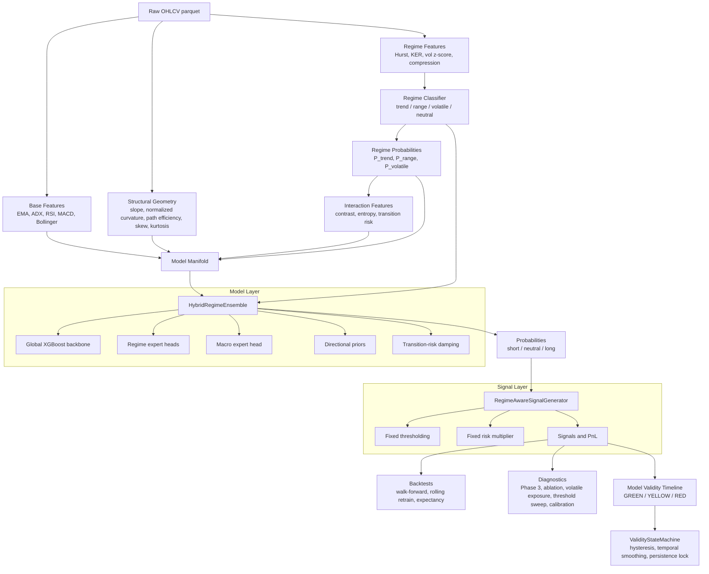

# QuantForge


QuantForge is a modular quantitative research framework for regime-conditioned FX strategy research. The current implementation focuses on EURUSD daily data and tests whether structural market geometry, regime conditioning, and model-validity gating can produce stable out-of-sample behavior under non-stationary market conditions.

This is a research system, not a production trading bot. The current stack is designed to answer three questions:

- Does price geometry contain predictive signal?
- Does regime structure preserve value or only add complexity?
- When is the model environment compatible enough to allocate risk?

---

## Current Architecture

```text
Raw OHLCV
  -> Base features
  -> Regime features and labels
  -> Structural geometry features
  -> Regime interaction features
  -> Hybrid regime ensemble (global XGBoost + regime experts + macro head)
  -> Fixed downstream signal policy
  -> Expectancy / walk-forward / validity diagnostics
```

The current design separates model roles:

- Geometry features are the primary alpha representation.
- Regime classification acts as structural conditioning and exposure allocation.
- Signal generation uses one routing decision point inside the ensemble.
- Diagnostics decide whether the system should be trusted in a given market era.

---

## System Architecture



### Control Flow

The system has three separate control layers:

1. **Prediction control**: the hybrid ensemble decides how much the global model, regime experts, and macro expert contribute.
2. **Execution control**: the signal generator converts probabilities into fixed-threshold signals.
3. **Validity control**: diagnostics feed a state machine that classifies whether the current market era should receive full, reduced, or no capital allocation.

The validity layer is observer-only. It does not retrain models, tune thresholds, or change features. Its job is to classify whether the current market era should receive full, reduced, or no capital allocation.

### Data Contracts

The main model manifold combines:

```text
base indicator features
+ regime probability features
+ structural geometry features
+ regime interaction features
+ macro features (rate_diff, dxy_mom, yield_slope)
```

The regime classifier requires raw regime inputs such as:

```text
hurst, kaufman_er, adx, vol_zscore, compression
```

The walk-forward validator keeps these contracts separate:

- `X`: model manifold passed to the ensemble
- `regime_features`: raw classifier inputs passed to the signal generator
- `regimes`: training labels used to fit regime experts

---

## Project Structure

```text
QuantForge/
|-- __init__.py
|-- main.py
|-- requirements.txt
|-- .gitignore
|
|-- backtests/
|   |-- expectancy_audit.py
|   |-- execution_simulator.py
|   |-- performance_metrics.py
|   |-- rolling_retrain.py           # Rolling retrain validator
|   |-- walk_forward.py
|
|-- configs/
|   |-- forex.yaml                   # Active config (EURUSD, GBPUSD, USDJPY, GC=F)
|   |-- crypto.yaml                  # Placeholder
|   |-- equities.yaml                # Placeholder
|   |-- metals.yaml                  # Placeholder
|
|-- data/
|   |-- loaders/
|   |   |-- downloader.py            # yfinance downloader
|   |   |-- macro_loader.py          # Macro factor loader
|   |-- raw/
|   |   |-- EURUSD_1d.parquet
|   |   |-- GBPUSD_1d.parquet
|   |   |-- GC=F_1d.parquet          # Gold futures
|   |-- processed/
|       |-- EURUSD_features.parquet
|       |-- EURUSD_regime_features.parquet
|       |-- EURUSD_regime_labels.parquet
|       |-- EURUSD_structural_features.parquet
|       |-- EURUSD_interaction_features.parquet
|       |-- EURUSD_labeled.parquet
|       |-- EURUSD_signals.parquet
|       |-- macro_factors.parquet
|       |-- macro_features.parquet
|
|-- diagnostics/
|   |-- cross_asset_test.py
|   |-- debug_mr.py
|   |-- model_validity_timeline.py
|   |-- phase3_validation.py
|   |-- probability_distribution.py
|   |-- psi_response_curves.py
|   |-- regime_ablation.py
|   |-- regime_audit.py
|   |-- signal_integrity_audit.py
|   |-- state_machine_calibration.py
|   |-- targeted_label_audit.py
|   |-- threshold_sweep.py
|   |-- validity_sensitivity.py
|   |-- volatile_exposure_test.py
|
|-- execution/
|   |-- broker_interface.py          # Placeholder
|   |-- order_manager.py             # Placeholder
|   |-- portfolio_sync.py            # Placeholder
|
|-- features/
|   |-- base_features.py
|   |-- cross_asset_features.py      # Placeholder
|   |-- interaction_features.py
|   |-- mean_reversion_features.py   # Placeholder
|   |-- regime_features.py
|   |-- structural_features.py
|   |-- trend_features.py            # Placeholder
|   |-- volatility_features.py       # Placeholder
|
|-- labels/
|   |-- meta_labels.py               # Placeholder
|   |-- triple_barrier.py            # Triple barrier labeling
|
|-- models/
|   |-- hybrid_ensemble.py           # HybridRegimeEnsemble (XGBoost)
|   |-- macro_expert_head.py         # Macro-protected expert head
|   |-- ensemble/
|   |   |-- model_router.py          # Placeholder
|   |-- regime/
|   |   |-- regime_classifier.py
|   |-- trend/
|   |   |-- trend_model.py
|   |-- mean_reversion/
|   |   |-- mr_model.py
|   |-- volatility/
|       |-- vol_model.py
|
|-- monitoring/
|   |-- drift_detection.py           # Placeholder
|   |-- live_dashboard.py            # Placeholder
|   |-- mlflow_logger.py             # Placeholder
|   |-- validity_state_machine.py    # GREEN/YELLOW/RED state machine
|
|-- notebooks/
|-- portfolio/
|   |-- correlation_clusters.py      # Placeholder
|   |-- hrp_allocator.py             # Placeholder
|   |-- risk_parity.py               # Placeholder
|
|-- risk/
|   |-- drawdown_controls.py         # Placeholder
|   |-- exposure_limits.py           # Placeholder
|   |-- position_sizing.py
|   |-- stop_engine.py               # Placeholder
|
|-- signals/
|   |-- signal_filters.py            # Placeholder
|   |-- signal_generator.py
|   |-- thresholding.py              # Placeholder
|
|-- tests/
```

---

## Feature Stack

### Base Features

Implemented in `features/base_features.py`:

- EMA spread
- ADX
- MACD difference
- RSI
- Bollinger z-score
- distance from EMA 20

### Regime Features

Implemented in `features/regime_features.py` and `models/regime/regime_classifier.py`:

- Hurst exponent
- Kaufman efficiency ratio
- ADX
- volatility z-score
- compression ratio
- session volatility profile
- probabilistic trend/range/volatile labels

The active regimes are:

- `trend`
- `range`
- `volatile`
- `neutral`

### Structural Geometry

Implemented in `features/structural_features.py`:

- rolling log-price slope
- scale-normalized curvature
- path efficiency
- rolling skew
- rolling kurtosis
- backward-looking tail ratio

Curvature is normalized by rolling log-price volatility so high-volatility periods do not dominate the geometry signal.

### Regime Interactions

Implemented in `features/interaction_features.py`:

- clipped regime contrast: `P_trend - P_range`
- EMA contrast
- slope contrast
- path efficiency contrast
- regime entropy
- transition risk

The regime ablation showed that these contrast features are useful as conditioning signals, especially `ema_contrast`.

### Macro Features

Implemented in `data/loaders/macro_loader.py`:

- rate differential
- DXY momentum
- yield curve slope
- VIX level

Used by the `MacroExpertHead` as a protected signal path that price noise cannot drown out.

---

## Data Layer

### Data Loading

`data/loaders/downloader.py` uses yfinance to download OHLCV data. Supported symbols:

- `EURUSD=X`
- `GBPUSD=X`
- `GC=F` (Gold futures)

`data/loaders/macro_loader.py` loads and aligns macro factor data.

### Label Generation

`labels/triple_barrier.py` implements triple barrier labeling with:

- profit-taking and stop-loss barriers
- vertical barrier timeout
- volatility-adjusted barrier widths

---

## Model Layer

### Hybrid Ensemble

Implemented in `models/hybrid_ensemble.py`.

The current model is a hybrid XGBoost ensemble:

- global backbone trained on all samples
- regime-specific expert heads where enough data exists
- recency-weighted samples
- model-layer directional priors
- transition-risk damping

### Macro Expert Head

Implemented in `models/macro_expert_head.py`.

A protected macro-only XGBoost expert trained exclusively on macro features (`rate_diff`, `dxy_mom`, `yield_slope`). Always fires at inference with a fixed blend weight so price noise cannot drown out the macro signal.

The regime layer is not treated as the main alpha source. Current diagnostics indicate it works better as a loss-prevention and exposure-allocation layer.

---

## Signal Layer

Implemented in `signals/signal_generator.py`.

The signal layer is intentionally simple:

- classify regime
- ask the hybrid ensemble for probabilities
- apply fixed probability thresholding
- apply fixed risk multiplier

Regime-specific routing happens once inside the ensemble. Downstream thresholding and risk sizing are kept stateless to avoid stacked regime decisions.

---

## Monitoring and Governance

### Validity State Machine

Implemented in `monitoring/validity_state_machine.py`.

Transforms point-in-time validity scores into state-based allocation decisions (GREEN / YELLOW / RED) with:

- hysteresis to prevent rapid flipping
- temporal smoothing
- regime persistence lock

### Model Validity Timeline

`diagnostics/model_validity_timeline.py` is the Phase 4 model-governance layer. It observes, scores, and classifies environment compatibility without changing model behavior.

Components:

- bounded performance score
- feature PSI
- regime distribution drift
- SHAP rank instability
- rolling consistency penalty
- GREEN/YELLOW/RED validity state

### State Machine Calibration

`diagnostics/state_machine_calibration.py` identifies over-stabilization and provides adaptive parameter recommendations for the validity state machine.

---

## Diagnostics

### Phase 3 Validation

Run:

```bash
export PYTHONPATH=$PYTHONPATH:. && python diagnostics/phase3_validation.py
```

Checks:

- no single feature dominates more than 40%
- path efficiency is used by at least one model
- transition risk reduces false positives around regime switches
- curvature SHAP importance beats a noise baseline
- trend/range/volatile directional consistency gates

Latest result:

```text
PHASE 3 STATUS: PASS
```

### Regime Ablation

Run:

```bash
export PYTHONPATH=$PYTHONPATH:. && python diagnostics/regime_ablation.py
```

This removes explicit regime-derived inputs and compares the no-regime model against the regime-aware path.

Latest interpretation:

- Regime structure is not the main alpha source.
- Regime structure improves participation and profit factor.
- Regime acts as structural conditioning and risk allocation.

### Probability Distribution

Run:

```bash
export PYTHONPATH=$PYTHONPATH:. && python diagnostics/probability_distribution.py
```

Compares model probability distributions with and without macro features.

### Threshold Sweep

Run:

```bash
export PYTHONPATH=$PYTHONPATH:. && python diagnostics/threshold_sweep.py
```

Systematically evaluates signal thresholds across `0.45` to `0.80` to identify optimal probability cutoffs.

### Cross-Asset Test

Run:

```bash
export PYTHONPATH=$PYTHONPATH:. && python diagnostics/cross_asset_test.py
```

Validates regime classification stability across EURUSD, GBPUSD, and Gold. Checks volatile proportion separation between assets.

### VOLATILE Exposure Test

Run:

```bash
export PYTHONPATH=$PYTHONPATH:. && python diagnostics/volatile_exposure_test.py
```

This freezes walk-forward probabilities and tests VOLATILE-only execution treatments:

- current threshold
- forced small exposure
- threshold sweep
- volatility-proportional sizing

Latest interpretation:

- forced exposure degrades results
- threshold relaxation around `0.36` showed conditional edge
- VOLATILE is undergated, not broadly directionally predictable

### Model Validity Timeline

Run:

```bash
export PYTHONPATH=$PYTHONPATH:. && python diagnostics/model_validity_timeline.py
```

Latest EURUSD classification:

```text
2019  YELLOW
2020  YELLOW
2021  YELLOW
2022  RED
2023  YELLOW
2024  RED
2025  RED
2026  YELLOW
```

The timeline identifies 2022, 2024, and 2025 as model-validity failure periods.

### Additional Diagnostics

- `regime_audit.py` -- standalone regime distribution audit
- `signal_integrity_audit.py` -- signal consistency checks
- `validity_sensitivity.py` -- sensitivity analysis of validity scoring
- `psi_response_curves.py` -- population stability index response analysis
- `targeted_label_audit.py` -- label quality audit
- `debug_mr.py` -- mean reversion debug tool

---

## Backtesting

Run the current walk-forward validation:

```bash
export PYTHONPATH=$PYTHONPATH:. && python backtests/walk_forward.py
```

Latest EURUSD walk-forward summary:

```text
2019   expectancy  0.000312   PF 1.30   trades 253
2020   expectancy  0.000239   PF 1.19   trades 201
2021   expectancy  0.000241   PF 1.21   trades 122
2022   expectancy -0.000466   PF 0.82   trades 259
2023   expectancy -0.000070   PF 0.96   trades 191
2024   expectancy -0.000273   PF 0.82   trades 212
2025   expectancy -0.000766   PF 0.63   trades 88
2026   expectancy  0.001371   PF 3.01   trades 24
```

Interpretation:

- 2019-2021 are the strongest stable period.
- 2022-2025 show structural degradation.
- 2026 is encouraging but too small to validate.

Rolling retrain validation (alternative to walk-forward):

```bash
export PYTHONPATH=$PYTHONPATH:. && python backtests/rolling_retrain.py
```

Uses 18-month train / 3-month validation / 6-month test windows with 6-month step.

---

## Research Workflow

Recommended loop:

```text
1.  Download or refresh data
2.  Load macro factors
3.  Generate base, regime, structural, and interaction features
4.  Generate labels (triple barrier)
5.  Train hybrid ensemble (with optional macro expert head)
6.  Generate signals
7.  Run expectancy audit
8.  Run walk-forward or rolling retrain validation
9.  Run Phase 3 validation
10. Run ablations and diagnostics
11. Run model validity timeline
12. Calibrate validity state machine
```

Useful commands:

```bash
export PYTHONPATH=$PYTHONPATH:. && python data/loaders/downloader.py
export PYTHONPATH=$PYTHONPATH:. && python features/structural_features.py
export PYTHONPATH=$PYTHONPATH:. && python features/interaction_features.py
export PYTHONPATH=$PYTHONPATH:. && python labels/triple_barrier.py
export PYTHONPATH=$PYTHONPATH:. && python models/hybrid_ensemble.py
export PYTHONPATH=$PYTHONPATH:. && python signals/signal_generator.py
export PYTHONPATH=$PYTHONPATH:. && python backtests/expectancy_audit.py
export PYTHONPATH=$PYTHONPATH:. && python backtests/walk_forward.py
export PYTHONPATH=$PYTHONPATH:. && python backtests/rolling_retrain.py
```

---

## Configuration

Asset universe and trading parameters are defined in `configs/forex.yaml`:

```yaml
symbols:
  - EURUSD=X
  - GBPUSD=X
  - USDJPY=X
  - GC=F
timeframe: 1h
risk_per_trade: 0.005
slippage_bps: 1.5
```

---

## Installation

```bash
git clone <repo_url>
cd QuantForge
python3 -m venv .venv
source .venv/bin/activate
pip install -r requirements.txt
```

Basic smoke test:

```bash
python main.py
```

Most research scripts expect repository-root imports:

```bash
export PYTHONPATH=$PYTHONPATH:.
```

---

## Current Research State

What is working:

- structural geometry features are implemented
- regime-conditioned feature coupling is implemented
- hybrid global/expert ensemble is implemented
- macro expert head as protected signal path
- triple barrier labeling
- Phase 3 validation passes
- regime ablation confirms the regime layer adds value as conditioning
- model validity timeline identifies non-stationary failure periods
- validity state machine with hysteresis and temporal smoothing
- cross-asset regime audit (EURUSD, GBPUSD, Gold)
- probability distribution analysis with/without macro features

Current bottlenecks:

- VOLATILE participation is fragile and sample-limited
- 2022-2025 EURUSD behavior breaks the learned mapping
- current validity layer is diagnostic only, not yet connected to allocation
- cross-asset validation is still early
- most execution/portfolio/risk modules are stubs

Near-term research direction:

- make VOLATILE threshold policy config-driven
- stabilize per-window expectancy before portfolio allocation
- expand validation to GBPUSD and Gold
- use the model validity timeline as a capital gating layer via the state machine
- calibrate state machine parameters for responsiveness vs stability
- populate execution, portfolio, and risk placeholders

---

## Disclaimer

This project is for research, experimentation, and education.

Nothing here is financial advice or a guarantee of profitability. Markets are noisy, adversarial, and non-stationary. Past performance does not imply future results.

---

## Author

Built by MktOwl.
