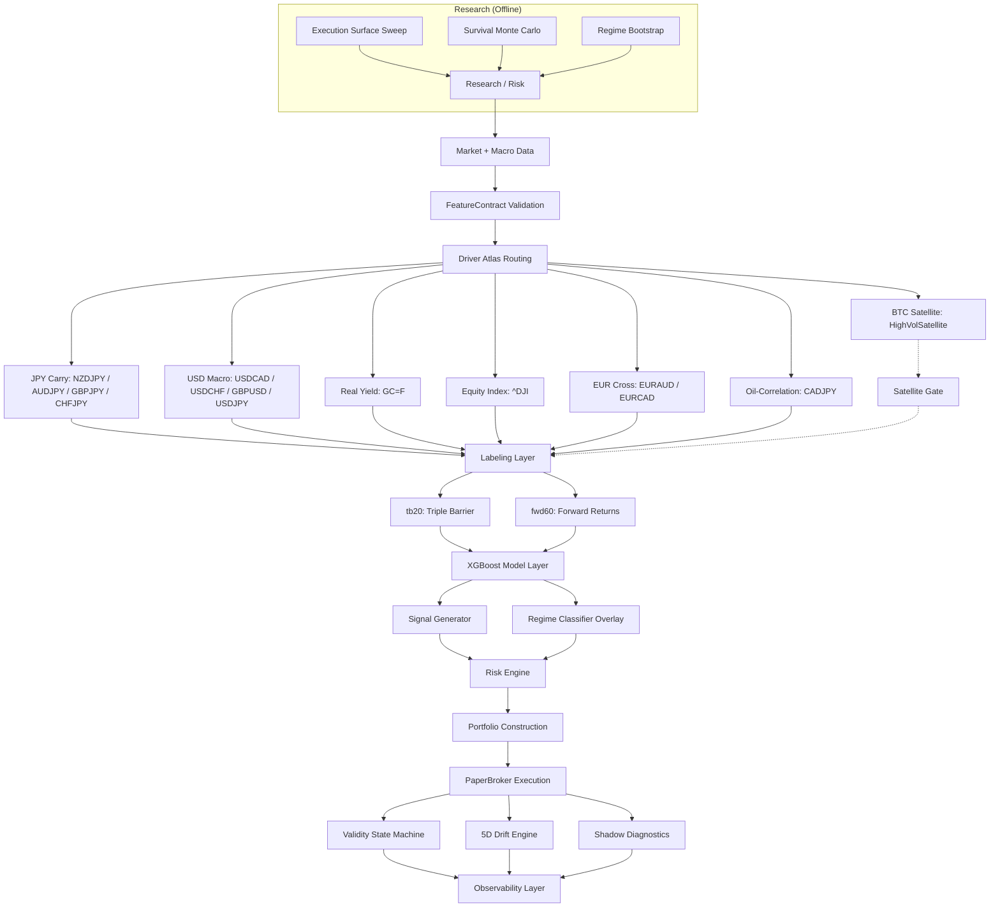

# QUANTFORGE


---

## 1. SYSTEM OVERVIEW

QuantForge is an adaptive multi-asset macro research and portfolio simulation platform with **governance-driven execution control and stress-conditioned survival modeling**.

| Layer | Purpose |
|-------|---------|
| **Features** | Deterministic macro-conditioned signals under strict schema contracts |
| **Models** | Probabilistic directional inference via XGBoost (BUY / HOLD / SELL) |
| **Governance** | 7-layer suppression under instability — see [docs/GOVERNANCE_LAYER.md](docs/GOVERNANCE_LAYER.md) |
| **Simulation** | Adversarial survival testing with execution physics and deleveraging feedback |
| **Execution** | Paper trading with mark-to-market PnL, SL/TP surface optimization, portfolio construction |
| **Telemetry** | Shadow analytics, drift detection, importance tracking, deterministic replay |

### Design Philosophy

- **Execution realism over nominal CAGR** — simulated fills, spread expansion, gap risk, partial fill decay
- **Survival under stress over historical fit** — adversarial perturbation, not backtest R²
- **Governance as primary component** — validity state machines, stability penalties, meta-labeling, narrative + liquidity governance
- **Portfolio topology over standalone alpha** — assets selected for marginal contribution to portfolio risk, not individual Sharpe

---

## 2. ARCHITECTURE



See [docs/SYSTEM_OVERVIEW.md](docs/SYSTEM_OVERVIEW.md) for full component details.

---

## 3. GETTING STARTED

```bash
git clone https://github.com/user/quantforge.git && cd quantforge
python -m venv .venv && source .venv/bin/activate
pip install -r requirements.txt
export FRED_API_KEY=your_key
./monitor_all                              # start engine + dashboard
# Dashboard: http://localhost:5000
```

**Rebuild frontend after changes:** `(cd paper_trading/dashboard && yarn build)`
**Run tests:** `pytest tests/ -q --tb=short`

### Environment

| Var | Required | Purpose |
|-----|----------|---------|
| `FRED_API_KEY` | Yes | Macro data (yields, VIX, DXY) |
| `OPENCODE_ZEN_API_KEY` | No* | Weekly LLM narrative extraction |
| `PYTHONPATH` | Yes | `PYTHONPATH=.` |
| `QUANTFORGE_REFRESH_INTERVAL` | No | Engine loop interval (default 300s) |

*\*Without OPENCODE_ZEN_API_KEY, narrative governance skips LLM call and uses neutral defaults.*

---

## 4. LIVE PORTFOLIO

13-asset continuously evaluated simulation with regime-optimized SL/TP (sl=0.30, sweep-derived TP per asset). BTC isolated in satellite bucket.

| Asset | Alloc | sl_mult | tp_mult | R:R | Scale-out | Regime-tuned |
|-------|-------|---------|---------|:---:|-----------|--------------|
| EURAUD | 12% | 0.30 | 1.00 | 1:3.3 | 4-tier | yes |
| GC | 13% | 0.30 | 1.50 | 1:5.0 | no | yes |
| NZDJPY | 11% | 0.30 | 1.75 | 1:5.8 | 4-tier | yes |
| CADJPY | 9% | 0.30 | 1.25 | 1:4.2 | 4-tier | yes |
| USDCAD | 8% | 0.30 | 1.50 | 1:5.0 | 4-tier | yes |
| GBPJPY | 8% | 0.30 | 1.25 | 1:4.2 | 4-tier | yes |
| CHFJPY | 7% | 0.30 | 1.00 | 1:3.3 | no | yes |
| AUDJPY | 6% | 0.30 | 1.75 | 1:5.8 | 4-tier | yes |
| EURCAD | 5% | 0.30 | 1.75 | 1:5.8 | 4-tier | yes |
| ^DJI | 5% | 0.30 | 1.50 | 1:5.0 | 4-tier | yes |
| GBPUSD | 5% | 0.52 | 1.97 | 1:3.8 | 4-tier | no |
| USDJPY | 4% | 0.30 | 1.00 | 1:3.3 | no | yes |
| USDCHF | 4% | 0.30 | 1.75 | 1:5.8 | 4-tier | yes |

**BTC satellite**: 5% AUM cap, vol target 40%, drawdown limit 25%, 5-condition AND gate.

---

## 5. KEY CONFIGURATION

Reference for `configs/paper_trading.yaml`. See [docs/PAPER_TRADING_RUNBOOK.md](docs/PAPER_TRADING_RUNBOOK.md) for full details.

| Key | Default | Description |
|-----|---------|-------------|
| `capital` | 100000 | Starting capital |
| `position_size` | 0.95 | Capital utilization cap |
| `halt.drawdown` | -0.08 | Per-asset drawdown halt |
| `portfolio_drawdown_limit` | -0.15 | Portfolio circuit breaker |
| `narrative_config.enabled` | true | Weekly macro narrative |
| `narrative_config.geopol_sl_widen_pct` | 10 | SL widen on geopol risk > 0.7 |
| `narrative_config.risk_off_size_reduce_pct` | 20 | Size reduce on risk_off |
| `narrative_config.min_confidence` | 0.6 | Min LLM confidence |
| `liquidity_config.enabled` | true | Per-tick liquidity regime |
| `liquidity_config.volume_z_thin_threshold` | -1.5 | Volume z → THIN |
| `liquidity_config.amihud_high_threshold` | 1.5 | Amihud z → THIN |
| `liquidity_config.stressed_sl_widen_pct` | 30 | SL widen in STRESSED |

---

## 6. GOVERNANCE LAYERS

| Layer | Frequency | Scope | Effect | Docs |
|---|---|---|---|---|
| Validity state machine | Per tick | Per asset | Exposure 0–100% | — |
| Feature stability | Per retrain | Per asset | Validity penalty | — |
| Meta-labeling | Per signal | Per asset | Trade skip | — |
| Macro narrative | Weekly | Global | SL +10%, size −20% | `features/macro_narrative.py` |
| Liquidity regime | Per signal | Per asset | SL +15/30%, size −15/30%, halt | `features/liquidity_regime.py` |
| PSI drift | Per cycle | Per asset | Validity penalty, halt at 3+ SEVERE | `monitoring/psi_monitor.py` |

Multiplicative chain: `final_sl = base × regime_geom × narrative_sl × liquidity_sl`  
Validity stacking: stability penalty + PSI penalty + halt penalties (additive, worst-wins at layer level)

Full detail: [docs/GOVERNANCE_LAYER.md](docs/GOVERNANCE_LAYER.md)

---

## 7. FEATURE ENGINEERING

FeatureContract system enforces deterministic train/serve parity with cross-asset isolation. 13 feature modules produce macro-conditioned signals under strict schema contracts. Driver atlas routes per-asset feature subspaces.

Full detail: [docs/FEATURES.md](docs/FEATURES.md)

---

## 8. MODEL ARCHITECTURE

**XGBoost** multiclass classifier (BUY / HOLD / SELL) with 300 trees, max_depth=2, learning_rate=0.02. Optional macro expert head with adaptive blend weight. Strategy interfaces via `shared/` abstract base classes.

Full detail: [docs/ARCHITECTURE_FOUNDATIONS.md](docs/ARCHITECTURE_FOUNDATIONS.md)

---

## 9. HARDENING ROADMAP

| Tier | Capability |
|------|------------|
| **1** | Cross-asset feature isolation, regime sizing, circuit breaker, trade quality gates |
| **2** | Vol-z spread model, square-root impact, ExecutionBridge |
| **3A** | Extended history (2000+, Sharpe 6.26, 0% ruin) |
| **3B** | Lead-lag matrix (205 relationships, 8 live edges) |
| **3C** | Adaptive macro expert weight |
| **4** | Scale-out + trailing, probability-based SL/TP, shadow SL/TP analytics |
| **5** | Macro narrative governance (weekly LLM overlay) |
| **6** | Liquidity regime model (volume/Amihud proxy) |
| **7** | PSI drift monitoring (fixed-width bin distribution shift detection) |

Full detail: [docs/HARDENING_ROADMAP.md](docs/HARDENING_ROADMAP.md)

---

## 10. SURVIVAL SIMULATION

Multi-layer survival framework at `research/risk/` with execution physics, regime-aware bootstrap, and deleveraging feedback. Validated across 5000 correlated paths.

**Key results:** Full Governance Sharpe 12.39 (vs Naked 6.06), 0% ruin, worst DD 5.2%. Extended history (25y): Sharpe 6.26, 0% ruin.

Full detail: [docs/SURVIVAL_SIMULATION.md](docs/SURVIVAL_SIMULATION.md)

---

## 11. SYSTEM INVARIANTS

- No train/serve skew (FeatureContract enforced)
- No look-ahead in feature construction (macro data lagged to publication)
- Deterministic replay via simulation snapshot system
- Strict signal/execution separation
- Backtest/live parity (training labels = runtime multipliers)
- Hysteresis-gated state transitions (no rapid flipping)
- Position manager as pure state machine (no I/O)
- Worst-wins penalty aggregation
- Synthetic stress capped at 25% of original series length
- Multiplicative governance layering: each layer independently configurable and gated

---

## 12. INFRASTRUCTURE

- Stateless inference, stateful execution with crash-safe snapshots
- Local HTTP observability dashboard (React + Vite + Tailwind + react-query)
- In-memory TTL cache with per-endpoint expiry (5-30s), gzip compression
- Configurable refresh interval via `QUANTFORGE_REFRESH_INTERVAL`
- JSONL decision tracing

---

## 13. KNOWN CONSTRAINTS

- Paper trading only (no live capital)
- Data limited to Yahoo Finance + FRED
- EURUSD excluded (pending COT integration)
- ^DJI marginal contribution under watch (ΔSharpe −0.11)
- 19 unscreened pairs not yet evaluated

---

## 14. SYSTEM CLASSIFICATION

> Adaptive multi-asset macro research and portfolio simulation platform with governance-driven execution control and stress-conditioned survival modeling.

Distinguished from backtesting frameworks by treating governance as a primary system component, stress survival as the central validation criterion, and portfolio topology as the unit of analysis.

---

## 15. DISCLAIMER

Research system only. No live capital execution. Not financial advice. Historical simulation results are not indicative of future performance.
