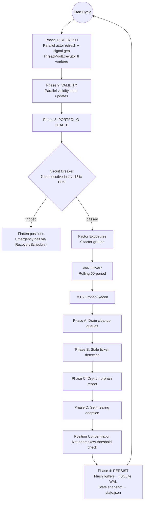
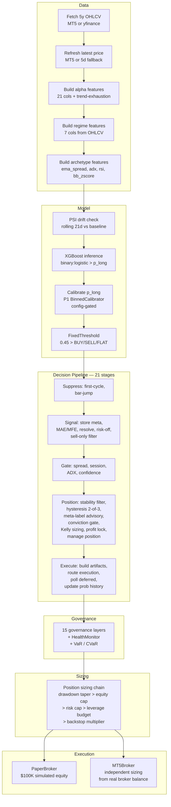
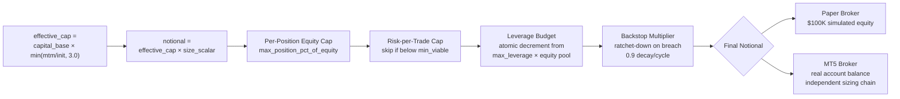

# QuantForge


[](https://codecov.io/gh/manuelhorvey/QuantForge)


---

Cross-sectional multi-asset research and paper trading engine with walk-forward asset selection, per-asset XGBoost models, 15-layer governance + HealthMonitor circuit breaker, decision pipeline suppression stages (including sell-only filter for 5 assets with inverted BUY calibration), MetaTrader 5 bridge execution (with full order lifecycle support), and a React dashboard.

---

# Design Philosophy

> alpha is fragile; infrastructure robustness matters more.

The system prioritizes:

* walk-forward validation,
* deterministic execution,
* train/serve symmetry,
* replayability,
* governance layering,
* per-asset isolation,
* and operational observability

over maximizing in-sample returns.

Every promoted asset must survive expanding-window validation before entering the live paper portfolio. Runtime execution is treated as a systems-engineering problem rather than purely a signal-generation problem.

---

# System Lifecycle

The engine runs a continuous 4-phase orchestrator cycle. Below is the core loop for each tick (every 30s):



---

# Current Portfolio

21 assets promoted from the research universe via expanding-window walk-forward. Per-asset SL/TP/max_depth calibrated via grid sweep. Values sourced from `configs/paper_trading.yaml`.

**Added 2026-06-22:** GBPUSD promoted (walk-forward IC 0.186, HR 0.371, pt_sl=(1.97, 0.52) → R:R=3.79).

**Added 2026-06-26:** USDJPY and GBPJPY promoted (trend-exhaustion features improved BuyWR above breakeven; removed from SELL_ONLY same day).

**2026-06-30:** 11 assets bumped to ratio=3.0 via optimizer (USDCAD, ES, NQ, GBPCAD, NZDCAD, NZDUSD, GBPAUD, AUDUSD, EURCAD, EURNZD, GBPCHF). All 21 models retrained. Dashboard `/optimization.json` endpoint added. Full optimizer suite in `scripts/optimization/`.

**Removed 2026-06-20:** AUDNZD, EURUSD, AUDCHF, GBPNZD (directional instability failure mode — confident wrong-direction bets during trends). USDCAD and NZDUSD allocations halved from 5%→2.5% to limit drawdown impact.

> **2026-06-30 update:** Portfolio table reflects the ratio=3.0 optimizer pass (11 assets bumped).
> Methodology: `scripts/optimization/portfolio_sltp_optimizer.py`. All models retrained.

| Asset      | Ticker       | sl_mult | tp_mult | Allocation | max_depth |
| ---------- | ------------ | ------- | ------- | ---------- | --------- |
| GC         | GC=F         | 1.00    | 4.00    | 7.0%       | 2         |
| USDCHF     | USDCHF=X     | 0.85    | 3.00    | 4.0%       | 4         |
| USDCAD     | USDCAD=X     | 1.30    | 3.90    | 2.5%       | 5         |
| ES         | ES=F         | 1.91    | 5.74    | 7.0%       | 2         |
| NQ         | NQ=F         | 2.04    | 6.12    | 7.0%       | 2         |
| GBPCAD     | GBPCAD=X     | 1.45    | 4.34    | 5.0%       | 2         |
| NZDCAD     | NZDCAD=X     | 1.83    | 5.48    | 5.0%       | 2         |
| ^DJI       | ^DJI         | 0.50    | 4.00    | 4.0%       | 4         |
| NZDUSD     | NZDUSD=X     | 1.29    | 3.87    | 2.5%       | 5         |
| GBPAUD     | GBPAUD=X     | 1.00    | 3.00    | 5.0%       | 3         |
| NZDCHF     | NZDCHF=X     | 1.00    | 4.00    | 7.0%       | 2         |
| CADCHF     | CADCHF=X     | 1.00    | 4.00    | 5.0%       | 2         |
| AUDUSD     | AUDUSD=X     | 1.41    | 4.24    | 4.0%       | 2         |
| EURCHF     | EURCHF=X     | 1.00    | 3.00    | 5.0%       | 4         |
| EURCAD     | EURCAD=X     | 0.71    | 2.12    | 2.0%       | 3         |
| EURNZD     | EURNZD=X     | 1.12    | 3.36    | 3.0%       | 3         |
| GBPCHF     | GBPCHF=X     | 0.82    | 2.45    | 3.0%       | 2         |
| GBPUSD     | GBPUSD=X     | 0.52    | 1.97    | 4.0%       | 2         |
| EURAUD     | EURAUD=X     | 0.54    | 1.77    | 1.0%       | 2         |
| USDJPY     | USDJPY=X     | 0.52    | 1.97    | 4.0%       | 2         |
| GBPJPY     | GBPJPY=X     | 0.50    | 2.22    | 3.0%       | 2         |

Allocation sums to ~0.90. Remaining capacity held as cash buffer.

### Backtest Performance (pre-leak-fix baseline — 5-Year 2021–2025, 18-asset portfolio)

> Metrics from the original screening (before look-ahead leak fixes). Current walk-forward
> diagnostics (post-fix, 19-asset portfolio) show lower, honest metrics. These numbers are preserved as the
> baseline that justified promotion; live performance will differ.

> **Note:** The original 18-asset baseline was calculated before GBPUSD promotion.
> The current 19-asset portfolio includes GBPUSD with its own walk-forward validation.

| Metric | Value |
|--------|-------|
| Profit factor | 1.908 |
| Avg R | +0.268 |
| All assets positive | 19/19 |
| Total trades | 2383 |

---

# MT5 Bridge Integration

QuantForge can route data fetching and order execution through a live MetaTrader 5 terminal (Exness demo) running under Wine.

## Architecture

```
Linux Host                          Wine Prefix
┌─────────────┐                ┌──────────────────────┐
│ Engine      │── TCP :9879 ──▶│ mt5_bridge.py        │
│ mt5_client  │◀───────────────│ (Python 3.12 via      │
│ (Python)    │                │  Wine → MetaTrader5)  │
└─────────────┘                ├──────────────────────┤
                               │ MetaTrader 5 terminal │
                               │ terminal64.exe        │
                               │ (Exness demo account) │
                               └──────────────────────┘
```

## Capabilities

* Real-time price streaming (bid/ask)
* Historical OHLCV and tick data
* Account info and position management
* Market order placement with SL/TP
* Trailing stop and post-entry SL/TP modification
* Position closing on flip, SL, TP, and time-stop

## Symbol Mapping

QuantForge tickers (e.g. `GC=F`) are mapped to MT5 symbols (e.g. `XAUUSD`) via `configs/mt5_symbol_map.yaml`.

## Capital Sync & Independent Sizing

Paper and MT5 equity are tracked independently. Paper sizing always uses the simulation's mtm_value ($100K initial capital), tracking its own peak equity and drawdown. MT5 sizing independently queries the real broker account balance at submission time for its own position size computation.

Paper and MT5 positions are sized through separate guardrail chains:

| Guardrail | Paper | MT5 (independent) |
|-----------|-------|--------------------|
| Equity basis | `sum(asset.mtm_value)` (~$100K) | `broker.get_account_summary().portfolio_value` (~$107) |
| Drawdown taper | Paper peak equity drawdown | MT5Broker._peak_equity drawdown |
| Per-position cap | `min(notional, max_position_pct × equity)` | Same formula with MT5 equity |
| Risk-per-trade cap | `risk ≤ max_risk_pct × equity`; skip if below min_viable | Same with MT5 equity |
| Leverage budget | Atomic lock decrement from shared pool | Deferred (0.01 lot minimum makes desired-vs-actual diverge) |
| Backstop multiplier | EngineOrchestrator Phase 3 | Not applied (MT5 too small) |

---

# Model Architecture

Each asset runs an independent XGBoost model with per-asset configuration.

**Training** (backtest): `binary:logistic` — binary classifier trained on {-1, 1} labels after dropping HOLD. Legacy research scripts use `multi:softprob`.
**Live inference**: `binary:logistic` — trained on {-1, 1} labels after dropping HOLD.

```text
Base model:    XGBClassifier (binary:logistic, 300 trees, LR=0.02, depth 2-5)
Regime model:  XGBClassifier (binary:logistic, 200 trees, LR=0.03, depth=2)
Ensemble:      disabled portfolio-wide (base_weight=1.0; see ADR-026)
```

### Base Model
Per-asset `binary:logistic` classifier trained on 13 alpha features (9 per-asset + 4 cross-asset, includes COT flag, `has_cot` zero-filled for pairs not in CFTC data).
Uses `scale_pos_weight` = imbalance ratio to correct the label skew.
Saved to `paper_trading/models/{ASSET}_model.json`.

### Regime-Conditional Model
Second `binary:logistic` classifier trained on the same alpha features **plus** 7 regime
features (hurst, kaufman_er, adx, vol_zscore, compression, utc_hour, session_vol_profile).
Generates a separate P(LONG) conditioned on market regime context.
Saved to `models/regime/{ASSET}_regime.json`. Requires `scripts/training/train_regime_models.py` to generate.
Not currently loaded in production (ensemble disabled).

### Ensemble (Disabled 2026-06-20)
Ensemble was disabled portfolio-wide after walk-forward validation showed
+2.5% PnL improvement (p=0.0446, fails Bonferroni correction against prior
IC test p=0.83) did not justify 22 extra model loads and debug surface.
See `docs/adr/ADR-026-ensemble-disabled.md` for full decision record and
re-enable criteria.

No shared multi-asset model exists.

---

## Portfolio Maturity Framework (P0–P4)

The system implements a 5-layer portfolio maturity framework (P0–P4). Each layer is
config-gated — no behavior change until explicitly enabled.

### P0 — Portfolio Truth Layer (enabled: `factor_constrained_v2`)
**File:** `shared/portfolio_weights.py`

Pure function weight computation. 8 registered strategies:

| Method | Description | Status |
|--------|-------------|--------|
| `equal_v1` | Simple 1/N allocation | Available |
| `risk_parity_v1` | Equal risk contribution via scipy SLSQP | Available |
| `risk_parity_v2` | Ledoit-Wolf shrinkage covariance | Available |
| `risk_parity_v3` | EWMA span=60 covariance | Available |
| `hrp_v1` | Lopez de Prado HRP with deterministic `optimal_leaf_ordering` | Available |
| `factor_constrained_v1` | Risk parity with factor exposure penalty (legacy) | Legacy |
| `factor_constrained_v2` | Risk parity with hard linear inequality constraints — binds CHF ≤0.20 | **Default** |
| `conviction_weighted_v1` | Risk parity tilted by model conviction scores | Available |

**Integration:** `engine_rebalance_service.py` reads `portfolio.weight_method` from config,
calls `compute_weights()` on schedule. Pure functions — same returns → same weights.

### P1 — Calibration Layer (enabled)
**Files:** `shared/calibration/` — `BinnedCalibrator`, `CalibrationRegistry`, `ECETracker`

Raw XGBoost probabilities are binned-calibrated per asset. Applied in `pipeline.py`
after `_run_inference()`, before the decision pipeline.

- **ECE reduction**: 0.36 → 0.02 (94.3% avg, 19/19 assets >80%)
- **Config:** `calibration.enabled: true`, `calibration.method: binned`, `calibration.n_bins: 10`
- **Training:** `scripts/training/train_calibration.py` — fits calibrators from walk-forward parquets

### P2 — Fractional Kelly Sizing (disabled)
**File:** `shared/kelly.py`

Converts calibrated probability + TP/SL barriers → position size multiplier.
Kelly multiplier flows through `_composite_size_scalar()` before position caps.

```
f* = p - q × sl_mult / tp_mult
edge = p × tp_mult - q × sl_mult
```

- **Status:** Disabled pending 2+ weeks live data to validate calibration-vs-win-rate alignment
- **Config:** `kelly.enabled: false`

### P3 — Factor Model (enabled for monitoring)
**File:** `shared/factor_model.py`

9 factor groups (USD, EUR, AUD, NZD, CHF, CAD, GBP, US_EQUITY, COMMODITY)
covering all 19 assets. Factor exposures computed per-cycle in `engine_state_service.py`.

### P4 — HRP Fix
**File:** `portfolio/hrp_allocator.py`

`_get_quasi_diag()` uses `optimal_leaf_ordering` for deterministic dendrogram
leaf order, fixing arbitrary weight volatility from near-singular correlation matrices.
17 tests confirm deterministic output.

---

# Feature Engineering

Three feature sets feed the inference pipeline: alpha, regime, and archetype.

## Alpha Features

Built in `features/alpha_features.py:build_alpha_features()`.
21 features per asset (17 per-asset + 4 cross-asset, includes 6 trend-exhaustion features added 2026-06-26):

| Feature | Description |
|---------|-------------|
| `{ASSET}_carry_vol_adj` | Volatility-adjusted carry |
| `{ASSET}_mom_21d` | 21-day momentum |
| `{ASSET}_mom_63d` | 63-day momentum |
| `{ASSET}_mom_126d` | 126-day momentum |
| `{ASSET}_mom_252d` | 252-day momentum |
| `{ASSET}_zscore_20` | 20-day z-score vs SMA |
| `{ASSET}_vol_ratio` | Short/long-term vol ratio |
| `{ASSET}_dow_signal` | Day-of-week encoding |
| `{ASSET}_has_cot` | COT data availability flag (zero-filled for pairs not in CFTC data) |
| `{ASSET}_cot_z` | COT speculative positioning z-score |
| `{ASSET}_cot_change_4w` | 4-week change in COT net positioning |
| `{ASSET}_macd_hist` | MACD histogram / close — trend exhaustion |
| `{ASSET}_stoch_k` | Stochastic %K — overbought/oversold |
| `{ASSET}_stoch_d` | Stochastic %D — signal line confirmation |
| `{ASSET}_bb_pct_b` | Bollinger Band %B — extreme range detection |
| `{ASSET}_adx_slope` | ADX rate of change — trend acceleration/deceleration |
| `{ASSET}_rsi_divergence` | RSI divergence (-1/0/+1) — bullish/bearish exhaustion |
| `dxy_mom_21d` | DXY 21-day return |
| `vix_mom_5d` | VIX 5-day return |
| `spx_mom_5d` | SPX 5-day return |
| `WTI_mom_21d` | WTI crude 21-day return |

> **Note:** All per-asset features use the `CLOSE_` prefix (e.g. `CLOSE_carry_vol_adj`) rather than the asset ticker, because the pipeline passes a single-column DataFrame named `"close"` to `build_alpha_features()`. The `{ASSET}_` placeholder in this table is documentation shorthand — actual model files contain `CLOSE_*` columns.

## Regime Features (inference + regime model training)

Built in `features/regime_features.py:generate_regime_features()` from OHLCV.
7 features prefixed with `{ASSET}_`:

| Feature | Description |
|---------|-------------|
| `hurst` | Hurst exponent — trending (H>0.5) vs mean-reverting (H<0.5) |
| `kaufman_er` | Kaufman efficiency ratio |
| `adx` | ADX(14) — trend strength |
| `vol_zscore` | Volatility shock detection (vol_10 / vol_21) |
| `compression` | Vol compression ratio (ATR_5 / ATR_20) |
| `utc_hour` | UTC hour of bar timestamp |
| `session_vol_profile` | Hourly vol relative to 20-day norm |

Used by the regime-conditional XGBoost model. The base model ignores these.

## Archetype Features (inference-only)

Derived from OHLCV for execution conditioning:
- EMA spread, ADX(14), RSI(14), Bollinger z-score

---

# Inference Pipeline

Each per-asset inference cycle follows this flow (every 30s per asset, 8 parallel workers):



---

# Execution Architecture

```
TradeDecision
      ↓
EntryOptimizer
      ↓
ExecutionPolicyLayer
      ↓
_can_enter()  (single entry authority)
      ↓
PositionManager → Position Sizing Chain
      ↓
Attribution Engine
```

Orders route through either:
- **PaperBroker** — simulated fills with slippage and market impact
- **MT5Broker** — live Exness demo via Wine bridge

## Entry Gates

Two additional gates protect entry quality and existing winners:
- **Entry price deviation gate** (`entry_service.py`): before submitting to MT5, compares current market price to the signal's reference price. If deviation exceeds `max_entry_slippage_pct` (default 2%), the entry is skipped — prevents entering far from the signal price due to gaps, reconnects, or execution lag.
- **Profit lock gate** (`decision_pipeline.py`): before flipping a position, checks unrealized PnL. If it exceeds `profit_lock_threshold_pct` (default 15%), the flip is blocked — lets SL/TP/trailing stop manage the exit instead of closing a winner for a new signal.

## Position Sizing Guardrails

Paper positions pass through a multiplicative guardrail chain in `_submit_to_broker()`:



MT5 positions run the same chain independently using real broker equity (minus the leverage budget). Both paths log decomposed factors (`SIZING` and `MT5_SIZING`).

## Key Invariants

### Single Entry Authority
All entry paths route through `_can_enter()`. No component may bypass centralized admission control.

### Immutable Execution Contract
```
PolicyDecision → FillResult → AttributionRecord
```
Execution artifacts are append-only and replay-safe.

### Train/Serve Symmetry
The same feature builder is used in both training and live inference.

### Replay-Oriented Persistence
Persistent state is stored in SQLite WAL mode with append-oriented semantics.

---

# Governance Framework

QuantForge uses independently configurable governance layers with worst-wins aggregation,
plus decision pipeline suppression stages, position sizing guardrails, and HealthMonitor circuit breaker.

## Governance Layers (15 + HealthMonitor)

| Layer                      | Frequency   | Scope     | Effect                              |
| -------------------------- | ----------- | --------- | ----------------------------------- |
| Exposure state machine     | Per tick    | Per asset | Exposure scaling                    |
| Feature stability          | Per retrain | Per asset | Validity penalty                    |
| Meta-labeling              | Per signal  | Per asset | Position scalar                     |
| Macro regime overlay       | Weekly      | Global    | Exposure + SL adjustments           |
| Liquidity regime           | Per signal  | Per asset | Exposure + halt logic               |
| PSI drift                  | Per cycle   | Per asset | Penalty + halt                      |
| Sell-only filter           | Per decision| Per asset | Override BUY→FLAT for 5 inverted-BUY assets |
| Calibration (P1)           | Per inference| Per asset | Remap raw p_long via BinnedCalibrator (config-gated, enabled) |
| Kelly sizing (P2)          | Per decision| Per asset | Scale position by Kelly criterion (config-gated, disabled) |
| Factor model (P3)          | Per cycle   | Portfolio | Factor exposures via 9 groups in state.json (monitoring only) |
| Equity cluster alarm       | Per cycle   | Global    | Flags ES/NQ/^DJI all same side (recommendation only) |
| Circuit breaker            | Per cycle   | Portfolio | Multi-condition: dd, vol spike, halt ratio, consecutive losses (threshold=7) |
| Portfolio drawdown         | Global      | Portfolio | Global throttling                   |
| Entry price deviation gate | Per entry   | Per asset | Skips entry if price drifted >2%    |
| Profit lock gate           | Per flip    | Per asset | Blocks flip if PnL >15%             |

**Live VaR/CVaR:** Rolling 60-period portfolio returns computed in Phase 3g. VaR(95) = 5th percentile, CVaR = mean of tail. Stored in `results["var_95"]` / `results["cvar_95"]`.

**RecoveryScheduler:** Exponential-backoff probe of halted actors in Phase 3g. Uses `is_due()`/`record_result()` to check re-enable timing.

**Schema migration:** SQLite state store at `DB_SCHEMA_VERSION = "2.0.0"` (up from implicit v1). Auto-migrates at connect time — adds `cycle_id` to trades, `vol_spike`/`var_95` to equity_history, and indexes.

## Decision Pipeline Stages

Applied in order within the decision pipeline (`DEFAULT_STAGES`):

| Stage                     | Effect                                  |
| ------------------------- | --------------------------------------- |
| First-cycle suppression   | Suppress trading on cold-start cycle 1  |
| Bar-jump suppression      | Suppress 60min if bar count changed >100 (data-source switch) |
| Store prediction metadata | Record pre-decision signal state        |
| Update MAE/MFE            | Update max adverse/favorable excursion  |
| Resolve signal            | Map proba to BUY/SELL/FLAT via FixedThresholdStrategy(0.45) |
| Risk-off suppression      | Flat AUDUSD when VIX>0 & SPX<0          |
| Sell-only filter          | Override BUY→FLAT for 5 inverted-BUY assets |
| Spread gate               | Block entry if spread > per-class threshold (observe 720 cycles) |
| Session gate              | Block entry outside market session hours per asset-class tier (observe 720 cycles) |
| ADX entry gate            | Block entry if ADX below threshold (observe-only, disabled by default) |
| Confidence gate           | Abort if net confidence below threshold |
| Signal stability filter   | Require >0.65 max(prob_long, prob_short) |
| Signal hysteresis         | 2-of-3 agreement before flip allowed    |
| Meta-label advisory       | Record meta-label recommendation (no enforcement) |
| Update regime bar counter | Track bars since last regime shift      |
| Conviction gate           | Flip gate based on regime conviction    |
| Kelly sizing (P2)         | Apply fractional Kelly multiplier (config-gated, disabled by default) |
| Profit lock gate          | Blocks flip if unrealized PnL > threshold |
| Manage position           | Close/re-open with entry gate check     |
| Build entry artifacts     | Construct TradeDecision for execution   |
| Route execution policy    | Direct to PaperBroker or MT5Broker      |
| Poll deferred entries     | Execute pending deferred orders         |
| Update prob history       | Record probability history for drift monitoring |

## Position Sizing Guardrails (5 multiplicative)

Applied in `_submit_to_broker()` — drawdown taper, per-position cap, risk-per-trade cap, portfolio leverage budget, backstop multiplier.

---

# Failure Isolation

Each `AssetEngine` executes independently via parallel orchestration (`EngineOrchestrator` with `ThreadPoolExecutor`). Failures in data ingestion, diagnostics, governance, execution, or model inference cannot halt the global engine.

---

# Dashboard

A React SPA (TypeScript, Vite, Tailwind CSS) served on port 5000.

## Features

* 6-layer execution dashboard (FilterBar → ExecutionQualityStrip → Attribution Breakdown → MAE/MFE Scatter → Execution Friction → Trade Table)
* Governance overlays (narrative status, liquidity badges, PSI drift panel, connection status)
* Risk-parity rebalancing visualization
* Historical trade log with attribution decomposition
* Optimizer recommendations panel (drift detector output overlaid on dashboard)
* Zod-validated API responses

### API Endpoints

| Path                             | Purpose                                  |
| -------------------------------- | ---------------------------------------- |
| `state.json`                     | Engine snapshot (portfolio + per-asset)  |
| `state-bundle.json`              | Full system bundle (state + live + health) |
| `trades.json`                    | Trade history                            |
| `equity_history.json`            | Equity curve history                     |
| `optimization.json`              | Optimizer drift detector output          |
| `governance.json`                | Governance layer state                   |
| `risk.json`                      | Risk metrics summary                     |
| `risk/{asset}.json`              | Per-asset risk detail                    |
| `risk-parity.json`               | Risk-parity weights                      |
| `statistical-metrics.json`       | PSR/DSR/MinTRL metrics                   |
| `narrative.json`                 | Macro narrative status                   |
| `liquidity.json`                 | Liquidity regime per asset               |
| `psi.json`                       | PSI drift monitoring                     |
| `confidence.json`                | Per-asset confidence distributions       |
| `volatility.json`                | Per-asset volatility metrics             |
| `trade-outcomes.json`            | Trade outcome breakdown                  |
| `weekly-review.json`             | Weekly performance review                |
| `attribution/trades.json`        | Trade-level attribution decomposition    |
| `attribution/summary.json`       | Attribution summary                      |
| `attribution/live.json`          | Live attribution breakdown               |
| `attribution/waterfall.json`     | Attribution waterfall chart data         |
| `execution/quality.json`         | Execution quality metrics                |
| `execution/slippage.json`        | Slippage analysis                        |
| `shadow/trades.json`             | Shadow trade comparison                  |
| `shadow/summary.json`            | Shadow trade summary                     |
| `shadow-actions`                 | Shadow action queue                      |
| `shadow-actions/{id}.json`       | Single shadow action detail              |
| `archetype/stats.json`           | Archetype classification stats           |
| `analytics/snapshot.json`        | Portfolio analytics snapshot             |
| `mt5/status.json`                | MT5 bridge/account status                |
| `health.json`                    | Governance health scores                 |
| `health/{asset}.json`            | Per-asset health detail                  |
| `health`                         | Engine liveness (pings engine loop)      |
| `asset/{name}.json`              | Full per-asset detail                    |
| `wal/{asset}.json`               | WAL event timeline for an asset          |
| `logs`                           | Live engine log stream (SSE)             |
| `metrics`                        | Prometheus-style metrics                 |
| `ping`                           | Liveness check                           |

---

# Getting Started

## Prerequisites

- Python 3.12+
- Wine 11+ (for MT5 bridge — skip if using yfinance only)
- `xvfb-run` (for headless MT5 terminal)
- Node.js + Yarn (for dashboard build)

## Install

```bash
git clone https://github.com/manuelhorvey/QuantForge.git
cd QuantForge

python -m venv .venv
source .venv/bin/activate

pip install -r requirements.txt
```

## MT5 Setup (optional)

Only needed if you want to use the MetaTrader 5 bridge for live demo execution:

```bash
# Install MT5 terminal in Wine prefix
./scripts/setup/setup_mt5_wine.sh

# Configure credentials in .env
cp .env.example .env
# Edit .env: set MT5_ACCOUNT, MT5_PASSWORD, MT5_SERVER
```

## Run

```bash
# One-command launcher: builds dashboard, starts MT5 terminal, bridge, and engine
./monitor_all

# Or for yfinance-only mode (no MT5):
# Set data_source: yfinance in configs/paper_trading.yaml
python -m paper_trading.ops.monitor
```

Dashboard: [http://localhost:5000](http://localhost:5000)

---

# Environment Variables

| Variable                      | Required | Purpose                                |
| ----------------------------- | -------- | -------------------------------------- |
| `PYTHONPATH`                  | Yes      | Set to `.`                             |
| `QUANTFORGE_REFRESH_INTERVAL` | No       | Engine loop interval (default 30s)      |
| `MT5_ACCOUNT`                 | No*      | Exness MT5 account number              |
| `MT5_PASSWORD`                | No*      | Exness MT5 account password            |
| `MT5_SERVER`                  | No*      | Exness MT5 server (e.g. Exness-MT5Trial2) |
| `OPENCODE_ZEN_API_KEY`        | No       | Weekly narrative extraction            |
| `WINE_PREFIX`                 | No       | Wine prefix path (default ~/.wine_mt5) |
| `MT5_BRIDGE_PORT`             | No       | Bridge TCP port (default 9879)          |

\* Required when `mt5.enabled: true` in config.

---

# Key Scripts

| Script                                         | Purpose                         |
| ---------------------------------------------- | ------------------------------- |
| `./monitor_all`                                | One-command launch (terminal + bridge + engine + dashboard) |
| `~/.local/bin/mt5-terminal`                    | Launch MT5 terminal via Wine    |
| `~/.local/bin/mt5-bridge`                      | Launch MT5 bridge server        |
| `scripts/research/trade_analysis.py`            | Walk-forward backtest + optimization |
| `scripts/backtest/walk_forward_backtest.py`             | Multi-ticker validation         |
| `scripts/research/score_tickers.py`                     | Asset scoring                   |
| `scripts/research/generate_promotion_report.py`         | Portfolio report generation     |
| `scripts/training/train_all_assets.py`                  | Full retraining (legacy)        |
| `scripts/training/retrain_all_fixed.py`                 | Retrain with all pipeline fixes |
| `scripts/training/train_regime_models.py`               | Train regime-conditional models |
| `scripts/training/retrain_counterfactual.py`            | Feature ablation walk-forward test (SHAP mechanism falsification) |
| `scripts/backtest/ensemble_pilot_backtest.py`           | 3-asset ensemble pilot backtest |
| `scripts/ops/monitor_paper_trading.py`             | Poll dashboard + CSV logging    |
| `scripts/backtest/backtest_pnl.py`                      | PnL backtest from OOS signal parquets (R-multiples, autocorrelation-adj Sharpe) |
| `scripts/training/train_calibration.py`                 | Train calibration models from walk-forward signal parquets |
| `scripts/replay/replay_rebalance.py`                  | Reconstruct historical portfolio weights and compare with live |
| `scripts/backtest/compare_ensemble.py`                  | Ensemble vs base PnL comparison with per-fold sign test |
| `scripts/backtest/filter_direction.py`                  | Directional filter diagnostic   |
| `scripts/backtest/crisis_replay.py`                     | Crisis replay against 4 historical windows (dec 2024, tariff, selloffs) |
| `scripts/backtest/monte_carlo_drawdown.py`              | Block-bootstrap drawdown simulation (3 horizons, 10K sims) |
| `scripts/diagnostics/check_chf_correlation.py`             | CHF cluster independence verification |
| `scripts/optimization/portfolio_sltp_optimizer.py`         | TP/SL ratio-space grid search (ratio=3.0 pass) |
| `scripts/optimization/sl_fragility_test.py`               | Intraday vs daily SL hit rate validation |
| `scripts/optimization/drift_detector.py`                   | Live win-rate drift against breakeven WR |
| `scripts/optimization/trade_outcome_repository.py`         | Flat trade outcome export from SQLite |
| `scripts/optimization/portfolio_balancer.py`               | Correlation-aware cluster risk penalty |
| `scripts/optimization/per_asset_quality.py`                | EV/breakeven/MFE/MAE quality classification |
| `scripts/optimization/risk_compression.py`                 | Stress scenario injection for TP/SL |
| `scripts/optimization/directional_win_rate.py`             | Per-direction BUY/SELL win-rate tracker |
| `scripts/setup/setup_mt5_wine.sh`                    | MT5 Wine environment setup      |
| `benchmarks/microbenchmark.py`                 | Runtime benchmarking            |

---

# Repository Structure

```text
configs/
    paper_trading.yaml        # Primary engine config
    mt5_symbol_map.yaml       # MT5 symbol mapping
scripts/research/             # Screening, research sweeps, model analysis
    trade_analysis.py         # Main backtest engine
features/
    builder.py                # Per-asset feature construction
    registry.py               # Feature contracts (36 assets)
    labels.py                 # Triple-barrier labeling
paper_trading/
    engine.py                 # Main engine + capital sync
    asset_engine.py           # Per-asset lifecycle
    orchestrator/             # Parallel AssetActor execution
    inference/                # Live inference pipeline
    execution/
        paper_broker.py       # Simulated fills
        mt5_broker.py         # MT5 live execution
        bridge.py             # Broker abstraction
    ops/
        monitor.py            # Main loop + dashboard server
        data_fetcher.py       # Data with MT5 fallback
        mt5_bridge.py         # Wine-side TCP bridge server
        mt5_client.py         # Host-side bridge client
    governance/               # 7-layer governance
    position/                 # Position management
    services/                 # Entry, metrics, position, state services
    attribution/              # Trade attribution collector
    replay/                   # WAL-based deterministic replay
    dashboard/                # React SPA (Vite + TypeScript)
    config_manager.py         # YAML config loader
    serve.py                  # Dashboard server entry point
scripts/                      # CLI tools
models/
    regime/                   # Per-asset regime-conditional models (gitignored)
docs/                         # Documentation + ADRs
shared/
    portfolio_weights.py    # P0 — portfolio weight computation
    kelly.py                # P2 — fractional Kelly sizing
    factor_model.py         # P3 — factor model
    calibration/            # P1 — calibration layer
        calibrator.py       # BinnedCalibrator, BetaCalibrator
        registry.py         # CalibrationRegistry
        ece_tracker.py      # ECETracker
    sizing.py               # Deprecated (replaced by P0–P2)
labels/                       # Triple-barrier labeling, meta-labeling
signals/                      # Signal generation, alpha weighting
risk/                         # Drawdown controls, exposure limits
portfolio/                    # HRP allocation, risk parity
quantforge/                   # DDD-structured application core
monitoring/                   # PSI drift, validity state machine, MLflow
benchmarks/                   # Performance benchmarks
tests/                        # Test suite
```

---

# Known Constraints

* Paper trading only (MT5 Exness demo — no live capital)
* MT5 bridge primary data source (with yfinance fallback)
* MT5 bridge requires Wine on Linux
* Some FX crosses may produce incomplete first-cycle bars
* Macro data sourced from Yahoo Finance (DXY, VIX, SPX, WTI, TNX)
* Dashboard requires `yarn build` after asset list changes
* MT5 bridge is single-threaded — concurrent requests are serialized via RLock
* **GBPNZD removed** (2026-06-20) — tp/sl=1.0/3.0 (ratio 0.33), breakeven WR 75%, achieved 72.3%. Net-negative (-37R total, -71R max_dd).
* **SELL_ONLY filter active for 5 assets** (CADCHF, ES, NQ, NZDCHF, EURAUD) — reduced from 10 on 2026-06-26 after Step 3 trend-exhaustion features improved BuyWR above breakeven for GBPJPY, USDCHF, EURCHF, USDJPY, ^DJI. Remaining 5 are confirmed permanent SELL_ONLY.
* **Equity cluster alarm** flags ES/NQ/^DJI all on same side — recommendation only, not a forced flatten.
* **Circuit breaker threshold lowered to 7** consecutive portfolio losses (was 15). Crisis replay showed max 4 consecutive losses — 15 would never trip.
* **THIN liquidity regime** is a soft warning (SL/size adjustment, no halt);
   only **STRESSED** liquidity regime halts trading
* **Confidence drift** halt requires 10+ signals for stable mean estimate (up from 3)
* **Small MT5 account** ($107 demo) means MT5 positions always round to 0.01 lots
   minimum — desired-vs-actual notional drifts upward. MT5 leverage budget deferred
* **Paper/MT5 sizing divergence** is expected — paper simulates $100K equity,
   MT5 executes on $107. Two independent sizing chains, no overlap
* **Spread gate** is in observe-only mode for first 720 cycles (~6h) — logs what it would block
   without actually blocking. Enforcement activates automatically after the observation window.
* **Exit reason canonicalization** — all tags are UPPERCASE (FLIP, SL, TP, BREAKEVEN, EXPIRY,
   GATE_CLOSED, PORTFOLIO_CIRCUIT_BREAKER). Legacy lowercase entries are migrated to uppercase
   on first read from SQLite.

---

# Roadmap

* Circuit breaker synthetic stress test (simulate 10 consecutive -1R days)
* Adversarial crisis replay (inject synthetic -3R shock across all assets)
* Retraining staleness decay measurement (accuracy at 30/60/90/120 days post-retrain)
* BUY inversion root cause investigation (SELL_ONLY is empirically correct but root cause unknown)
* Deterministic full-day replay reconstruction
* Event-sequence validation tooling
* Extended execution quality analytics
* Multi-engine distributed orchestration
* Portfolio-level regime optimization
* Async MT5 bridge for concurrent symbol queries

---

# License

MIT License.

Research and paper-trading system only.

Not financial advice.
