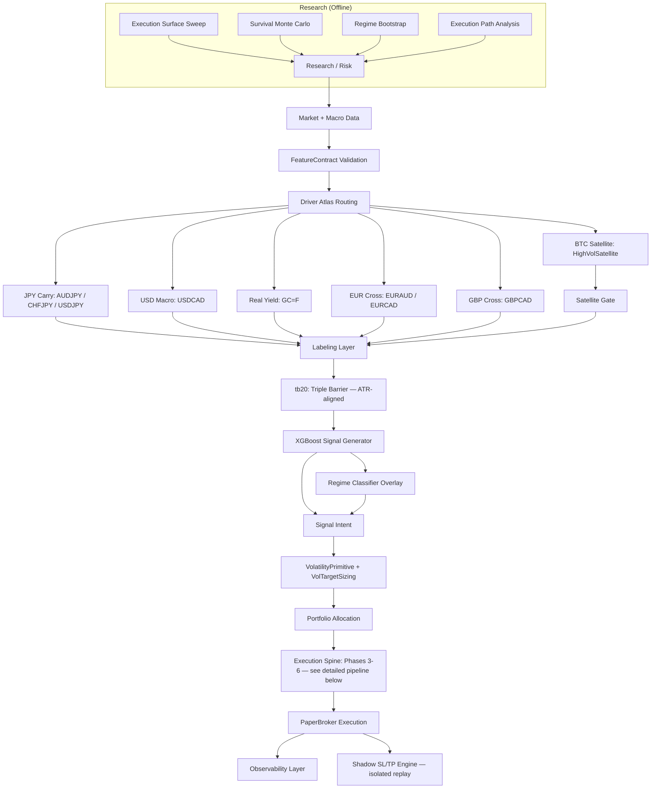

# QUANTFORGE


[](https://codecov.io/gh/manuelhorvey/QuantForge)


---

## 1. SYSTEM OVERVIEW

QuantForge is a **deterministic market interaction simulator with causally decomposed execution quality** — an adaptive multi-asset research platform combining governance-driven execution control, stress-conditioned survival modeling, and an immutable execution contract ledger.

| Layer | Purpose |
|-------|---------|
| **Features** | Deterministic macro-conditioned signals under strict schema contracts |
| **Models** | Probabilistic directional intent via XGBoost (BUY / HOLD / SELL) — signal generator, not decision authority |
| **Archetype Classification** | 5 pure-feature market structure archetypes — primary execution conditioning variable across Phases 1-4 |
| **Volatility Primitive** | Frozen ATR-based shared module — single vol source for labels, execution geometry, shadow replay, and attribution |
| **Entry Quality** | DeferredEntry engine with idempotent entry_id, EntryOptimizer routing (ENTER / DEFER / SKIP) |
| **Execution Policy** | Immutable PolicyDecision dispatch — archetype-to-policy switchboard |
| **Fill Realism** | Seeded deterministic slippage (asymmetric SL/TP), gap-through, partial fill, latency |
| **Shadow Counterfactual Engine** | Isolated SL/TP replay on live tape — never shares mutable state with PositionManager |
| **Trade Attribution** | 4-domain causal reconstruction (Prediction, Execution, Exit, Friction) with counterfactual decomposition + archetype stratification — observes everything, mutates nothing |
| **Execution Path Analysis** | Distributional attribution diagnostics — per-archetype path stats, meta-confidence decile stratification |
| **Governance** | 7-layer suppression under instability — see [docs/GOVERNANCE_LAYER.md](docs/GOVERNANCE_LAYER.md) |
| **Simulation** | Adversarial survival testing with execution physics and deleveraging feedback |
| **Execution** | Paper trading with mark-to-market PnL, SL/TP surface optimization, portfolio construction, continuous meta sizing |
| **Telemetry** | Shadow analytics, drift detection, importance tracking, deterministic replay |

### Design Philosophy

- **Execution realism over nominal CAGR** — simulated fills, spread expansion, gap risk, partial fill decay
- **Survival under stress over historical fit** — adversarial perturbation, not backtest R²
- **Governance as primary component** — validity state machines, stability penalties, meta-labeling, narrative + liquidity governance
- **Portfolio topology over standalone alpha** — assets selected for marginal contribution to portfolio risk, not individual Sharpe
- **Archetypes as primary routing key** — execution policy, TP geometry, and entry behavior are all conditioned on archetype classification; archetypes are the central conditioning variable across Phases 1-4
- **Epistemic boundary separation** — prediction (Phase 3), decision (Phase 4), execution (Phase 5), attribution (Phase 6), shadow research, and path analysis are causally isolated layers; each can only degrade the signal, never create it
- **Fill realism as degradation** — Phase 5 may only make fills worse, never better; sits after PolicyDecision freeze
- **Observe-only analytics** — Phase 6 attribution observes everything but mutates nothing; never feeds back into labels, frozen kernel, or policies
- **Frozen volatility primitive** — single ATR implementation shared across labels, execution geometry, shadow replay, and attribution; eliminates train/serve skew at barrier geometry level
- **Meta-confidence as size scalar only** — modulates exposure magnitude; never modifies TP geometry, trailing, or scale-out schedules
- **Shadow engines are isolated** — never share mutable execution state with live engine; replay same tape independently

---

## 2. ARCHITECTURE



### Execution Pipeline (Phases 3–6 + Research Tiers)

```mermaid
graph LR
    subgraph Primitive [Shared Volatility — FROZEN]
        V[VolatilityPrimitive: ATR] --> V1[Label Barrier Geometry]
        V --> V2[DynamicSLTP Barriers]
        V --> V3[Shadow SL/TP Replay]
        V --> V4[Attribution Path Analysis]
    end

    subgraph Signal [Signal Layer]
        A[Model Signal + Confidence] --> B[Archetype Classifier]
    end

    subgraph Entry [Entry Quality]
        B --> C[EntryOptimizer]
        C --> D{EntryAction}
        D -->|ENTER| E[PolicyDecision Builder]
        D -->|DEFER| F[DeferredEntry]
        D -->|SKIP| G[Skip Signal]
    end

    subgraph Policy [Execution Policy — FROZEN CONTRACT]
        E --> H[POLICY_MAP Dispatch]
        H --> I[PolicyDecision: immutable]
        F -->|Triggered| E
    end

    subgraph Barriers [Barrier Geometry]
        V2 --> I
    end

    subgraph Fill [Fill Realism — FROZEN CONTRACT]
        I --> J[ExecutionSimulator]
        J --> K[SlippageModel: asym SL/TP]
        J --> L[FillModel: gap-through]
        J --> M[LatencyModel: seeded delay]
        K & L & M --> N[FillResult: immutable]
    end

    subgraph Attribute [Causal Reconstruction — FROZEN CONTRACT]
        N --> O[AttributionCollector: observe-only]
        O --> P[Prediction Attribution]
        O --> Q[Execution Attribution]
        O --> R[Exit Attribution]
        O --> S[Friction Attribution]
        O --> T[ExecutionPathAnalysis: distributional]
    end

    subgraph Shadow [Shadow Research — ISOLATED]
        N --> U[ShadowSLTPEngine]
        U --> W[Counterfactual Replay]
        V3 --> U
    end

    subgraph State [State Mutation — Mutable]
        N --> X[AssetEngine: position state]
        X --> Y[PnL + Journal + Snapshots]
    end

    style I fill:#1a1a2e,stroke:#e94560
    style O fill:#1a1a2e,stroke:#0f3460
    style U fill:#1a1a2e,stroke:#533483
    style N fill:#16213e,stroke:#e94560
    style V fill:#1a1a2e,stroke:#00b4d8
```



See [docs/SYSTEM_OVERVIEW.md](docs/SYSTEM_OVERVIEW.md) for full component details.

---

## 3. GETTING STARTED

```bash
git clone https://github.com/user/quantforge.git && cd quantforge
python -m venv .venv && source .venv/bin/activate
pip install -r requirements.txt
export FRED_API_KEY=your_key
./monitor_all                              # build frontend + start engine + dashboard
# Dashboard: http://localhost:5000
```

**Rebuild frontend after UI changes:** `(cd paper_trading/dashboard && yarn build)` — 24 components, sortable DataTable, Recharts charts, anchor nav
**Run tests:** `pytest tests/ -q --tb=short`

### Environment

| Var | Required | Purpose |
|-----|----------|---------|
| `FRED_API_KEY` | Yes | Macro data (yields, VIX, DXY) |
| `OPENCODE_ZEN_API_KEY` | No* | Weekly LLM narrative extraction |
| `PYTHONPATH` | Yes | `PYTHONPATH=.` |
| `QUANTFORGE_REFRESH_INTERVAL` | No | Engine loop interval (default 300s) |

*\*Without OPENCODE_ZEN_API_KEY, narrative governance skips LLM call and uses neutral defaults.*

---

## 4. LIVE PORTFOLIO

8-core-asset continuously evaluated simulation with ATR-based dynamic barrier geometry (via `shared/volatility.py:VolatilityPrimitive`). SL/TP are computed as ATR multiples per asset config. BTC actively traded in a satellite bucket via a macro gate with vol-adjusted SL/TP and full position management.

| Asset | Alloc | sl_mult | tp_mult | Dynamic SL/TP | Scale-out | Meta-label |
|-------|-------|---------|---------|:-------------:|:---------:|:----------:|
| EURAUD | 5% | 0.48 | 1.00 | ATR ×2.0/3.0, period=14 | 4-tier | 0.55 |
| AUDJPY | 16% | 0.48 | 1.75 | ATR ×2.0/3.5, period=14 | 4-tier | 0.55 |
| CHFJPY | 14% | 0.48 | 1.00 | ATR ×1.8/2.0, period=14 | 4-tier | 0.55 |
| EURCAD | 20% | 0.48 | 1.75 | ATR ×2.0/3.5, period=14 | 4-tier | 0.55 |
| GBPCAD | 7% | 0.48 | 1.50 | ATR ×2.0/3.0, period=14 | 4-tier | 0.55 |
| GC | 17% | 0.30 | 1.50 | ATR ×2.5/4.0, period=14 | no | 0.55 |
| USDCAD | 13% | 0.48 | 1.50 | ATR ×2.0/3.0, period=14 | no | 0.55 |
| USDJPY | 8% | 0.48 | 1.50 | ATR ×2.0/3.0, period=14 | 4-tier | 0.55 |

**Total core allocation**: 100% (sum before capital utilization cap). **BTC satellite**: 5% AUM cap, vol target 40%, drawdown limit 25%, ATR period 7, ATR ×2.5/3.0, meta-label threshold 0.50.

> Portfolio allocation provides capital input only. Execution truth resides in the deterministic contract chain: VolatilityPrimitive → DynamicSLTP → PolicyDecision → FillResult → AttributionRecord. Allocation weights are not execution decisions. Barriers are recomputed via `post_entry_adjust()` — vol spikes (>1.3×) tighten SL for protection; vol collapses (<0.7×) trigger no action.

---

## 5. KEY CONFIGURATION

Reference for `configs/paper_trading.yaml`. See [docs/PAPER_TRADING_RUNBOOK.md](docs/PAPER_TRADING_RUNBOOK.md) for full details.

| Key | Default | Description |
|-----|---------|-------------|
| `capital` | 100000 | Starting capital |
| `position_size` | 0.95 | Capital utilization cap |
| `halt.drawdown` | -0.08 | Per-asset drawdown halt |
| `portfolio_drawdown_limit` | -0.15 | Portfolio circuit breaker |
| `narrative_config.enabled` | true | Weekly macro narrative |
| `narrative_config.geopol_sl_widen_pct` | 10 | SL widen on geopol risk > 0.7 |
| `narrative_config.risk_off_size_reduce_pct` | 20 | Size reduce on risk_off |
| `narrative_config.min_confidence` | 0.6 | Min LLM confidence |
| `liquidity_config.enabled` | true | Per-tick liquidity regime |
| `liquidity_config.volume_z_thin_threshold` | -1.5 | Volume z → THIN |
| `liquidity_config.amihud_high_threshold` | 1.5 | Amihud z → THIN |
| `liquidity_config.stressed_sl_widen_pct` | 30 | SL widen in STRESSED |
| `dynamic_sltp.method` | atr | Volatility method (atr / ewm) |
| `dynamic_sltp.atr_period` | 14 | ATR lookback period |
| `dynamic_sltp.atr_mult_sl` | 2.0 | ATR × SL distance |
| `dynamic_sltp.atr_mult_tp` | 3.0 | ATR × TP distance |
| `dynamic_sltp.post_adjust_interval_bars` | 3 | Bars between post-entry adjustment |
| `meta_labeling.threshold` | 0.55 | XGBoost meta-confidence threshold |
| `shadow_sltp.enabled` | false | Counterfactual shadow replay |

---

## 6. GOVERNANCE LAYERS

| Layer | Frequency | Scope | Effect | Docs |
|---|---|---|---|---|
| Validity state machine | Per tick | Per asset | Exposure 0–100% | — |
| Feature stability | Per retrain | Per asset | Validity penalty | — |
| Meta-labeling (XGBoost) | Per signal | Per asset | Continuous size scalar [0–1] | `labels/meta_labels.py` |
| Macro narrative | Weekly | Global | SL +10%, size −20% | `features/macro_narrative.py` |
| Liquidity regime | Per signal | Per asset | SL +15/30%, size −15/30%, halt | `features/liquidity_regime.py` |
| PSI drift | Per cycle | Per asset | Validity penalty, halt at 3+ SEVERE | `monitoring/psi_monitor.py` |

Multiplicative chain: `final_sl = base × regime_geom × narrative_sl × liquidity_sl`
Size scalar chain: `final_size = base × governance_scalar × meta_confidence_scalar`
Validity stacking: stability penalty + PSI penalty + halt penalties (additive, worst-wins at layer level)

Full detail: [docs/GOVERNANCE_LAYER.md](docs/GOVERNANCE_LAYER.md)

---

## 7. FEATURE ENGINEERING

FeatureContract system enforces deterministic train/serve parity with cross-asset isolation. 13 feature modules produce macro-conditioned signals under strict schema contracts. Driver atlas routes per-asset feature subspaces.

Full detail: [docs/FEATURES.md](docs/FEATURES.md)

---

## 8. MODEL ARCHITECTURE

**XGBoost** multiclass classifier (BUY / HOLD / SELL) with 300 trees, max_depth=2, learning_rate=0.02 — serves as **probabilistic signal generator**, not decision authority. Optional macro expert head with adaptive blend weight. Strategy interfaces via `shared/` abstract base classes.

The model produces directional intent; execution truth is resolved downstream by the structural decision spine: Archetype Classification (Phase 3) → Entry Optimizer (Phase 1) → Execution Policy (Phase 4) → Fill Realism (Phase 5) → Attribution (Phase 6). Model output is one of several inputs to the archetype-conditioned policy layer — never a direct trading decision.

Full detail: [docs/ARCHITECTURE_FOUNDATIONS.md](docs/ARCHITECTURE_FOUNDATIONS.md)

---

## 9. HARDENING ROADMAP

### Execution Research Framework (Phases 0–6)

| Phase | Capability |
|-------|------------|
| **0** | Frozen Kernel + Labels — retrained with runtime-consistent initial geometry; no adaptive logic leaks into labels |
| **1** | Entry Quality Engine — EntryOptimizer, DeferredEntry with idempotent entry_id |
| **2** | TP/Exit Geometry — regime×archetype TP compiler; backloaded scale-out tiers per archetype |
| **3** | Archetype Classification — 5 pure-feature archetypes: BREAKOUT, TREND_PULLBACK, MEAN_REVERSION, VOLATILITY_EXPANSION, MOMENTUM_IGNITION |
| **4** | Execution Policy Layer — archetype-to-policy dispatch via POLICY_MAP; PolicyDecision as immutable instruction packet |
| **5** | Fill Realism Layer — SlippageModel, FillModel, LatencyModel, ExecutionSimulator; asymmetric SL/TP slippage; gap-through; partial fill; seeded deterministic randomness |
| **6** | Causal Reconstruction Layer — 4-domain attribution (Prediction, Execution, Exit, Friction); counterfactual metrics (perfect entry, zero slippage, ideal exit); MAE/MFE time-normalized; archetype drift tracking; deterministic replay audit |

### Execution Research Infrastructure Tiers (A0–B3)

| Tier | Capability |
|------|------------|
| **A0** | Frozen volatility primitive — `shared/volatility.py:VolatilityPrimitive` with `compute_atr_series()`, `compute_atr_pct()`, `estimate_gap_risk()`, `estimate_ewm_vol()` |
| **A1** | ATR-aligned triple-barrier labeling — barrier widths computed via `shared.volatility.compute_atr_pct()`; `label_version` hash auto-updates on vol param change |
| **A2** | Vol-drop anti-pattern fix — `post_entry_adjust()` tightens SL on vol spike (>1.3×), no action on vol collapse (<0.7×) |
| **A3** | Continuous meta-confidence sizing — `_meta_size_multiplier()` maps [threshold, 1.0] → [min_size, 1.0], applied in `_composite_size_scalar()` |
| **B1** | Shadow counterfactual replay — `paper_trading/shadow_sltp.py` isolated SL/TP engine on live tape; config-gated via `shadow_sltp.enabled` |
| **B2** | Expanded attribution — `ExitAttribution.meta_bucket` field; `get_metrics().archetype_stats` per-archetype win rate, avg R, SL/TP rate |
| **B3** | Execution path analysis — `research/execution_path_analysis.py` distributional attribution diagnostics, per-archetype path stats, report generation |

### Pre-existing Tiers (1–7)

| Tier | Capability |
|------|------------|
| **1** | Cross-asset feature isolation, regime sizing, circuit breaker, trade quality gates |
| **2** | Vol-z spread model, square-root impact, ExecutionBridge |
| **3A** | Extended history (2000+, Sharpe 6.26, 0% ruin) |
| **3B** | Lead-lag matrix (205 relationships, 8 live edges) |
| **3C** | Adaptive macro expert weight |
| **4** | Scale-out + trailing, probability-based SL/TP, shadow SL/TP analytics |
| **5** | Macro narrative governance (weekly LLM overlay) |
| **6** | Liquidity regime model (volume/Amihud proxy) |
| **7** | PSI drift monitoring (fixed-width bin distribution shift detection) |

Full detail: [docs/HARDENING_ROADMAP.md](docs/HARDENING_ROADMAP.md)

---

## 10. SURVIVAL SIMULATION

Multi-layer survival framework at `research/risk/` with execution physics, regime-aware bootstrap, and deleveraging feedback. Validated across 1000 correlated paths.

**Key results (CF=0.40, 3yr):** Full Governance Sharpe 5.29 (vs Naked 6.03), 0% ruin, worst DD 8.5%, P50x 1.87. Extended history (25y): Sharpe 6.26, 0% ruin.

Full detail: [docs/SURVIVAL_SIMULATION.md](docs/SURVIVAL_SIMULATION.md)

---

## 11. SYSTEM INVARIANTS

- No train/serve skew (FeatureContract enforced)
- No look-ahead in feature construction (macro data lagged to publication)
- Deterministic replay via simulation snapshot system
- Strict signal/execution separation
- Backtest/live parity (training labels = runtime multipliers)
- Hysteresis-gated state transitions (no rapid flipping)
- Position manager as pure state machine (no I/O)
- Worst-wins penalty aggregation
- Synthetic stress capped at 25% of original series length
- Multiplicative governance layering: each layer independently configurable and gated
- Frozen kernel alignment: training label geometry matches runtime initial barriers (no adaptive logic leaks)
- Execution fill determinism: same seed + same inputs → identical FillResult across runs
- Degradation-only fill realism: Phase 5 may only degrade outcomes, never improve them
- Observe-only attribution: Phase 6 analytics never mutate labels, kernel, or policies
- Frozen execution contract: PolicyDecision (Phase 4), FillResult (Phase 5), and AttributionRecord (Phase 6) form an immutable causal ledger — deterministic replay, counterfactual evaluation, no upstream mutation
- **Frozen volatility primitive**: single ATR implementation shared across labels, execution, shadow, and attribution — no duplicate vol logic
- **Meta-confidence is size-only**: never modifies TP geometry, trailing, or scale-out schedules
- **Shadow engine isolation**: never shares mutable state with PositionManager; independent replay on same tape
- **No auto-widening on SL rate**: preserves replayability and contract determinism
- **No Kelly sizing**: amplifies error on noisy estimates; excluded by design
- **No post-entry re-interpretation of open trades**: preserves frozen execution contracts

---

## 12. INFRASTRUCTURE

- Stateless inference, stateful execution with crash-safe snapshots
- Local HTTP observability dashboard (React + Vite + Tailwind + react-query) — sortable tables, sticky anchor nav, real-time session clock, governance state visualization with animated status indicators
- In-memory TTL cache with per-endpoint expiry (5-30s), gzip compression
- Configurable refresh interval via `QUANTFORGE_REFRESH_INTERVAL`
- JSONL decision tracing

---

## 13. KNOWN CONSTRAINTS

- Paper trading only (no live capital)
- Data limited to Yahoo Finance + FRED
- EURUSD excluded (pending COT integration)
- 19 unscreened pairs not yet evaluated
- Shadow engine in data-collection phase — no statistical output until attribution variance stabilizes across regimes

---

## 14. SYSTEM CLASSIFICATION

> Deterministic market interaction simulator with causally decomposed execution quality, governance-driven execution control, and stress-conditioned survival modeling.

Distinguished from backtesting frameworks by treating execution physics as the primary unit of analysis, governance as a primary system component, stress survival as the central validation criterion, and portfolio topology as a downstream allocation concern.

---

## 15. EXECUTION LEDGER MODEL

The system now operates on a **frozen execution ledger** composed of immutable artifacts forming a causal chain of market interaction:

| Artifact | Layer | Immutability |
|----------|-------|--------------|
| Volatility Primitive | Shared | Frozen single ATR implementation |
| Initial Barrier Geometry | Phase 0 | Frozen at kernel compile |
| Archetype Context | Phase 3 | Deterministic from feature vector |
| Entry Decision State | Phase 1 | Idempotent entry_id |
| Reward Geometry | Phase 2 | Compiled from regime×archetype |
| Policy Decision Packet | Phase 4 | Frozen instruction |
| Dynamic SL/TP Barriers | Phase 4 | ATR-based, post_entry_adjust vol-filtered |
| Fill Simulation Result | Phase 5 | Seeded deterministic |
| Trade Attribution Record | Phase 6 | Observe-only append |
| Shadow Counterfactual Replay | Research | Isolated, never mutates live state |
| Execution Path Analysis | Research | Distributional, never feeds back |

These artifacts form a **deterministic replay chain**: same inputs + same seed → identical execution history. This enables counterfactual evaluation — what-if analysis on any single artifact without recomputing upstream layers. The volatility primitive is the single source of truth for barrier geometry across all layers.

---

## 16. SYSTEM TRANSFORMATION

QuantForge has transitioned from:

> Predictive trading system with analytics

to:

> Causally decomposed execution simulator with observability-first architecture

| Dimension | Before (Phases 0–2) | After (Phases 0–6 + A0–B3) |
|-----------|--------------------|-----------------------------|
| Core abstraction | ML pipeline | Execution contract ledger |
| Model role | Decision authority | Signal generator |
| Volatility source | EWM duplicate per layer | Single frozen ATR primitive (shared) |
| Meta-confidence | Binary ENTER/BLOCK gate | Continuous size scalar [0–1] |
| Execution truth | Position manager state | Frozen PolicyDecision → FillResult |
| Analytics | Performance metrics | Causal decomposition + shadow replay + path analysis |
| Attribution | PnL attribution | 4-domain + archetype stratification + meta-bucket deciles |
| Shadow research | None | Isolated counterfactual SL/TP replay |
| Reproducibility | Stochastic | Seeded deterministic across all layers |

---

## 17. SYSTEM MATURITY STATE

QuantForge is now in **execution research infrastructure complete** state. The architecture is structurally complete through Phase 6 + Tiers A0–B3. The next phase is data accumulation:

- **Let the system accumulate data across regimes** — resist adding new logic until attribution variance stabilizes
- **Generate first execution-path diagnostics report** — ranked PnL degradation decomposition is the first genuinely valuable diagnostic output
- **Statistical governance** — edge discovery from the full attribution surface once data is sufficient
- **Regime sensitivity analysis** — expectancy surfaces conditioned on market regime
- **Policy optimization** — tuning execution within existing contract boundaries (no kernel contamination)

The architecture is contract-frozen. All subsequent development operates within the existing causal isolation boundaries and respects the observe-only constraint on the signal kernel. The highest-value next action is data accumulation quality, not engineering.

---

## 18. DISCLAIMER

Research system only. No live capital execution. Not financial advice. Historical simulation results are not indicative of future performance.
