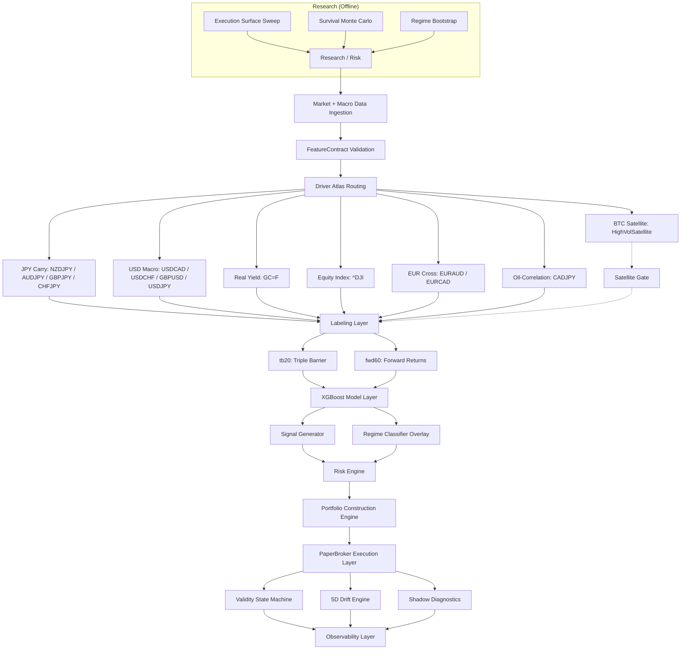

# QUANTFORGE


---

## TABLE OF CONTENTS

1. [System Overview](#1-system-overview)
2. [System Objective](#2-system-objective)
3. [Getting Started](#3-getting-started)
4. [Live Simulation Portfolio](#4-live-simulation-portfolio)
5. [Data Architecture](#5-data-architecture)
6. [Feature Engineering](#6-feature-engineering)
7. [Model Architecture](#7-model-architecture)
8. [Labeling & Signal Generation](#8-labeling--signal-generation)
9. [Validation Framework](#9-validation-framework)
10. [Execution System (Paper Trading Engine)](#10-execution-system-paper-trading-engine)
11. [Risk & Governance Layer](#11-risk--governance-layer)
12. [Survival Monte Carlo Simulation](#12-survival-monte-carlo-simulation)
13. [Shadow Analytics System](#13-shadow-analytics-system)
14. [System Architecture (Causal Execution Graph)](#14-system-architecture-causal-execution-graph)
15. [System Invariants](#15-system-invariants)
16. [Infrastructure Design](#16-infrastructure-design)
17. [Known Constraints](#17-known-constraints)
18. [Research Status](#18-research-status)
19. [System Classification](#19-system-classification)
20. [Disclaimer](#20-disclaimer)

---

## 1. SYSTEM OVERVIEW

QuantForge is an adaptive multi-asset macro research and portfolio simulation platform with **governance-driven execution control and stress-conditioned survival modeling**.

### 1.1 Architecture at a Glance

| Layer | Purpose |
|-------|---------|
| **Features** | Deterministic macro-conditioned signals under strict schema contracts (FeatureContract) |
| **Models** | Probabilistic directional inference via XGBoost (BUY / HOLD / SELL) |
| **Governance** | Exposure suppression under instability — validity state machine, feature stability penalties, meta-labeling |
| **Simulation** | Adversarial survival testing with execution physics, regime bootstrap, and deleveraging feedback |
| **Execution** | Continuous paper trading with mark-to-market PnL, SL/TP surface optimization, and portfolio construction |
| **Telemetry** | Adaptive risk observability — shadow analytics, drift detection, importance tracking, deterministic replay |

### 1.2 Lifecycle Pipeline

* Feature engineering under strict schema contracts (FeatureContract)
* Walk-forward out-of-sample validation across 5-year rolling windows
* Multi-class XGBoost signal generation (BUY / HOLD / SELL)
* Triple-barrier and forward-return labeling
* Portfolio construction with volatility targeting
* Continuous paper trading simulation with mark-to-market PnL
* Multi-layer governance: drift detection, validity state machine, shadow analytics
* **Survival Monte Carlo simulation** with execution physics, regime-aware bootstrap, and deleveraging feedback
* SL/TP execution surface optimization via replay engine

### 1.3 Design Philosophy

QuantForge is designed under a specific philosophy that distinguishes it from conventional backtesting frameworks:

* **Execution realism is prioritized over nominal CAGR** — simulated fills, spread expansion, gap risk, and partial fill decay prevent over-optimistic projections
* **Survival under stress is prioritized over historical fit** — portfolio resilience is validated through adversarial perturbation, not backtest R²
* **Governance is a primary system component, not an afterthought** — validity state machines, stability penalties, and meta-labeling actively suppress exposure when the system degrades
* **Portfolio topology is prioritized over standalone alpha** — assets are selected for their marginal contribution to portfolio-level risk metrics, not individual Sharpe ratios

This is not a backtesting engine. Backtesting engines answer "would this strategy have made money historically?" QuantForge answers "under what conditions does this portfolio survive?"

---

## 2. SYSTEM OBJECTIVE

QuantForge evaluates whether **macro-conditioned statistical structure produces persistent predictive edge under non-stationary market regimes**.

Primary research constraints:

* Structural regime shifts
* Feature interference across heterogeneous assets
* Cross-asset correlation instability
* Temporal decay of predictive signals
* Execution friction (spreads, gaps, partial fills)
* Robustness under adversarial perturbation

All strategies must pass **walk-forward validation and governance gating** prior to inclusion in the simulation portfolio.

---

## 3. GETTING STARTED

### 3.1 Installation

```bash
git clone https://github.com/user/quantforge.git
cd quantforge

python -m venv .venv
source .venv/bin/activate

pip install -r requirements.txt
```

### 3.2 Environment Configuration

```env
FRED_API_KEY=your_key_here
PYTHONPATH=.
```

### 3.3 System Execution

Start full simulation system (builds dashboard, starts engine, serves UI):

```bash
./monitor_all
```

Or manually:

```bash
python paper_trading/monitor.py
```

Dashboard (React + TypeScript + Tailwind CSS):

```
http://localhost:5000
```

Rebuild dashboard after frontend changes:

```bash
(cd paper_trading/dashboard && yarn build)
```

Dev mode (port 3000, proxies /state.json to port 5000):

```bash
(cd paper_trading/dashboard && yarn dev)
```

### 3.4 Running Research Simulations

Survival Monte Carlo (full pipeline):

```bash
python research/risk/survival_sim.py --execution-physics --btc-execution --deleverage --regime-bootstrap --exposure-telemetry
```

Extended history (25+ years, after backfill):

```bash
python scripts/run_extended_history_pipeline.py
python research/risk/survival_sim.py --extended-history --regime-bootstrap --execution-physics
python diagnostics/extended_history_report.py
```

See **[docs/HARDENING_ROADMAP.md](docs/HARDENING_ROADMAP.md)** for tier-by-tier details.

SL/TP execution surface sweep:

```bash
python research/execution_surface/surface_sweep.py
```

### 3.5 Running Backtests

```bash
python equity/walk_forward_eurusd.py
python equity/walk_forward_nzdjpy.py
```

---

## 4. LIVE SIMULATION PORTFOLIO

The system maintains a **13-asset continuously evaluated simulation portfolio** with **regime-optimized SL/TP configurations** (sl_mult=0.30, sweep-derived TP per asset). BTC is isolated in a separate satellite bucket (see §4.1). 12 of 13 core assets use regime-differentiated geometry from per-regime sweeps across 3 volatility regimes (low/transition/high); the 13th (GBPUSD) uses plateau default.

| Asset   | Ticker    | Label | Cluster       | Alloc | sl_mult | tp_mult | R:R   | Scale-out | Regime-tuned |
| ------- | --------- | ----- | ------------- | ----- | ------- | ------- | ----- | --------- | ------------ |
| EURAUD  | EURAUD=X  | tb20  | eur_cross     | 12%   | 0.30    | 1.00    | 1:3.3 | 4-tier    | yes |
| GC      | GC=F      | fwd60 | real_asset    | 13%   | 0.30    | 1.50    | 1:5.0 | no        | yes |
| NZDJPY  | NZDJPY=X  | tb20  | carry_fx      | 11%   | 0.30    | 1.75    | 1:5.8 | 4-tier    | yes |
| CADJPY  | CADJPY=X  | tb20  | oil_carry     | 9%    | 0.30    | 1.25    | 1:4.2 | 4-tier    | yes |
| CHFJPY  | CHFJPY=X  | tb20  | carry_fx      | 7%    | 0.30    | 1.00    | 1:3.3 | no        | yes |
| AUDJPY  | AUDJPY=X  | tb20  | carry_fx      | 6%    | 0.30    | 1.75    | 1:5.8 | 4-tier    | yes |
| USDCAD  | USDCAD=X  | tb20  | usd_macro     | 8%    | 0.30    | 1.50    | 1:5.0 | 4-tier    | yes |
| GBPJPY  | GBPJPY=X  | tb20  | carry_fx      | 8%    | 0.30    | 1.25    | 1:4.2 | 4-tier    | yes |
| EURCAD  | EURCAD=X  | tb20  | eur_cross     | 5%    | 0.30    | 1.75    | 1:5.8 | 4-tier    | yes |
| ^DJI    | ^DJI      | tb20  | equity_index  | 5%    | 0.30    | 1.50    | 1:5.0 | 4-tier    | yes |
| GBPUSD  | GBPUSD=X  | tb20  | usd_macro     | 5%    | 0.52    | 1.97    | 1:3.8 | 4-tier    | no |
| USDJPY  | USDJPY=X  | tb20  | usd_macro     | 4%    | 0.30    | 1.00    | 1:3.3 | no        | yes |
| USDCHF  | USDCHF=X  | tb20  | usd_macro     | 4%    | 0.30    | 1.75    | 1:5.8 | 4-tier    | yes |

* **Cash buffer**: ~3% retained as dynamic risk slack.
* **SL/TP values**: sl=0.30 universal base (per-regime sweep optimum), TP varies by asset (sweep-derived per-regime, mid-range shown). Model-validity adjustments: YELLOW → TP × 0.85, RED → TP × 0.70.
* **Dynamic SL/TP ATR Calibration**: ATR-based dynamic barriers auto-calibrated at startup to EWM vol using `calibration_scale: 1.2` (expanding barriers by 20% to optimize TP rates).
* **Confidence-based SL adjustment (optional)**: `confidence_sl_adjust > 0.0` tightens SL at high meta-confidence (p=0.9 → sl × (1.0 - adjust)), widens at low confidence (p=0.1 → sl × (1.0 + adjust/2)). Default 0.0 (disabled).
* **Scale-Out Strategy**: For assets with scale-out enabled (EURAUD, NZDJPY, CADJPY, AUDJPY, USDCAD, GBPJPY, USDCHF, GBPUSD, EURCAD, DJI), position profit-taking is split into 4 equal tiers (25% at 0.25x / 0.50x / 0.75x / 1.00x of original TP). Stop-loss is moved to breakeven after Tier 1 realizes. Trailing stop activation can optionally trigger after a configurable tier (`trailing_after_tier` in `ScaleOutEngine`).
* **Stop-loss** = vol × sl_mult, **take-profit** = vol × tp_mult. Training labels in `features/registry.py` must match runtime multipliers — enforced by `PaperTradingEngine.initialize()`.

### 4.1 BTC Satellite Bucket

Bitcoin is removed from the core portfolio and managed via a `HighVolSatellite` with independent risk controls:

| Property | Value |
|----------|-------|
| Allocation | 5% AUM cap |
| Vol target | 40% annualised |
| Drawdown limit | 25% |
| Regime gate | 5-condition AND logic (correlation, BTC vol, VIX, DXY momentum, CRISIS) |
| Marginal monitoring | Rolling 63d ΔSharpe, alert at -0.5, auto-reduce at -1.0 |

The satellite runs after core portfolio signal generation each tick. BTC trades only when all five gate conditions are met — maximum conservatism.

---

## 5. DATA ARCHITECTURE

### 5.1 Data Sources

* Yahoo Finance (OHLCV) — primary market data
* FRED macroeconomic series (yields, spreads, inflation)
* COT (Commitments of Traders) positioning data
* Parquet-based deterministic cache layer

### 5.2 Data Layout

```
data/
├── raw/               # Raw downloaded OHLCV parquet
├── processed/         # Cleaned, aligned macro factors
├── live/              # Runtime state (state.json, trade journal, equity history)
├── sandbox/           # Research outputs (OOS predictions, SL/TP analysis, risk simulations)
├── shadow_*/          # Shadow analytics persistence
└── loaders/           # Data ingestion (macro, COT, downloads)
```

---

## 6. FEATURE ENGINEERING

### 6.1 Feature Contract System

All features are enforced via a **FeatureContract** to ensure deterministic train/serve parity:

* `features/contract.py` — `FeatureContract` dataclass + `validate_no_cross_asset_leakage()` (prevents foreign asset columns in train/serve frames)
* `features/registry.py` — `FEATURE_REGISTRY` with per-asset `contract_prefix`; `FEATURE_CONTRACT_VALIDATION` gate
* `features/builder.py` — Orchestrates feature computation, optional lead-lag columns, and triple-barrier labels
* `features/lead_lag_features.py` — Curated cross-asset lead-lag edges from `data/research/lead_lag_edges.yaml`

### 6.2 Feature Categories

| Module | Features |
|--------|----------|
| `base_features` | OHLCV returns, ranges, gaps |
| `trend_features` | ADX, slope, curvature, path efficiency |
| `volatility_features` | ATR, Parkinson, Yang-Zhang, rolling vol |
| `mean_reversion_features` | RSI, Bollinger z-score, mean reversion strength |
| `regime_features` | Volatility regime classification, trend/range/volatile probabilities |
| `structural_features` | Skew, kurtosis, tail ratio, serial correlation |
| `cross_asset_features` | Inter-asset correlations, relative strength |
| `interaction_features` | Regime contrast, EMA contrast, transition risk |
| `pair_specific` | FX carry, rate differentials |
| `lead_lag_features` | Optional lagged peer returns (e.g. `nzdjpy_lead_3` on AUDJPY) |

### 6.2.1 Cross-Asset Isolation

Every asset feature frame is validated so columns match:

- Asset prefix: `{contract_prefix}_` (e.g. `nzdjpy=x_mom_21`)
- Shared macro columns from `KNOWN_MACRO_COLUMNS` or `macro_*` / `spy_*` / `regime_*` prefixes
- Explicit `custom_features` (lead-lag columns must be declared on the contract)

Foreign asset momentum (e.g. `eurusd=x_mom_21` in an NZDJPY frame) raises `FeatureMismatchError`. See `docs/HARDENING_ROADMAP.md` § Tier 1.

### 6.3 Driver Atlas

Each asset is mapped to a **driver-specific feature subspace** to prevent cross-regime contamination:

| Asset Group | Primary Drivers |
|-------------|----------------|
| JPY crosses (NZDJPY, AUDJPY, GBPJPY, CHFJPY) | VIX, yield spreads, JPY momentum |
| USD pairs (USDCAD, USDCHF, GBPUSD, USDJPY) | DXY, rate differential, VIX |
| EUR crosses (EURAUD, EURCAD) | Rate differential, DXY, VIX |
| CADJPY | Oil correlation, VIX, yield spreads |
| Equity indices (^DJI) | Rate differential, VIX, DXY, gold correlation, index momentum |
| GC (Gold) | Real yields, breakevens, DXY |
| BTC (satellite) | Momentum, spread vs SPY, VIX |

---

## 7. MODEL ARCHITECTURE

### 7.1 Core Model

* **XGBoost** multiclass classifier
* Outputs: BUY / HOLD / SELL
* Configuration:
  * 300 trees
  * max_depth = 2
  * learning_rate = 0.02
  * Early stopping with validation set

### 7.2 Additional Model Types

* `models/hybrid_ensemble.py` — Hybrid ensemble combining XGBoost with auxiliary models
* `models/macro_expert_head.py` — Macro expert head with optional **adaptive blend weight** (`online_weight`, bounds [0.25, 0.65]); see ADR-022
* `models/regime/` — Regime classification models
* `models/mean_reversion/` — Mean-reversion specific models

### 7.3 Strategy Interfaces

All model components implement abstract base classes via `shared/`:

* `shared/model.py` — `ModelInterface` (implemented by `XGBoostModel`)
* `shared/signal.py` — `SignalStrategy` (implemented by `FixedThresholdStrategy`)
* `shared/sizing.py` — `PositionSizingStrategy` (implemented by `VolTargetSizing`)
* `shared/pnl.py` — `PnLStrategy`
* `shared/features.py` — `FeaturePipeline`
* `shared/registry.py` — `StrategyRegistry` singleton provides per-asset instances

---

## 8. LABELING & SIGNAL GENERATION

### 8.1 Labeling Regimes

* **tb20**: Triple-barrier event labeling (20-bar horizon). Take-profit and stop-loss levels set per-asset via `ASSET_LABEL_PARAMS` in `features/registry.py`. The `pt_sl` array `[tp_mult, sl_mult]` must match runtime `tp_mult`/`sl_mult` from `configs/paper_trading.yaml`.
* **fwd60**: 60-day forward return classification with fixed threshold.

### 8.2 Signal Pipeline

1. Feature computation via `FeaturePipeline`
2. XGBoost inference → probability distribution (BUY / HOLD / SELL)
3. `FixedThresholdStrategy` converts probabilities to discrete signals
4. `VolTargetSizing` applies vol-target sizing when `vol_scalar` is set; **regime_sizing** adjusts target vol by regime (calm/range × 1.2, crisis/volatile × 0.5)
5. `TradeDecision` encapsulates signal + sizing → `PositionIntent` for execution

---

## 9. VALIDATION FRAMEWORK

### 9.1 Walk-Forward Protocol

* 5-year training window
* 1-year out-of-sample window
* Rolling evaluation (2021–2026)
* Strict temporal isolation (no leakage)
* Retrain frequency: annual (configurable)

### 9.2 Evaluation Metrics

* Sharpe ratio (annualized)
* Maximum drawdown
* Directional accuracy
* Stability of positive return windows

### 9.3 Empirical Results (Walk-Forward)

| Asset   | Sharpe | Stability | Notes |
| ------- | ------ | --------- | -------------------------------- |
| NZDJPY  | 2.72   | 5/5       | Strongest carry structure        |
| AUDJPY  | 2.62   | 5/5       | Screened, promoted to live       |
| EURAUD  | 2.28   | 5/5       | Feature augmentation uplift      |
| GBPJPY  | 1.75   | 4/5       | Screened, promoted to live       |
| CADJPY  | 1.70   | 4/5       | Regime-dependent uplift          |
| USDCHF  | 1.64   | 4/5       | Screened, promoted to live       |
| CHFJPY  | 1.62   | 5/5       | Promoted to live (batch 2)       |
| ^DJI    | 1.53   | 4/5       | Equity index, underweight start  |
| USDCAD  | 1.48   | 4/5       | Stable macro sensitivity         |
| EURCAD  | 1.41   | 5/5       | Promoted to live (batch 2)       |
| USDJPY  | 1.28   | 4/5       | Screened, promoted to live       |
| GBPUSD  | 1.24   | 4/5       | Screened, promoted to live       |
| GC      | 1.06   | 4/5       | Macro persistence observed       |
| BTC     | 0.83   | 3/5       | Moved to satellite bucket        |

### 9.4 Model Governance Pipeline

1. Sandbox retraining
2. Four-lens evaluation (model / signal / portfolio / shadow)
3. Walk-forward validation
4. MAS scoring (6-dimensional compression metric)
5. Adversarial regime stress testing (9 perturbation modes)
6. Promotion gate evaluation

**Outcome classes**: LIVE_CANDIDATE → PAPER_TRADING_ONLY → SHADOW_ONLY → REJECT

---

## 10. EXECUTION SYSTEM (PAPER TRADING ENGINE)

### 10.1 System Structure

See [§10.2](#102-module-layout) for the full module tree and [§10.3](#103-core-abstractions) for core types.

### 10.2 Module Layout

```
paper_trading/
├── engine.py              # PaperTradingEngine — top-level orchestrator
├── asset_engine.py        # AssetEngine — per-asset execution engine
├── config_manager.py      # EngineConfig dataclass, lazy YAML loader
├── data_fetcher.py        # fetch_live, fetch_history, safe_download, flatten/norm_index
├── portfolio_builder.py   # build_paper_portfolio() from config or defaults
├── satellite_runner.py    # Macro context fetch, BTC vol z-score, core returns
├── satellite.py           # HighVolSatellite — BTC satellite bucket
├── position_manager.py    # Position lifecycle (open, close, SL/TP, PnL)
├── execution_bridge.py    # PaperBroker fill prices + impact estimates for AssetEngine
├── decision.py            # TradeDecision / PositionIntent
├── state_store.py          # Crash-safe snapshot persistence
├── dynamic_sltp.py         # DynamicSLTPEngine — ATR-calibrated SL/TP, trailing stop, confidence adjustment
├── scale_out.py            # ScaleOutEngine — 4-tier profit-taking, breakeven, trailing activation
├── tracer.py               # Trade/decision tracer with shadow SL/TP comparison
├── simulation_snapshot.py # Deterministic replay snapshots
├── monitor.py             # HTTP observability + dashboard serve
├── serve.py               # REST API layer
└── ...                    # shadow_*, risk_governance, drift_scoring, etc.
```

### 10.3 Core Abstractions

* `PaperTradingEngine` — Orchestrator, runs signal generation for all assets each tick
* `AssetEngine` — Per-asset engine: model, features, position manager, validity state
* `PositionManager` — Pure state machine: position lifecycle, SL/TP checks, PnL accounting
* `PaperBroker` — Simulated fills with per-asset spread/impact from `ExecutionConfig` (YAML-driven)
* `ExecutionBridge` — Connects broker physics to `AssetEngine` entry/exit prices and sizing `impact_bps`
* `TradeDecision` — Model output intent (signal, confidence, position_size)
* `PositionIntent` — Execution representation (side, price, SL/TP, vol)
* `EngineConfig` — Typed config dataclass, loaded from `configs/paper_trading.yaml`
* Separation enforced between: signal generation, execution logic, accounting

### 10.3 Per-Asset Risk Multipliers

Stop-loss and take-profit distances are set per asset via `configs/paper_trading.yaml`:

```yaml
assets:
  BTC:
    sl_mult: 0.58    # stop = entry × (1 − vol × 0.58)
    tp_mult: 1.51    # take-profit = entry × (1 + vol × 1.51)
```

The `PositionIntent.from_price_and_vol()` factory computes SL/TP from current volatility.

### 10.4 Training Alignment Validation

On startup, `PaperTradingEngine.initialize()` asserts runtime multipliers match training labels in `ASSET_LABEL_PARAMS`. This prevents silent training/execution misalignment. The config is loaded once at startup via `config_manager.get_config()` and populated into module-level `CONFIG` / `HALT` dicts for backward compatibility.

### 10.5 REST API

The engine state is served by `serve.py`, an stdlib `http.server`-based REST API with:

- **Per-endpoint TTL cache** — state.json (5s), trades (15s), equity history (30s), confidence/volatility/risk/shadow/health (15-30s). Cache lookup before disk I/O keeps the single-threaded handler responsive.
- **Gzip compression** — responses > 512 bytes auto-compressed when client sends `Accept-Encoding: gzip`.
- **`/ping`** — returns `{"status": "ok"}`, useful for health checks.
- **Paginated `/trades.json`** — accepts `?limit=N&offset=M` (max 200). React TradeFeed shows prev/next controls.

### 10.6 Dashboard

React + TypeScript + Tailwind + react-query frontend in `paper_trading/dashboard/`:

- **Refetch indicator** — animated spinner next to Live/Delayed/Disconnected status badge (visible during background refetches).
- **TradeFeed** — paginated trade table with prev/next navigation.
- **SignalsTable** — real-time asset name search filter.
- **FeatureCards** — landing page mockups lazy-loaded via `React.lazy()` + `Suspense` (separate 11 KB chunk, never loaded in main dashboard).
- **Theme** — dark/light toggle persisted to localStorage; inline `<script>` in `index.html` prevents theme flash on load.
- **Scale-out tier visualization** — per-asset tier progress blocks (filled vs pending) in AssetCard when a position has active scale-out tiers.
- **SL/TP hit rate gauges** — color-coded gauge bars (GREEN/YELLOW/RED) for TP, SL, and flip rates in the Trade Outcomes table.

### 10.7 Key Configuration

| Key | Default | Description |
| --- | ------- | ----------- |
| `capital` | 100000 | Starting capital |
| `position_size` | 0.95 | Capital utilization cap |
| `rebalance` | daily | Rebalance frequency |
| `halt.drawdown` | -0.08 | Drawdown halt threshold |
| `halt.monthly_pf` | 0.70 | Monthly profit factor minimum |
| `halt.signal_drought` | 30 | Max days without signal |
| `halt.prob_drift` | 0.15 | Max confidence drift |
| `assets.<name>.allocation` | — | Portfolio weight |
| `assets.<name>.sl_mult` | 1.0 | Stop-loss vol multiplier |
| `assets.<name>.tp_mult` | 2.5 | Take-profit vol multiplier |
| `vol_baselines.<asset>` | — | Annualized vol floor for sizing (see YAML) |
| `execution_defaults` | — | Default spread/impact model for all assets |
| `portfolio_drawdown_limit` | -0.15 | Portfolio-level circuit breaker: force-close all positions when total equity drawdown ≤ limit |
| `assets.<name>.regime_sizing` | false | Regime-aware vol target (range/calm up, volatile/crisis down) |
| `assets.<name>.execution_config` | — | Per-asset `base_spread_bps`, `avg_daily_volume`, `impact_model`, etc. |
| `assets.<name>.adaptive_macro` | false | Enable online macro blend weight (requires hybrid model + `macro_head`) |
| `assets.<name>.config.min_confidence` | 50 | Skip trade entry if model confidence below threshold |
| `assets.<name>.config.max_holding_days` | 30 | Force-close position after N calendar days without hitting SL/TP |
| `satellite.BTC.max_allocation_pct` | 0.05 | Max BTC allocation |
| `satellite.BTC.vol_target` | 0.40 | BTC vol target |
| `satellite.BTC.max_drawdown_pct` | -0.25 | BTC drawdown limit |
| `QUANTFORGE_REFRESH_INTERVAL` | 300 | Engine loop interval in seconds (env var) |

### 10.8 Three-Tier Hardening

See **[docs/HARDENING_ROADMAP.md](docs/HARDENING_ROADMAP.md)** for full procedures. Summary:

| Tier | Capability |
|------|------------|
| **1** | Cross-asset feature isolation audit; regime + vol-baseline sizing; portfolio-level circuit breaker; trade quality gates (min_confidence, max_holding_days) |
| **2** | Vol-z spread model, square-root impact, `ExecutionBridge` on live fills |
| **3A** | Extended history backfill (2000+) — Sharpe 6.26, 0% ruin at 5000 paths |
| **3B** | Lead-lag matrix (205 relationships) — DJI→FX, GC→USDJPY/USDCHF edges live |
| **3C** | Adaptive macro expert weight on trade close (NZDJPY; ADR-022) |
| **4A** | Scale-out + trailing stop — `trailing_after_tier` config, cross-bar best-price tracking, trailing activation wired to tier fills |
| **4B** | Probability-based SL/TP via meta-label confidence — `confidence_sl_adjust` parameter biases SL width toward prediction reliability |
| **4C** | Shadow SL/TP drift analytics — tracer logs runtime barrier deviations; shadow memory tracks drift history per asset |
| **4D** | Dashboard polish — scale-out tier visualization, SL/TP hit rate gauge bars |

See **[docs/HARDENING_ROADMAP.md](docs/HARDENING_ROADMAP.md)** for full details.

---

## 11. RISK & GOVERNANCE LAYER

### 11.1 Validity State Machine (Active)

Each asset runs an independent validity state machine in `monitoring/validity_state_machine.py`:

* **GREEN** → full exposure (1.0×)
* **YELLOW** → reduced exposure (0.5×)
* **RED** → halted (0.0× — no PnL accrual)

Transitions use **hysteresis bands**, **exponential inertia smoothing**, and a **regime persistence lock** to prevent rapid state flipping. Input signals:

* Drawdown vs threshold
* Monthly profit factor
* Signal drought (days since last signal)
* Confidence drift from expected baseline

**Exposure gating**: Each tick, `run_once()` calls `update_validity()` and sets `pos_mgr.exposure_multiplier` to the state machine's output. This directly scales all PnL calculations — GREEN=full, YELLOW=half, RED=flat.

### 11.2 Feature Importance Stability Monitoring (PR #4)

Training-window feature importances are persisted per asset per retrain cycle. Two metrics feed into the ValidityStateMachine:

* **Jaccard similarity** (top-10 features): < 0.6 → −0.10 penalty, < 0.4 → −0.25 penalty
* **Spearman rank correlation** (shared features): < 0.7 → −0.08 penalty, < 0.5 → −0.20 penalty
* **Worst-wins aggregation**: the most negative penalty is applied (not averaged)

A model whose top features change between retrain cycles is chasing noise, not reinforcing stable patterns. Stability penalties reduce exposure via the existing validity framework automatically.

### 11.3 Meta-Labeling Layer (PR #5)

A secondary confidence filter applied after the primary XGBoost signal:

* **Model**: Logistic regression, `class_weight='balanced'`, min 50 trades
* **Features** (5): primary confidence, regime state, periods in state, stability penalty, close price
* **Decision bands**: FULL (≥ 0.55, scale 1.0×), REDUCED (≥ 0.40, scale 0.5×), SKIP (< 0.40, scale 0.0×)
* **Integration**: `pos_size *= meta_result.scale_factor` in `_generate_and_apply()` before `TradeDecision`

Logistic regression underfits if no signal exists — a natural guard against overfitting. Class weighting preserves real trade outcome distribution. The SKIP band filters ~30-40% of signals.

### 11.4 Drift Monitoring (5D)

* Model drift (KL divergence)
* Signal flip rate
* PnL MAE
* Feature set Jaccard similarity
* Regime consistency score

### 11.5 Shadow Risk Engine

* `risk_governance.py` — Real-time risk evaluation (composite risk score, exposure multiplier)
* `shadow_actions.py` — Corrective action recommendations (PAUSE / REDUCE / MONITOR)
* Advisory layer — computed but not enforced (validity state machine is the enforcement layer)

---

## 12. SURVIVAL MONTE CARLO SIMULATION

A multi-layer survival simulation framework at `research/risk/` that evaluates portfolio robustness under extreme market conditions with progressively increasing realism.

### 12.1 Execution Physics

**Shared config** (`shared/execution_config.py`): `ExecutionConfig`, `compute_slippage_cost()`, `compute_market_impact()`, `build_execution_configs()` — used by live `PaperBroker` and `research/risk/execution_physics.py`.

Models market microstructure degradation:

* **Spread expansion**: Base spread widens proportionally to volatility z-score, capped at max bps
* **Market impact**: `none`, `linear`, or `square_root` vs average daily volume (per asset in YAML)
* **Gap risk**: Stop-loss gap-through increases with vol, adding nonlinear downside
* **Partial fills**: Fill probability decays with vol; unfilled orders truncate returns
* **Deleveraging feedback**: When portfolio drawdown exceeds threshold (−10%), exposure is linearly reduced (up to 50% max), then recovers at 0.5%/day when above threshold

**Per-asset execution configs**: Loaded from `configs/paper_trading.yaml` (`execution_defaults` + per-asset overrides). BTC satellite uses wider spreads and lower fill rates.

### 12.2 Regime-Aware Bootstrap

**Tail-weighted regime classification** (`vol³ composite index`):

* COMPOSITE = weighted avg of each asset's rolling vol z-score
* Weight ∝ vol³ — high-vol assets (BTC) dominate crisis detection
* Thresholds: CALM (<1.0σ), ELEVATED (1.0–2.0σ), CRISIS (>2.0σ)

**Regime-conditioned block sampling**: During bootstrap, blocks are sampled such that the starting day's regime matches the current simulated regime state. This preserves volatility clustering, crisis persistence, and deleveraging feedback compounding.

### 12.3 Portfolio Variant System

| Variant | Description |
|---------|-------------|
| Full Portfolio | All 14 core assets at current allocations |
| BTC Satellite | 14 core assets + BTC satellite bucket at 5% cap |
| No BTC | Excludes BTC entirely, renormalized |
| BTC Legacy 20% | Original 11-asset with BTC at 20% (pre-satellite) |

### 12.4 Stress Scenarios

| Scenario | Description |
|----------|-------------|
| Crypto Bear 2022 | −0.45%/day for 12 months on BTC |
| Flash Crash | −30% single-day shock across all assets |
| Correlation Spike | 6-month period at 0.90 inter-asset correlation + 2× vol + amplified execution friction |

### 12.5 Marginal Contribution Analysis

Leave-one-out delta for each asset against the full portfolio:

* ΔSharpe, ΔAnn.Return%, ΔWorstDD%, ΔCVaR, ΔRuin probability
* Performance assessment: growth engine / stabilizer / contaminant

### 12.6 Exposure Telemetry

Tracks the deleveraging system's behavior across all paths:

* Exposure cone (percentiles of leverage over time)
* Deleveraging trigger rate and frequency
* Regime-bucketed average exposure (CALM vs ELEVATED vs CRISIS)
* Min exposure distribution (crisis severity)

### 12.7 Calibration Results (v5 — Regime-Optimized Geometry, 5000 paths)

| Scenario | Metric | Regime-Geometry Portfolio | Flash Crash | Corr Spike |
|---|---|---|---|---|
| Normal | Sharpe | **9.67** | **1.59** | **6.44** |
| | Ann.Ret | +44.6% | +28.5% | +36.1% |
| | Worst DD | 5.2% | 32.8% | 23.8% |
| | Med DD | 1.9% | 30.1% | 6.1% |
| | Terminal P50 | **3.03×** | **2.12×** | **2.52×** |
| | Terminal P5 | **2.39×** | **1.68×** | **2.00×** |
| | Ruin | 0.00% | 0.00% | 0.00% |
| | Positive paths | 100.0% | 100.0% | 100.0% |

**Key findings**:

* Regime-optimized geometry (sl=0.30 sweep-derived TP) delivers **Sharpe 9.67** across 13 assets with 0% ruin across 5000 correlated bootstrap paths
* All stress scenarios remain profitable — flash crash Sharpe 1.59, correlation spike Sharpe 6.44
* Worst DD peak across all paths: **5.2%** (regime) vs **8.3%** (v4 plateau defaults) vs **27.5%** (BTC legacy)
* All 4 BTC variants (full, no BTC, capped 5%, regime-gated) produce equivalent Sharpe ~9.67 — robust to BTC exposure
* 5000-path bootstrap with block resampling confirms narrow CIs — Sharpe floor above 6.0 at P5
* Marginal contributions: EURCAD (+0.08 Sharpe), EURAUD/AUDJPY/GC/GBPJPY (+0.06) are strongest additive assets
* Deleveraging activates on ~12% of paths; BTC satellite improves worst DD by 15.4pp vs legacy

**Important caveat**: Current regime space remains sparsely populated in CRISIS states (0.27% sample frequency). The bootstrap injects synthetic stress blocks to compensate; with `--extended-history`, `adjust_injection_rate_for_crisis_density()` reduces injection when empirical CRISIS density is already sufficient.

### 12.8 Extended History (25+ years)

| Step | Status | Key result |
|------|--------|------------|
| OHLCV backfill 33 tickers from 2000-01-01 | ✅ | `data/raw/historical_extended/` |
| Neutral prediction stubs | ✅ | |
| Survival sim `--extended-history --paths 5000` | ✅ | Full Governance Sharpe **6.26**, Ann.Ret +25.1%, **0% ruin** |
| Metrics export | ✅ | `data/research/survival_extended.json` |
| 5y vs 25y comparison | ✅ | Sharpe 6.26 (extended) vs 6.27 (10y) — nearly identical |

**Validation conclusion:** The 25-year extended history produces nearly identical survival metrics to the 10-year window (Sharpe 6.26 vs 6.27). All governance variants maintain 0% ruin. This confirms the portfolio structure and governance layer are robust to multi-decade market regimes, not overfit to post-2015 dynamics.

| Component | Path / command |
|-----------|----------------|
| OHLCV backfill | `python data/loaders/backfill_to_2000.py` → `data/raw/historical_extended/` |
| Prediction stubs | `python scripts/run_extended_history_pipeline.py` |
| Extended features | `features/builder.compute_training_data_extended()` |
| Survival sim flag | `python research/risk/survival_sim.py --extended-history ...` |
| Metrics export | `data/research/survival_extended.json` |
| 5y vs 25y report | `python diagnostics/extended_history_report.py` |

### 12.9 Lead-Lag Research

| Component | Status | Detail |
|-----------|--------|--------|
| Full matrix (32 assets, lags 1–10) | ✅ | 205 significant relationships saved |
| Heatmap | ✅ | `data/research/lead_lag_matrix.png` |
| Curated edges | ✅ | 9 edges in `data/research/lead_lag_edges.yaml` |

**Key findings:**
- **DJI leads FX crosses** at lag 1: AUDJPY (+0.46), NZDJPY (+0.42), CADJPY (+0.39), GBPJPY (+0.33), EURAUD (–0.37), USDCAD (–0.39). All p-values < 1e-60.
- **GC leads USDJPY/USDCHF** at lag 1: –0.34 (p < 1e-60).
- 8 new production features: `dji_lead_1` on 6 FX crosses; `gc_lead_1` on USDJPY, USDCHF.

**Pipeline:**
- `research/lead_lag/lead_lag_matrix.py` — shift-based Pearson correlation (no scipy dependency), date-normalized index, timezone conversion
- `research/lead_lag/run_lead_lag.py` — multi-pattern filename matching, yfinance fallback for missing parquet
- Production hook: `data/research/lead_lag_edges.yaml` → `features/pair_specific.build_lead_lag_features()` via `features/builder._attach_lead_lag_features()`

### 12.10 SL/TP Execution Surface Optimization

The `research/execution_surface/` module runs OHLCV-driven replay simulation over SL/TP grids to find plateau-center configurations:

* `replay_engine.py` — OHLCV-driven trade lifecycle simulation
* `surface_sweep.py` — Sweeps SL/TP combinations across parameter space
* `sltp_surface.py` — SL/TP plateau analysis; centre selected over global max for robustness
* `monte_carlo.py` — Monte Carlo validation of selected SL/TP parameters
* Aggregate reports at `data/sandbox/sltp_analysis/aggregate_report.json`

### 12.11 Limitations of Realism

The survival simulation is stateful and regime-conditioned, but it is not a full market microstructural model. The following are **not** yet modeled:

* **Funding stress** — no margin funding rate shocks or repo market dislocations
* **Market impact** — orders do not move prices; fills occur at observed levels
* **Dynamic spread feedback** — spreads expand with vol but do not react trade-by-trade to order flow
* **Order book exhaustion** — no queue priority, iceberg detection, or liquidity hole mechanics
* **Endogenous correlation cascades** — correlations spike exogenously (stress blocks) but do not emerge from cross-asset margin calls
* **Exchange outages** — no gateway disconnections, trading halts, or data feed failures

These limitations mean the simulation likely understates true tail persistence, especially under compound stress where multiple degradation modes reinforce each other. The deleveraging governor provides a first-order safety layer against this class of risk, but the absence of endogenous cascades should be considered when interpreting absolute risk metrics.

### 12.12 Simulation Snapshot System (PR #6)

Full engine state captured per asset at each `save_state()` call for deterministic replay:

* **Storage**: `data/live/snapshots/simulation_history.parquet` — row-based parquet with positions, trade_log, prob_history, validity state, meta-model inference, feature stability metrics
* **Cold state**: model pickle files stored separately as external references (not duplicated per snapshot)
* **Load modes**: exact timestamp, date-prefix, date listing
* **Deduplication**: on (timestamp, asset)
* **Use cases**: replay from any historical date, SQL-like analysis ("what was every asset's position on all Mondays?")

---

## 13. SHADOW ANALYTICS SYSTEM

Parallel observability layer operating independently of execution:

* **Shadow trade replication**: Wrapper strategy runs alongside primary model
* **Drift attribution**: KL divergence, signal divergence, feature impact
* **Regime context analysis**: Market regime classification overlay
* **Shadow feedback**: Structured event logging (signal + drift + risk + action)
* **Shadow learning**: Longitudinal behavioral memory and drift trends

This subsystem is strictly **non-executional**.

---

## 14. SYSTEM ARCHITECTURE

The system is implemented as a deterministic transformation pipeline:



---

## 15. SYSTEM INVARIANTS

* No train/serve skew (FeatureContract enforced)
* No look-ahead in feature construction (macro data lagged to publication date)
* Deterministic replay via simulation snapshot system (parquet rows + model pickle references)
* Strict signal/execution separation
* Stateless inference layer
* Backtest/live parity enforcement (training labels = runtime multipliers)
* Hysteresis-gated state transitions (no rapid flipping)
* Position manager as pure state machine (no I/O)
* Meta-labeling trains on live trades only (min 50), never on historical backtest data
* Worst-wins penalty aggregation (single low stability metric triggers full penalty)
* Synthetic stress capped at 25% of original series length (prevents synthetic dominance)

---

## 16. INFRASTRUCTURE DESIGN

* Stateless model inference layer
* Stateful execution engine with crash-safe snapshots
* Schema-versioned persistence layer (StateStore, EngineSnapshot)
* Local HTTP observability dashboard with React frontend (React + Vite + Tailwind + react-query)
* In-memory TTL cache on API layer with per-endpoint expiry (5-30s)
* Gzip compression for responses > 512 bytes
* `/ping` health check endpoint
* Configurable refresh interval via `QUANTFORGE_REFRESH_INTERVAL` env var (default 300s)
* Cached market data subsystem (parquet + memory)
* Paper broker with simulated fills, slippage, and fees
* Real-time decision tracing (JSONL trace log)

---

## 17. KNOWN CONSTRAINTS

### 17.1 Operational

* Paper trading only (no live capital execution)
* Data limited to Yahoo Finance + FRED
* Weekend liquidity discontinuities
* EURUSD excluded (pending COT integration)
* Ensemble layer not yet activated in production loop

### 17.2 Portfolio

* ^DJI marginal contribution under watch (ΔSharpe −0.11, 30-day monitoring window)
* CL=F rejected from promotion (regime overfit to 2020 crash); may be re-evaluated with different label params
* 19 unscreened pairs (AUDCHF, NZDCHF, etc.) not yet evaluated through full pipeline

### 17.3 Simulation Validity

* Regime detection calibrated on 1,852-day sample (2019–2026); may not generalize to longer horizons
* CRISIS regime only 0.27% of sample — crisis dynamics rely on synthetic stress injection, not empirical observation
* Survival simulation does not model funding stress, endogenous correlation cascades, or exchange outages (see §12.11); live path models spread/impact via `ExecutionBridge`
* Sharpe ratios above 5.0 reflect diversified portfolio construction + deleveraging feedback + regime-aware bootstrap — these are structural features of the simulation architecture, not standalone alpha metrics, and should be interpreted as bounds on modeled dynamics, not predictions of live performance

---

## 18. RESEARCH STATUS

* **13-asset live paper trading** active with regime-optimized SL/TP geometry (sl=0.30 sweep-derived TP, 12/13 assets regime-tuned, BTC in satellite). Portfolio rebalanced: EURAUD 17→12%, EURCAD 7→5%, USDCAD 6→8%, GBPJPY 5→8%, GBPUSD 3→5%.
* **14 models** in `paper_trading/models/` (13 core + BTC satellite). Stale non-traded models cleaned up.
* **32 assets** registered in FEATURE_REGISTRY with full FeatureContracts, walk-forward evaluated via `scripts/walk_forward_all.py`
* **Regime-optimized SL/TP geometry** discovered via per-regime sweep across 3 volatility regimes × 20 SL × 9 TP grid. Universal optimum at **sl=0.30** (tight-stop physics), TP varies per-asset per-regime. Extends execution surface optimization from plateau-center to regime-conditional.
* **13-asset survival Monte Carlo v5** — regime-geometry portfolio: **Sharpe 9.67**, 0% ruin, worst DD 5.2%, P50 terminal 3.03×, P5 terminal 2.39×, 100% positive paths across 5000 correlated bootstrap paths
* **Extended history survival** (25y, 5000 paths): Sharpe **6.26**, 0% ruin on all governance variants. Validates long-term tail robustness.
* **Flash crash resilience**: Sharpe 1.59, worst DD 32.8%, 0% ruin — all paths profitable even under 30% single-day shock
* **Correlation spike resilience**: Sharpe 6.44, worst DD 23.8%, 0% ruin
* **Meta-model removed from live path** — holdout validation across all 8 assets showed AUC 0.49-0.55 (random). All references removed from `asset_engine.py` and `survival_sim.py`.
* **Per-asset regime geometry** integrated into paper trading engine: `regime_geometry` now interpreted as relative multipliers on research-optimized base sl/tp, instead of absolute overrides
* **BTC removed from core portfolio** — isolated in `HighVolSatellite` with 5-condition AND-gate (see §4.1, ADR-018)
* **Ensemble freeze completed** — `ensemble_oos_predictions.parquet` generated per asset; macro head trained on every asset
* **Phase H validation**: BTC FX-transfer Sharpe 0.44 → domain model 0.51; GC FX-transfer feature overlap → domain model 1.51. Domain-specific models dominate.
* **Naked vs Full governance uplift** (1000 paths): Full Sharpe 12.39 (+51.9% ann, 3.2% worst DD) vs Naked 6.06 (+26.6% ann, 9.1% worst DD)
* **3 assets promoted in batch 2**: CHFJPY, EURCAD, ^DJI — passed walk-forward gate, historical 5-year sandbox validation, SL/TP surface sweeps, and survival sim validation; ^DJI started underweight (marginal contribution monitoring active)
* **CL=F rejected** by historical walk-forward (avg Sharpe −0.33) despite passing walk-forward gate — regime overfit to 2020 crash
* **Publication lag audit** completed — all macro features lagged to real publication date; no look-ahead in feature construction
* **Synthetic stress scenarios** (6 blocks: COVID, GFC, taper tantrum, flash crash, correlation spike, vol regime) parameterised from historical analogues via common-factor Gaussian return model; injection rate capped at 25%
* **Feature importance stability tracking** per-asset — Jaccard top-10 / Spearman rank correlation feeds ValidityStateMachine penalties (worst-wins aggregation)
* **Meta-labeling layer** (kept in research path) — logistic regression with class_weight='balanced', min 50 trades, 3 decision bands (FULL / REDUCED / SKIP); AUC 0.49-0.55, not deployed in live path
* **Simulation snapshot system** — full engine state per asset to parquet at each save_state(); 3 load modes (exact timestamp, date-prefix, date listing); deduplication on (timestamp, asset)
* **Lead-lag matrix** (32 assets, 205 significant relationships): DJI leads FX crosses, GC leads USDJPY/USDCHF at lag=1. 8 edges wired into production features.
* **Portfolio-level circuit breaker** — `portfolio_drawdown_limit: -0.15` force-closes all positions when total equity drawdown exceeds limit. Tracks portfolio peak across ticks.
* **Trade quality gates** — `min_confidence: 50%` skips low-conviction entries; `max_holding_days: 30` force-closes stale positions via time stop.
* **Cross-asset feature leakage audit** — `FeatureContract.validate_no_cross_asset_leakage()` validates every column; wired into `build_features()`.
* **Adaptive macro expert head** — `online_weight=True` with rolling 63d Sharpe tracking (ADR-022).
* **SL/TP execution surface** — regime-conditional sweeps completed for 12 of 14 assets; `regime_sweep.py` CLI with `--spread` and `--assets` parameters; logging fix for `%-SL%` format string
* **Full governance pipeline**: validity state machine (GREEN/YELLOW/RED), 5D drift detection, feature stability penalties, shadow analytics
* **Shadow system** continuously accumulating behavioral dataset
* **In-memory TTL cache** on serve.py with per-endpoint expiry; gzip compression for large responses; `/ping` health endpoint
* **Three-tier hardening** — feature isolation + circuit breaker, `ExecutionBridge` + YAML execution physics, extended history / lead-lag / adaptive macro (see `docs/HARDENING_ROADMAP.md`, ADR-022)
* **Config-driven vol baselines** — `vol_baselines` in `EngineConfig` wired into `VolTargetSizing` and `/volatility.json`
* **Dashboard UX**: TradeFeed pagination, SignalsTable search filter, lazy-loaded FeatureCards, refetch indicator spinner
* **Configurable refresh interval** via `QUANTFORGE_REFRESH_INTERVAL` env var (default 300s)
* **281 tests** across 19 test files — zero regressions
* **DynamicSLTPEngine** — ATR-calibrated SL/TP with trailing stop, cross-bar best-price tracking, post-entry adjustment, and optional confidence-based SL width (`confidence_sl_adjust`)
* **ScaleOutEngine** — 4-tier scale-out with configurable trailing activation after tier fill (`trailing_after_tier`); breakeven trigger independent of trailing
* **Shadow SL/TP drift analytics** — `shadow_compare_sltp()` logs runtime barrier deviations in bps; shadow memory profiles track mean/max drift history per asset; wired into trailing stop and post-entry adjustment paths
* **Dashboard: scale-out tier visualization** — filled vs pending tier blocks in AssetCard; **SL/TP hit rate gauges** — color-coded bars (GREEN/YELLOW/RED) in Trade Outcomes table

---

## 19. SYSTEM CLASSIFICATION

> Adaptive multi-asset macro research and portfolio simulation platform with governance-driven execution control and stress-conditioned survival modeling.

Designed to evaluate persistence of macro-driven structure under regime stress, cross-asset generalization constraints, and realistic market microstructure friction. Distinguished from conventional backtesting frameworks by treating governance as a primary system component, stress survival as the central validation criterion, and portfolio topology as the unit of analysis rather than standalone asset alpha.

---

## 20. DISCLAIMER

Research system only. No live capital execution. Not financial advice. Historical simulation results are not indicative of future performance.
