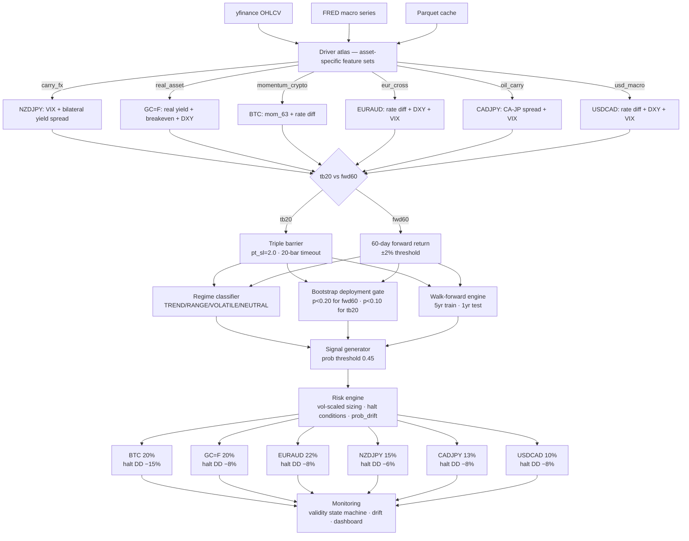

# QuantForge


-orange)


**QuantForge** is a modular quantitative research framework focused on **macro-conditioned trading systems** across equities, FX, metals, and crypto. It features a live 24/7 paper-trading engine with a web dashboard and a complete model governance stack spanning sandbox evaluation, regime adversarial testing, trajectory tracking, and a formal promotion gate — turning model selection from metric comparison into regime-conditioned behavioral manifold analysis.

**This is a research and paper-trading system — not a production trading bot.**

---

## Live Paper Trading

The paper-trading engine runs continuously with the following allocation across 6 assets and 5 distinct driver clusters:

| Asset   | Ticker      | Label | Cluster         | Alloc | Key Features |
|---------|-------------|-------|-----------------|-------|------|
| BTC     | `BTC-USD`   | tb20  | momentum_crypto | 20%   | rate_diff, 2y_yield_delta_63, btc_mom_63, btc_vs_spy_63 |
| GC=F    | `GC=F`      | fwd60 | real_asset      | 20%   | real_yield_delta_63, breakeven_delta_63, dxy_mom_63, gc_mom_63 |
| EURAUD  | `EURAUD=X`  | tb20  | eur_cross       | 22%   | rate_diff, dxy_mom_21, vix_ma21, euraud_mom_21 |
| NZDJPY  | `NZDJPY=X`  | tb20  | carry_fx        | 15%   | vix_ma21, vix_delta_5, us_jp_10y_spread, nzdjpy_mom_21 |
| CADJPY  | `CADJPY=X`  | fwd60 | oil_carry       | 13%   | ca_jp_spread_mom_5, ca_jp_spread_mom_21, cadjpy_mom_21, vix_ma21 |
| USDCAD  | `USDCAD=X`  | tb20  | usd_macro       | 10%   | rate_diff, dxy_mom_21, vix_ma21, usdcad_mom_21 |

### Run

```bash
./monitor_all
```

**Dashboard**: <http://127.0.0.1:5000>

- Engine refresh: every 30 minutes
- UI refresh: every 30 seconds
- Yahoo Finance resilience: exponential backoff (5s/15s/45s) + parquet cache fallback

### Dashboard Features

- Portfolio summary (Total Value, Return, Unrealized P&L, Trade Count)
- Per-asset signal cards with confidence meters, position details, and P&L
- Session-scoped execution log (auto-cleaned on restart)
- Performance metrics (Profit Factor, Win Rate, Sharpe, Mean Confidence)
- Validity & Halt condition monitors
- Regime status and advisory bar
- Risk governance dashboard (`/risk.json`, `/risk/{asset}.json`)
- Shadow action intelligence (`/shadow-actions`, `/shadow-actions/{asset}.json`)

---

## Research Track

Primary validated assets across 6 asset classes using walk-forward validation. Two label architectures are deployed: **tb20** (triple-barrier, 20-bar timeout) for mean-reverting/short-term assets, and **fwd60** (60-day forward return) for macro-trend assets. See [ADR-015](docs/adr/ADR-015-asset-specific-label-horizons.md).

### Model Specifications

- **Type**: XGBoost multiclass classifier (BUY / NEUTRAL / SELL)
- **Parameters**: 300 trees, max depth 2, learning rate 0.02
- **Labeling**: Triple-barrier (pt_sl=2.0, vertical barrier=20 bars) for tb20 assets; 60-day forward return classification for fwd60 assets
- **Sizing**: Volatility-scaled positions
- **Validation**: Rolling walk-forward (5yr train / 1yr test / 1yr step)

### Walk-Forward Results — Portfolio Assets

| Asset  | Label | Windows | Avg PF | Avg Sharpe | Pos Windows | Cumulative Return |
|--------|-------|---------|--------|------------|-------------|-------------------|
| CADJPY | fwd60 | 6/6     | 1.47   | 1.07       | 88%         | +34.9%            |
| GC=F   | fwd60 | 6/6     | 1.37   | 1.02       | 75%         | +96.3%            |
| EURAUD | tb20  | 6/8     | 2.52   | 0.82       | 75%         | —                 |
| NZDJPY | tb20  | 5/8     | 1.16   | 0.69       | 62%         | —                 |
| USDCAD | tb20  | 5/8     | 1.24   | 0.61       | 62%         | —                 |
| BTC    | tb20  | 4/8     | 1.04   | 0.09       | 50%         | —                 |

See [ADR-015](docs/adr/ADR-015-asset-specific-label-horizons.md) for fwd60 methodology and [ADR-016](docs/adr/ADR-016-gold-validation.md) for GC=F validation. See [ADR-017](docs/adr/ADR-017-inference-lookahead-investigation.md) for inference integrity.

---

## Advanced Architecture

### Research (Ensemble)

| Module                    | Description |
|--------------------------|-----------|
| HybridRegimeEnsemble | Global XGBoost backbone (depth=2, 100 trees) with regime-specific expert heads (TREND/RANGE/VOLATILE) and protected macro head (0.45 blend) |
| MacroExpertHead | Asset-specific XGBoost (depth=2) with protected weight 0.45 — prevents price features drowning macro signal |
| RegimeClassifier | TREND/RANGE/VOLATILE/NEUTRAL — operates as risk/participation controller |
| DriverAtlas | Asset-to-feature-cluster routing: carry_fx, yield_equity, momentum_crypto, positioning |
| ValidityStateMachine | GREEN/YELLOW/RED capital allocation with PSI-gated hysteresis |
| WalkForwardEngine | 5yr rolling train, 1yr OOS test, bootstrap p<0.05 deployment gate |

### FeatureContract System

The feature algebra is governed by a **3-template grammar** that covers 100% of deployed features. This eliminates train/serve skew by enforcing identical computation in both training and live inference:

| Component | Description |
|-----------|-------------|
| FeatureContract | Frozen dataclass — ticker, name, label type/params, macro filters, price momentum windows, vs-SPY windows. Runtime validators (`validate_dataframe`, `validate_model`) act as CI safety net |
| FEATURE_REGISTRY | Canonical dict mapping 6 tickers to their contracts — single source of truth for feature sets, label strategy, and model paths |
| Builder | `build_features()` — single generic pipeline: compute labels, align macro, compute template features, drop NaN. Called identically by training script and live engine |
| contract.features | Computed property — derives canonical column names from contract fields, eliminating hardcoded `*_FEATURES` constants and slug-based naming mismatches |
| model_path() | Returns `{name}_model.pkl` — fixes the old mismatch where training saved `{slug}_model.pkl` but engine expected `{name}_model.pkl` |

### Paper Trading (Deployed)

| Component                 | Description |
|---------------------------|-----------|
| FeatureContract / Registry / Builder | Canonical feature algebra — contract-driven feature computation, validation, and model path resolution |
| StateStore | Versioned persistence boundary — EngineSnapshot, corrupt-file recovery, file locking, cache management |
| StrategyRegistry | Per-asset strategy routing — model, signal, sizing, PnL, and feature pipeline interfaces with auto-register and validation |
| Shared Interfaces | `shared/model.py`, `shared/signal.py`, `shared/sizing.py`, `shared/pnl.py`, `shared/features.py` — ABCs + default implementations wrapping all critical computations |
| TradeDecision | Pure model intent dataclass — signal, confidence, provenance, no execution side-effects |
| PositionIntent / PositionManager | Extracted position lifecycle — open, close, SL/TP check, PnL accounting, deterministic replay |
| ValidityStateMachine | Per-asset GREEN/YELLOW/RED state with hysteresis, inertia smoothing, regime persistence lock |
| ExecutionState | Portfolio-level ACTIVE/PAUSED/HALTED — derived from halt conditions and validity exposure |
| AssetEngine | Per-asset XGBoost (depth=2, 300 trees, lr=0.02), contract-driven feature computation, tb20 or fwd60 label routing, strategy-registry-backed |
| PaperTradingEngine | Orchestrates 6 assets, volatility-scaled sizing, halt conditions, P&L tracking |
| PaperBroker(BrokerInterface) | Simulated broker — yfinance fills at market price, configurable slippage/fees |
| Dashboard (stdlib http.server) | Real-time web UI with portfolio summary, signal cards, session-scoped log, performance metrics |
| Wrappers | `paper_trading/wrappers.py` — shadow recomputation layer: pure-function delegators to shared interfaces, used for output-identity verification |
| Tracer | `paper_trading/tracer.py` — structured JSONL event tracing of every decision cycle + shadow comparison (signal, sizing, PnL) |
| Diagnostics | `paper_trading/diagnostics.py` — root-cause analysis layer: signal divergence classification, model distribution tracking, one-at-a-time feature impact scoring, volatility regime context, PnL decomposition |
| Shadow Memory | `paper_trading/shadow_memory.py` — persistent longitudinal store partitioned by asset+date (JSONL); immutable baseline with histogram-based model proba, signal mismatch, PnL error, and regime distributions |
| Drift Scoring | `paper_trading/drift_scoring.py` — 5-dimensional drift engine: model KL divergence, signal mismatch rate, PnL MAE, feature Jaccard stability, regime consistency; `get_shadow_intelligence()` produces per-asset drift report |
| Risk Governance | `paper_trading/risk_governance.py` — advisory risk layer: weighted composite score → LOW/MEDIUM/HIGH with risk flags, explanations, and non-binding recommended action |
| Shadow Actions | `paper_trading/shadow_actions.py` — non-binding execution advisor: action_type, exposure_adjustment, recommended_guardrails |
| Shadow Feedback | `paper_trading/shadow_feedback.py` — persistent behavioral dataset generator: append-only feedback events partitioned by asset+month |
| Shadow Analytics | `paper_trading/shadow_analytics.py` — offline aggregation: learning profiles, stability ranking, systemic pattern detection |
| Shadow Learning | `paper_trading/shadow_learning.py` — offline knowledge distillation: learning profiles, latent patterns, regime map, insights |

### Model Governance (Sandbox)

| Module | Description |
|--------|-------------|
| `backtests/sandbox_retrain.py` | Isolated training pipeline with frozen DataLock audit trail |
| `backtests/model_comparator.py` | 4-lens evaluation: model AUC/logloss, signal agreement/flip rate, portfolio PnL/drawdown, shadow entropy — all regime-stratified |
| `backtests/forward_test.py` | Walk-forward hold-out: trains fresh model on pre-cutoff data, computes forward Sharpe/hit rate/stability for baseline + candidate |
| `backtests/mas.py` | Model Acceptance Score: 6-dim weighted compression (model/signal/portfolio/shadow/forward/stress) with 4 hard gates |
| `backtests/model_evolution.py` | Temporal trajectory: append-only JSONL, MAS velocity, equilibrium bands, cross-asset convergence |
| `backtests/model_promotion_engine.py` | 4-condition admission gate (performance/stability/consistency/safety) producing structured LIVE_CANDIDATE/PAPER_ONLY/SHADOW_ONLY/REJECT decisions |
| `backtests/adversarial_manifold.py` | 9-regime perturbation engine across 4 axes (volatility, correlation, trend, noise); CMSS score + attractor drift + stability class |

---

## Key Findings

- Simplicity wins: 4-feature model consistently outperforms complex ensembles in walk-forward tests
- Asset-specific driver features are mandatory: generic macro features fail on 28/30 assets tested; pair-specific features (VIX + bilateral yield spread for NZDJPY) flipped 0/7 → 5/7 positive windows
- Genuine diversification across 6 driver clusters: 6-asset portfolio spans momentum_crypto, real_asset, eur_cross, carry_fx, oil_carry, and usd_macro with max |r| < 0.40
- Feature interference is a real failure mode: macro features drowned by 25 price features until protected weight architecture separated them
- Macro features describe environment, not price response: yield_slope and real_yield_10y removed from XLF model because they stayed bearish through 2023–2024 rally; 2y_yield_delta_63 (direction, not level) was the fix
- EURUSD blocked at daily frequency: 8 years walk-forward showed 1.65% CAGR; requires COT positioning data

---

## System Architecture



---

## Repository Structure

```text
QuantForge/
├── backtests/            # Sandbox model governance stack (Phases 11–14)
│   ├── sandbox_retrain.py        # Orchestrator: trains isolated models + runs full eval pipeline
│   ├── model_comparator.py       # 4-lens evaluation engine (model/signal/portfolio/shadow)
│   ├── forward_test.py           # Walk-forward hold-out (Sharpe, hit rate, drawdown, stability)
│   ├── mas.py                    # Model Acceptance Score — 6-dim weighted compression + hard gates
│   ├── model_evolution.py        # Trajectory tracking: velocity, equilibrium bands, convergence
│   ├── model_promotion_engine.py # 4-condition admission gate with structured failure modes
│   └── adversarial_manifold.py   # 9-regime perturbation engine + CMSS stability scoring
├── paper_trading/       # Live engine + stdlib HTTP dashboard
│   ├── serve.py         # stdlib HTTP server
│   ├── engine.py        # Paper trading engine
│   ├── state_store.py   # Versioned persistence boundary (EngineSnapshot, cache, journal)
│   ├── decision.py      # TradeDecision / PositionIntent pure dataclasses
│   ├── position_manager.py  # Position lifecycle (open, close, SL/TP, PnL)
│   ├── monitor.py       # Entry point (data → signal → trade loop)
│   ├── wrappers.py      # Shadow recomputation layer (pure-function delegators)
│   ├── tracer.py        # Structured JSONL event tracing + shadow comparison
│   ├── diagnostics.py   # Root-cause analysis: signal divergence, model dist, feature impact, regime, PnL decomp
│   ├── shadow_memory.py # Persistent longitudinal store, partitioned by asset+date, baseline builder
│   ├── drift_scoring.py # 5-dim drift engine: model KL, signal mismatch, PnL MAE, feature stability, regime consistency
│   ├── risk_governance.py   # Advisory risk layer: weighted composite score + non-binding recommendations
│   ├── shadow_actions.py    # Non-binding execution advisor: action_type, guardrails from drift+risk
│   ├── shadow_feedback.py   # Persistent behavioral dataset generator (append-only, partitioned by asset+month)
│   ├── shadow_analytics.py  # Offline aggregation: learning profiles, stability ranking, systemic pattern detection
│   ├── shadow_learning.py   # Offline knowledge distillation: learning profiles, latent patterns, regime map, insights
│   ├── frontend/        # Dashboard UI (index.html, script.js, style.css)
│   └── models/          # 6 serialised XGBoost model pickles
├── shared/              # Strategy interfaces and registry
│   ├── __init__.py
│   ├── registry.py      # StrategyRegistry singleton — per-asset routing, auto-register, validation
│   ├── model.py         # ModelInterface ABC + XGBoostModel wrapper
│   ├── signal.py        # SignalStrategy ABC + FixedThresholdStrategy
│   ├── sizing.py        # PositionSizingStrategy ABC + VolTargetSizing
│   ├── pnl.py           # PnLStrategy ABC + DefaultPnLStrategy
│   └── features.py      # FeaturePipeline ABC + DefaultFeaturePipeline
├── scripts/             # Training & validation runners
│   ├── walk_forward_all.py
│   ├── train_all_assets.py
│   ├── gc_walk_forward.py
│   └── ...
├── equity/              # Walk-forward research scripts
├── archive/             # Retired model source code
├── models/              # Research models
│   ├── regime/          # Regime classifier
│   ├── ensemble/        # Model router
│   ├── mean_reversion/  # RSI + Bollinger for RANGE
│   ├── trend/           # Trend-following models
│   ├── volatility/      # Volatility models
│   ├── macro_expert_head.py
│   └── hybrid_ensemble.py
├── features/            # FeatureContract system + feature engineering pipeline
│   ├── contract.py      # FeatureContract dataclass + runtime validators
│   ├── registry.py      # FEATURE_REGISTRY — canonical contracts for 6 portfolio assets
│   └── builder.py       # Generic builder — compute_macro_derived, build_features, compute_label, model_path
├── labels/              # Triple-barrier & meta-labeling
├── signals/             # Signal filtering, thresholding, generation, paper signal adapter
├── risk/                # Position sizing, drawdown controls, exposure limits
├── monitoring/          # Validity state machine, drift detection, dashboard backend, MLflow, weekly reports
├── data/
│   ├── loaders/         # yfinance, FRED, COT downloaders
│   ├── raw/             # Raw OHLCV parquet files
│   ├── processed/       # Feature-engineered datasets & walk-forward results
│   ├── live/            # Runtime engine state, equity history, logs, yfinance cache
│   └── weekly_pipeline.py
├── diagnostics/         # Model audits, sweeps, SHAP analysis, isolation tests
├── portfolio/           # HRP allocator, risk parity, correlation clusters
├── execution/           # Broker interface, order manager, portfolio sync, PaperBroker (simulated broker)
├── configs/             # YAML configs (paper trading, forex) + driver atlas
├── tests/               # Pytest test suite (148 tests, regression-verified via shadow comparisons)
├── docs/                # Project documentation, runbook, system overview
│   └── adr/             # Architecture Decision Records (ADR-000 through ADR-017)
├── adr/                 # Additional ADRs (ADR-011 known issues)
├── notebooks/           # (placeholder — no notebooks yet)
├── .github/
│   └── workflows/       # CI pipeline (py_compile lint + pytest)
├── quantforge/          # Package root (version, logging)
├── main.py              # Minimal entry point
├── monitor_all          # Launch script (paper trading)
├── Makefile             # Dev targets (install, test, lint, run, clean)
├── pyproject.toml       # Project metadata & deps
└── requirements.txt     # Pinned dependencies
```

---

## Documentation

Project documentation and architecture decisions live alongside the code:

| Path | Description |
|------|-------------|
| [`docs/`](docs/) | Project documentation — guides, references, deep-dives |
| [`docs/adr/`](docs/adr/) | Architecture Decision Records — key design decisions and their rationale (ADR-000 through ADR-017) |
| [`adr/`](adr/) | Supplementary ADRs — known issues and deferred decisions |

ADR entries follow the standard [Michael Nygard template](https://github.com/joelparkerhenderson/architecture-decision-record) and are numbered sequentially.

---

## Setup

```bash
git clone git@github.com:manuelhorvey/QuantForge.git
cd QuantForge

python3 -m venv .venv
source .venv/bin/activate
pip install -r requirements.txt
pip install pytest pytest-cov   # dev dependencies

export PYTHONPATH=$PYTHONPATH:.
```

---

## Quick Start

```bash
# Train models for all 6 portfolio assets (contract-driven pipeline)
python scripts/train_all_assets.py

# Run walk-forward validation
python scripts/walk_forward_all.py

# Run tests
make test

# Start live paper trading + dashboard
./monitor_all
```

---

## Refactoring Phases (Zero-Behavior-Drift)

The paper-trading engine has undergone a structural refactoring across 14 phases, each preserving byte-identical outputs:

| Phase | Description | Status |
|-------|-------------|--------|
| **1** | Tracer + shadow comparison + baseline snapshot + live contract + dependency guard | ✓ |
| **2** | Shared interfaces (model, signal, sizing, PnL, features) + AssetEngine migration | ✓ |
| **3** | Strategy registry with per-asset routing + research_mode flag | ✓ |
| **4** | Wrapper consolidation (delegate to shared interfaces) + PnL shadow + dead code removal | ✓ |
| **5** | Shadow diagnostics layer: signal divergence, model distribution, feature impact, regime context, PnL decomposition | ✓ |
| **6** | Persistent shadow memory (asset+date partitioned JSONL) + 5-dim drift scoring engine + baseline initialization | ✓ |
| **7** | Risk governance layer: weighted composite risk score, advisory exposure_multiplier, non-binding recommended action, `/risk.json` dashboard endpoints | ✓ |
| **8** | Shadow action layer: non-binding execution advisor with action_type (NONE/MONITOR/REDUCE/PAUSE), reason_codes, guardrails, `/shadow-actions` endpoints | ✓ |
| **9** | Shadow feedback loop: persistent behavioral dataset generator with derived metrics (agreement_score, instability_index, risk_alignment); offline analytics toolkit | ✓ |
| **10** | Shadow learning compilation: offline knowledge distillation — 5-dim learning profiles, latent pattern mining, regime behavior map, shadow insights | ✓ |
| **11** | **Sandbox retraining harness**: physically isolated model training + 4-lens evaluation engine (model/signal/portfolio/shadow comparison) with regime-stratified signal agreement and frozen DataLock audit trail | ✓ |
| **11.5** | **Walk-forward test + M_stress**: out-of-sample hold-out evaluation (Sharpe, hit rate, drawdown, stability); regime stress robustness sub-score calibrated to 0.5 at identity | ✓ |
| **12** | **Model evolution tracking**: per-asset trajectory JSONL with MAS velocity (Δ/retrain), acceleration, sub-axis drift, equilibrium band estimation, cross-asset convergence tracking | ✓ |
| **13** | **Model promotion protocol**: 4-condition multivariate admission gate (performance/stability/consistency/safety) producing structured decisions (LIVE_CANDIDATE/PAPER_TRADING_ONLY/SHADOW_ONLY/REJECT) with explicit failure modes | ✓ |
| **14** | **Cross-manifold adversarial testing**: 9-regime perturbation engine (volatility shock/compression, correlation break/inversion, trend flip/burst, noise inject/spike); CMSS stability score + attractor drift + stability class (ROBUST/MODERATE/BRITTLE) | ✓ |

### Pipeline

```
sandbox retrain
  → 4-lens comparison (model/signal/portfolio/shadow)
  → walk-forward test (6mo hold-out)
  → MAS (6-dim weighted compression: model/signal/portfolio/shadow/forward/stress)
  → adversarial manifold (9 regime perturbations → CMSS)
  → trajectory append (velocity + equilibrium bands)
  → promotion gate (4-condition admission) → structured decision
```

The live engine is **swap-ready but locked**. The sandbox is a proper **model selection energy landscape**: stable models sit in an equilibrium basin (~80 MAS), genuine structural improvements must climb past 88 with >0.6 stress robustness, and degraded models fall below 70. No single metric can force deployment — MAS is a manifold position, not a pass/fail score.

## Roadmap

### Near Term

- Live broker integration (Alpaca / Interactive Brokers) — PaperBroker(BrokerInterface) contract exists
- Adversarial manifold expansion: bootstrap volatility shocks, permuted regime segments, synthetic spread widening
- Shadow intelligence dashboard integration — surface drift, CMSS, and MAS trajectory in web UI
- AUDJPY re-evaluation post-November — model trained, deferred pending correlation analysis

### Medium Term

- Ensemble manifold synthesis — merge accepted models via regime-conditional weighting
- External regime validation sets — periodic "unknown regime injection" tests to prevent over-calibration
- EURUSD/GBPUSD with COT data pipeline

---

## Research backlog

Assets pending validation: ETH-USD (momentum_crypto cluster), XLU/XLRE (yield_equity cluster). AUDJPY (model trained, deferred post-November — r=0.87 with NZDJPY).

Blocked pending data acquisition: EURUSD, GBPUSD (need CFTC COT weekly positioning data).

---

## Limitations

- Paper trading only (no real capital at risk)
- Weekend data staleness for equities/FX
- No live broker execution — PaperBroker(BrokerInterface) provides the contract; Alpaca/IBKR stubs exist
- EURUSD and GBPUSD blocked — requires COT positioning data
- Model validity depends on PSI distribution stability
- Paper trading uses simple 4-feature XGBoost per asset; research ensemble (`HybridRegimeEnsemble`) not yet deployed — registry is swap-ready but locked (a single `StrategyRegistry.register_model()` call would activate it)
- Yahoo Finance data can be rate-limited; engine mitigates with exponential backoff (5s/15s/45s) + parquet cache fallback

---

## Disclaimer

This project is for **research and educational purposes only**. It is not financial advice. Trading involves substantial risk of loss. Past performance does not guarantee future results.

---

## Author

**MktOwl**  
Focus: Macro-driven systematic trading • Walk-forward validation • Production-grade research engineering

---

**Contributions, issues, and suggestions are welcome.**
