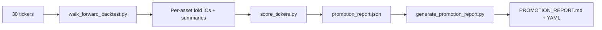

# QuantForge — System Overview

Architecture, component responsibilities, and data flow for the QuantForge cross-sectional factor ranking and paper trading system.

## Architecture

```
┌─────────────────────────────────────────────────────────────────────┐
│                       SCREENING (offline)                           │
│  30 tickers → walk_forward_backtest.py → score_tickers.py          │
│  → generate_promotion_report.py → PROMOTION_REPORT.md              │
│  Output: promotion_report.json (GREEN/YELLOW/RED), fold ICs        │
└─────────────────────────────────────────────────────────────────────┘
                              │
                              ▼
┌─────────────────────────────────────────────────────────────────────┐
│                    TRAINING (per promoted asset)                     │
│  fetch_asset_data(ticker) → build_alpha_features()                  │
│  → triple_barrier_labels(pt_sl) → binary reduction (drop HOLD)     │
│  → XGBoost binary:logistic (300 trees, depth=2, lr=0.02)          │
│  → save .json model → persist PSI baseline                         │
└─────────────────────────────────────────────────────────────────────┘
                              │
                              ▼
┌─────────────────────────────────────────────────────────────────────┐
│                    LIVE INFERENCE (every 300s)                       │
│  Parallel asset fetch (ThreadPoolExecutor, max_workers=8)           │
│                                                                     │
│  ┌─────────────┐    ┌──────────────────┐    ┌────────────────┐     │
│  │ fetch_live  │───▶│ build_alpha_     │───▶│ XGBoost        │     │
│  │ 500d OHLCV  │    │ features()       │    │ binary predict │     │
│  │ (truncated  │    └──────────────────┘    └────────────────┘     │
│  │  to 250d    │                              │    │               │
│  │  for XGB)   │                              │    ▼               │
│  └─────────────┘    ┌──────────────────┐    ┌────────────────┐     │
│                     │ AsyncDiagnostics │    │ Archetype      │     │
│                     │ Queue (daemon)   │    │ features       │     │
│                     │ → 8 heavy imports│    │ (OHLCV)        │     │
│                     │   off hot path   │    └────────────────┘     │
│                     └──────────────────┘         │                  │
│                                                   ▼                 │
│  ┌──────────────┐    ┌──────────────┐    ┌────────────────┐        │
│  │ Entry        │───▶│ Execution    │───▶│ Position       │        │
│  │ Optimizer    │    │ Policy Layer │    │ Manager        │        │
│  └──────────────┘    └──────────────┘    └────────────────┘        │
└─────────────────────────────────────────────────────────────────────┘
                              │
                              ▼
┌─────────────────────────────────────────────────────────────────────┐
│                    STATE PERSISTENCE                                 │
│  SQLite state store (WAL mode, O(1) append):                        │
│  trades, attribution, shadow_trades, confidence_buckets,            │
│  equity_history → trade_outcomes.json (cached aggregates)          │
│  state.json (EngineSnapshot) → dashboard                            │
└─────────────────────────────────────────────────────────────────────┘
```

## Component Responsibilities

### Feature Engineering (`features/`)

| Module | Key Exports | Purpose |
|---|---|---|
| `alpha_features.py` | `build_alpha_features()` | Alpha feature factory: vol-adjusted carry, multi-horizon momentum (21/63/126/252d), z-score reversion (20d), vol regime ratio, day-of-week signal + cross-asset (DXY/VIX/SPX/WTI momentum) |
| `data_fetch.py` | `fetch_asset_data()`, `fetch_asset_ohlcv()`, `fetch_yf_series()`, `_fetch_macro_batch()` | YFinance ingestion: asset close + macro (10y), full OHLCV (10y), TZ-naive date normalization. Macro tickers batched into single `yf.download` call. TTL cache (300s) for macro data. Removed 0.5s hard sleep. |
| `labels.py` | `triple_barrier_labels()`, `PurgedWalkForwardFolds` | Vol-scaled triple-barrier labeling with purged walk-forward CV |
| `regime_features.py` | `generate_regime_features()`, `compute_hurst()`, `compute_kaufman_er()` | Regime detection: Hurst exponent, KER, ADX, vol z-score, compression ratio, session vol profile |
| `archetypes.py` | `ArchetypeClassifier`, `SetupArchetype` | 5 pure-feature market structure archetypes (MOMENTUM_IGNITION, MEAN_REVERSION, BREAKOUT_TEST, VOL_EXPANSION, UNKNOWN) |
| `macro_narrative.py` | `MacroNarrativeFeatures`, `narrative_governance_scalars()` | Weekly LLM-driven macro context (geopol risk, USD bias, regime) |
| `liquidity_regime.py` | `compute_liquidity_features()`, `classify_liquidity_regime()` | Volume z-score + Amihud illiquidity → NORMAL/THIN/STRESSED |
| `contract.py` | `FeatureContract`, `validate_no_cross_asset_leakage()` | Immutable feature schema contract (used for validation only) |
| `fxstreet_fetcher.py` | `run_weekly_narrative_pipeline()` | FXStreet article → LLM → structured narrative extraction |

### Screening & Promotion (`scripts/`)

| Script | Purpose | Output |
|---|---|---|
| `walk_forward_backtest.py --tickers` | Run 5-fold expanding window backtest per ticker | Per-asset fold ICs, signal parquet, summary CSV |
| `score_tickers.py` | Compute composite score (IC + hit rate + consistency + bidirectionality); classify GREEN/YELLOW/RED | `promotion_report.json`, `promotion_report.csv` |
| `generate_promotion_report.py` | Generate markdown report with YAML config block | `PROMOTION_REPORT.md` |

### Paper Trading Engine (`paper_trading/`)

| Component | File | Role |
|---|---|---|
| `PaperTradingEngine` | `engine.py` | Top-level orchestrator: manages 13 AssetEngine instances + BTC satellite; `run_once()` cycle every 300s |
| `AssetEngine` | `asset_engine.py` | Per-asset lifecycle: inference, position management, governance, halt conditions |
| `AssetInferencePipeline` | `inference/pipeline.py` | Live inference: OHLCV fetch → alpha features → XGBoost → archetype → decision. Inference truncation (500d → 250d) with behavioral validation. Model hot-swap re-validation on object identity change. |
| `AssetTrainingPipeline` | `inference/training.py` | On-demand training: yfinance → alpha features → binary XGBoost → model save |
| `DiagnosticsSnapshot` | `inference/async_diagnostics.py` | Deferred diagnostics: captures model/feature snapshots on hot path, processes off-thread via daemon consumer queue. 8 heavy imports removed from inference hot path. |
| `EnsembleSignal` | `inference/ensemble.py` | Optional regime ensemble blend (disabled by default) |
| `RegimeConditionalModel` | `inference/regime_model.py` | Optional regime-conditional XGBoost (disabled by default) |
| `PortfolioBuilder` | `portfolio_builder.py` | Builds asset registry from `configs/paper_trading.yaml` |
| `StateStore` | `state_store.py` | SQLite-backed persistent state (WAL mode). 5 tables: trades, attribution, shadow_trades, confidence_buckets, equity_history. O(1) append, periodic WAL checkpoint. Falls back to legacy JSON files. |
| `EntryOptimizer` | `entry/optimizer.py` | Evaluate signal + archetype + structure → ENTER/DEFER/SKIP |
| `ExecutionPolicyLayer` | `entry/policy.py` | Unified policy routing with POLICY_MAP dispatch |
| `PositionManager` | `position/manager.py` | Position lifecycle (open/close/SL/TP/scale-out) |
| `DynamicSLTPEngine` | `position/dynamic_sltp.py` | Vol-adaptive SL/TP via ATR |
| `PaperBroker` | `execution/paper_broker.py` | Simulated fills, capital tracking, execution configs |
| `ExecutionBridge` | `execution/bridge.py` | Fill price adjustment (slippage, impact) |
| `ShadowSLTPEngine` | `shadow/engine.py` | Counterfactual SL/TP replay on live tape |
| `AttributionCollector` | `attribution/collector.py` | Observe-only 4-domain trade attribution |
| `HighVolSatellite` | `satellite/engine.py` | BTC satellite with macro gate |
| `EngineOrchestrator` | `orchestrator/engine.py` | Orchestrates parallel asset execution (ThreadPoolExecutor, max_workers=8). Phases: REFRESH+Signal (parallel), VALIDITY (sequential), PORTFOLIO health, PERSIST. |
| `AssetActor` | `orchestrator/actor.py` | Actor wrapper around each asset. Tracks health state (HEALTHY/DEGRADED/HALTED), cycle timing, exposure. |
| `HealthMonitor` | `orchestrator/health.py` | Portfolio-level health computation: drawdown, vol spike, signal drought, halt ratio. Emergency circuit breaker at 50% halt ratio. |

### Governance (`paper_trading/governance/`, `monitoring/`)

| Component | File | Role |
|---|---|---|
| `ValidityStateMachine` | `monitoring/validity_state_machine.py` | GREEN/YELLOW/RED with hysteresis + inertia |
| `FeatureImportanceTracker` | `monitoring/importance_tracker.py` | Jaccard + Spearman stability per retrain |
| `PSIMonitor` | `monitoring/psi_monitor.py` | Fixed-width bin distribution shift detection |
| `AssetGovernance` | `governance/asset.py` | Narrative + liquidity governance state |
| `RegimeClassifier` | `governance/regime.py` | KER+ADX+vol regime detection |

### Web Dashboard (`paper_trading/`)

| Component | File | Role |
|---|---|---|
| HTTP Server | `serve.py` | Zero-dependency stdlib REST API |
| API Routes | `api/routes.py`, `api/handler.py` | Route registry, request handling |
| Dashboard UI | `dashboard/` | React + Vite + Tailwind + react-query (70+ components) |

## Data Flow

### 1. Screening Pipeline



### 2. Live Inference Pipeline

```mermaid
graph TD
    A[yfinance 5min] --> B[fetch_live: 500d OHLCV]
    B --> C[TZ-normalize to UTC date]
    C --> D[refresh_price: realtime or 5d fallback]
    D --> E[ffill close column]
    E --> F[fetch_asset_data: 10y close + macro]
    F --> F1[macro batched via yf.download<br>TTL cache 300s]
    F1 --> G[build_alpha_features]
    G --> H[fetch_asset_ohlcv: 10y OHLCV]
    H --> I[archetype features: ema_spread, ADX, RSI, BB]
    I --> J[XGBoost predict binary]
    J --> K[3-col proba expansion]
    K --> L[FixedThresholdStrategy(0.45)]
    L --> M[archetype classification]
    M --> N[TradeDecision]
    N --> O[inference truncation: 500d→250d<br>model hot-swap validation]
    O --> P[_apply_decision]
    P --> Q[EntryOptimizer → Policy → Position]
    R[DiagnosticsSnapshot<br>async daemon queue<br>8 heavy imports off hotpath] -.-> J
```

### 3. Training Pipeline

```mermaid
graph LR
    A[fetch_asset_data: 10y] --> B[build_alpha_features]
    B --> C[triple_barrier_labels(pt_sl)]
    C --> D[drop HOLD → binary {0,1}]
    D --> E[XGBoost binary:logistic]
    E --> F[save .json model]
    E --> G[persist PSI baseline]
    E --> H[train meta-label model]
    E --> I[train regime model if configured]
```

## Data Persistence

| Store | Format | Purpose |
|---|---|---|
| `state.json` | JSON | EngineSnapshot serialization → dashboard |
| `state.db` (SQLite) | SQLite (WAL mode) | 5 persistent tables: trades, attribution, shadow_trades, confidence_buckets, equity_history |
| `trade_outcomes.json` | JSON | Cached aggregate outcomes (rebuilt from SQLite on demand) |

## Configuration

`configs/paper_trading.yaml` defines:
- Capital, position size, rebalance frequency
- 13 assets with ticker, allocation, sl_mult, tp_mult
- Ensemble config (disabled by default)
- Meta-labeling config
- Narrative governance config
- Liquidity governance config
- Per-asset regime geometry (GREEN/YELLOW/RED sl/tp multipliers)
- Engine orchestrator (parallel asset fetch, max_workers)

## Key Entry Points

| Action | Command |
|---|---|
| Run walk-forward screening | `python scripts/walk_forward_backtest.py --tickers BTC-USD,EURGBP=X,...` |
| Score screened tickers | `python scripts/score_tickers.py` |
| Generate promotion report | `python scripts/generate_promotion_report.py` |
| Start paper trading + dashboard | `./monitor_all` |
| Force-retrain all assets | `python scripts/train_all_assets.py` |
| Run microbenchmark | `python benchmarks/microbenchmark.py --state-dir /tmp/bench-state` |
| Run tests | `pytest tests/ -q --tb=short` |
| Dashboard URL | `http://127.0.0.1:5000` |
