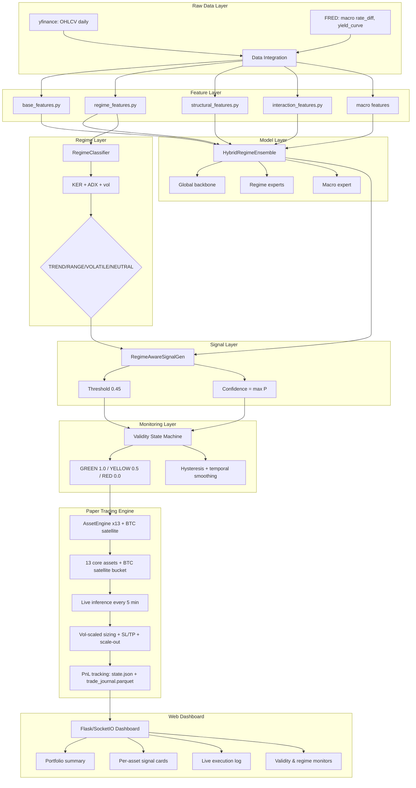
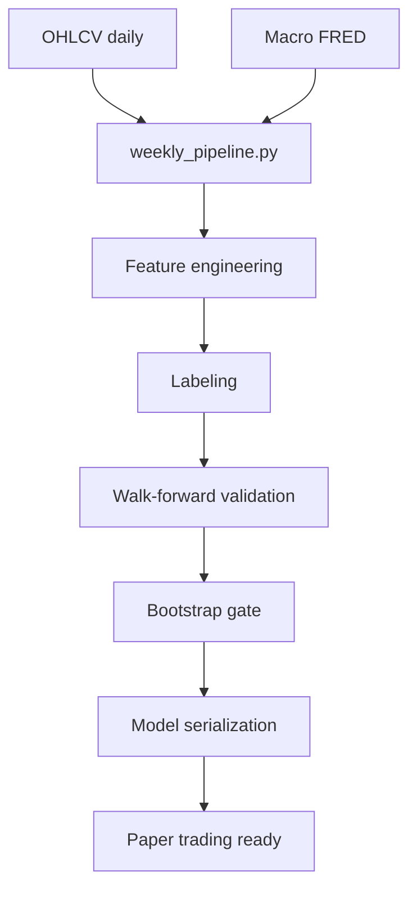
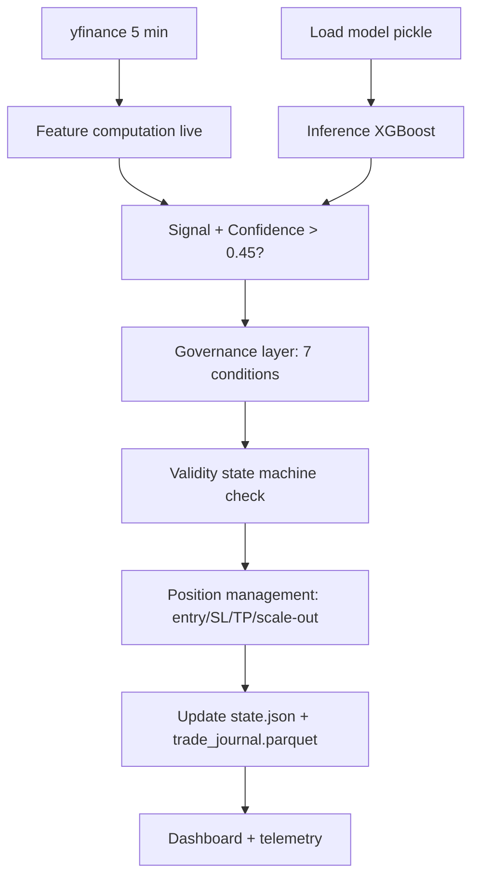

# QuantForge — System Overview

High-level architecture, component responsibilities, and data flow for the QuantForge quantitative trading framework.

---

## Architecture Diagram

---

## Component Responsibilities

### Data Layer (`data/`)

| Component | File | Responsibility |
|-----------|------|---------------|
| Downloader | `data/loaders/downloader.py` | Daily OHLCV via yfinance |
| Macro Loader | `data/loaders/macro_loader.py` | FRED data — rate_diff, yields, DXY, VIX |
| Weekly Pipeline | `data/weekly_pipeline.py` | Weekly resample (W-FRI), full feature pipeline |
| Live State | `data/live/` | Runtime engine state: state.json, history.parquet |

### Feature Engineering (`features/`)

Features are computed independently per module and concatenated by common index. Each module returns a DataFrame that can be included or excluded per asset.

| Module | Key Features | Used By |
|--------|-------------|---------|
| base | EMA spreads, ADX, MACD, RSI, Bollinger Z-score | All models |
| regime | Hurst exponent, KER, ADX, vol_zscore, compression | Regime classifier |
| structural | Price slope, curvature, path efficiency, skew, kurtosis | Research only |
| interaction | Regime contrast, entropy, transition risk | Research only |
| macro (loader) | rate_diff, dxy_mom, yield_slope, yield_delta | Macro expert head |

### Model Layer (`quantforge/`, `shared/model.py`)

**Standard XGBoost** per asset (`shared/model.py:StandardModel`)
- `xgboost.XGBClassifier` with `n_estimators=300, max_depth=2, learning_rate=0.02`
- 3-class softprob: BUY / HOLD / SELL
- Optional macro expert head (`HybridEnsemble`) with adaptive blend weight
- Training via `shared/strategies/` abstract base classes
- Walk-forward validated per asset (5yr train / 1yr test / 1yr step, bootstrap gate p<0.10)

**RegimeClassifier** (`models/regime/regime_classifier.py`)
- TREND score: KER × 1.3 × 0.45 + (ADX / 45) × 0.55
- RANGE score: (1 - KER × 1.8) × 0.35 + (1 - ADX / 30) × 0.35 + (1 - compression) × 2.0 × 0.3
- VOLATILE gate: vol_zscore > 1.35 OR compression > 1.45 (overwrites probabilistic)
- NEUTRAL: softmax confidence < 0.45
- Smoothing: 10-bar rolling mode with persistence lock

### Risk & Monitoring (`risk/`, `monitoring/`)

**ValidityStateMachine** (`monitoring/validity_state_machine.py`)
- Input: validity score (composite of model confidence, feature drift, market conditions)
- Output: state (GREEN/YELLOW/RED) with capital allocation (1.0/0.5/0.0)
- Hysteresis bands: GREEN entry 0.70, exit 0.60; YELLOW entry 0.45, exit 0.40; RED entry 0.40, exit 0.50
- Exponential decay smoothing (α=0.7, β=0.3)
- Regime persistence lock (minimum 5 periods before transition allowed)
- Capital allocation is stepped, not continuous — makes state auditable

**Position Sizing** (`risk/position_sizing.py`)
- Base dollar risk × regime multiplier
- Engine adds volatility scalar (target_vol=0.30, cap=1.0) for BTC
- Triple-barrier volatility used for SL/TP placement

### Execution (`paper_trading/`)

**AssetEngine** (per-asset instance)
- Loads serialized model pickle
- Fetches live data (yfinance)
- Runs inference → signal → confidence
- Manages position: entry, SL/TP, PnL tracking
- Updates live state (history.parquet, state.json)

**PaperTradingEngine** (orchestrator)
- Manages 13 AssetEngine instances + BTC satellite
- Label architectures: tb20 (triple-barrier) for FX/equities, fwd60 (60-day forward return) for GC
- 7-layer governance: validity state machine, narrative, liquidity, PSI drift, drawdown, signal drought, confidence drift
- SL/TP chain: `final_sl = base × regime_geom × narrative_sl × liquidity_sl`
- Scale-out: 4-tier profit-taking for 10 of 13 assets
- Dynamic SL/TP calibration at startup (ATR-based, calibration_scale=1.2)
- Runs every 300s (configurable via `QUANTFORGE_REFRESH_INTERVAL` env var)
- Exposes state via JSON for dashboard, persists to Parquet/JSON

**HTTP Server** (`paper_trading/serve.py`)
- Zero-dependency stdlib `http.server`-based REST API
- In-memory TTL cache per endpoint (5-30s), gzip compression for large responses
- `/ping` health endpoint, paginated `/trades.json?limit=N&offset=M`
- Endpoints: `/state.json`, `/trades.json`, `/equity_history.json`, `/governance.json`, `/liquidity.json`, `/narrative.json`, `/psi.json`, `/risk-parity.json`, `/volatility.json`, `/health.json`, `/logs`

**Dashboard** (`paper_trading/dashboard/` — React + Vite + Tailwind + react-query)
- Full dark/light theme with localStorage persistence
- TradeFeed with pagination, SignalsTable with asset name search, sortable columns
- GovernanceStateCards with halted status, validity state badges, animated RED pulse
- Scale-out tier visualization per asset (filled vs pending blocks)
- PSI Drift panel with feature-level distribution shift, trend arrows, color-coded badges
- RiskParityPanel with governance-colored allocation bars
- AlertFeed with governance halt/state-change/PSI-SEVERE events, dismissible
- ConnectionStatus bar monitoring 5 endpoints (Live/Degraded/Offline)
- Satellite card showing entry/SL/TP prices, exit reason history
- Lazy-loaded FeatureCards on landing page
- Zod schema validation on all API responses
- SessionStorage-persisted sort state and alert history

### Validation (`backtests/`)

**WalkForwardValidator**
- Expanding window (all data up to year N-1)
- Default: 5yr train / 1yr test / 1yr step
- Bootstrap p < 0.10 deployment gate (10,000 permutations)
- Metrics: PF, Sharpe, win rate, expectancy, max DD, CAGR
- 4/6 windows must pass gate for asset deployment

### Configuration (`configs/`)

YAML configs define per-asset parameters:
- Asset ticker, allocation weight, features
- Halt conditions (drawdown limits per asset)
- Retrain frequency (annual)
- Volatility scaling toggle
- Per-asset model parameters (overrides defaults)

---

## Data Flow

### Research Pipeline

### Paper Trading Pipeline

---

## Key Entry Points

| Action | Command/File |
|--------|-------------|
| Run walk-forward research | `python equity/walk_forward_xlf.py` |
| Start paper trading + dashboard | `./monitor_all` (rebuilds frontend, starts engine + HTTP server) |
| Wipe state & restart fresh | `rm -rf data/live/ && ./monitor_all` |
| Dashboard URL | `http://127.0.0.1:5000` |
| Run tests | `make test` |
| Run full test suite with coverage | `make test-cov` |
| CI pipeline | `.github/workflows/ci.yml` |
| Daily data refresh | `data/weekly_pipeline.py` |

---

## Configuration Reference

**`configs/paper_trading.yaml`:**
- `capital: 100000` — Starting capital
- `position_size: 0.95` — Max position fraction
- Per-asset: ticker, weight, features, drawdown limits, halt conditions
- `retrain_freq: annual` — Model retraining frequency
- `target_vol: 0.30` — Annualized target volatility for position scaling

**Environment:**
- `PYTHONPATH=.:$PYTHONPATH` — Required for module imports
- `.venv/` — Python virtual environment
- `paper_trading/models/*.pkl` — Serialized models
